I am analyzing the data from New York City Taxi and Limousine commission for Green Taxis. The green taxis are not allowed to pick up passengers inside of the densely populated areas of Manhattan.

I will be analyzing the September 2015 data set, available from below link: <http://www.nyc.gov/html/tlc/html/about/trip_record_data.shtml>.

Data dictionary: <http://www.nyc.gov/html/tlc/downloads/pdf/data_dictionary_trip_records_green.pdf> Rate information: <http://www.nyc.gov/html/tlc/html/passenger/taxicab_rate.shtml>

I will be using R for data analysis and visualization.

I will also be submitting the nyc\_taxi.rmd markdown file, when knit can be used to reproduce the results, includes the r-code, its output and my write-up

As a first step, all the necessary libraries are downloaded and loaded to memory.

``` r
# install.packages("lubridate")
# install.packages("ggplot2")
# install.packages("plotrix")
# install.packages("pastecs")
# install.packages("randomForest")
# install.packages("miscTools")
# install.packages("caret")
# install.packages("gbm")
library(randomForest)
```

    ## randomForest 4.6-12

    ## Type rfNews() to see new features/changes/bug fixes.

``` r
library(reshape2)
library(plotrix)
library(ggplot2)
```

    ## 
    ## Attaching package: 'ggplot2'

    ## The following object is masked from 'package:randomForest':
    ## 
    ##     margin

``` r
library(data.table)
```

    ## 
    ## Attaching package: 'data.table'

    ## The following objects are masked from 'package:reshape2':
    ## 
    ##     dcast, melt

``` r
library(lubridate)
```

    ## 
    ## Attaching package: 'lubridate'

    ## The following objects are masked from 'package:data.table':
    ## 
    ##     hour, isoweek, mday, minute, month, quarter, second, wday,
    ##     week, yday, year

    ## The following object is masked from 'package:base':
    ## 
    ##     date

``` r
library(pastecs)
```

    ## Loading required package: boot

    ## 
    ## Attaching package: 'pastecs'

    ## The following objects are masked from 'package:data.table':
    ## 
    ##     first, last

``` r
library(miscTools)
library(caret)
```

    ## Loading required package: lattice

    ## 
    ## Attaching package: 'lattice'

    ## The following object is masked from 'package:boot':
    ## 
    ##     melanoma

``` r
library(gbm)
```

    ## Loading required package: survival

    ## 
    ## Attaching package: 'survival'

    ## The following object is masked from 'package:caret':
    ## 
    ##     cluster

    ## The following object is masked from 'package:boot':
    ## 
    ##     aml

    ## Loading required package: splines

    ## Loading required package: parallel

    ## Loaded gbm 2.1.3

``` r
library(MASS)
library(tidyr)
```

    ## 
    ## Attaching package: 'tidyr'

    ## The following object is masked from 'package:pastecs':
    ## 
    ##     extract

    ## The following object is masked from 'package:reshape2':
    ## 
    ##     smiths

Question 1 - Loading Data
=========================

To begin the analysis, I will be loading the file in R. If the file is not available in current location, it will be downloaded from <https://s3.amazonaws.com/nyc-tlc/trip+data/green_tripdata_2015-09.csv> and loaded.

The number of rows, columns and summary statistics per feature of the green taxis trip data is displayed.

``` r
if(!file.exists('green_tripdata_2015-09.csv')){
  print ("File does not exist so downloading..", quote = FALSE)
  res <- tryCatch(
    download.file('https://s3.amazonaws.com/nyc-tlc/trip+data/green_tripdata_2015-09.csv',
                  'green_tripdata_2015-09.csv', method="auto"), error=function(e) 1)
}
print ("Loading the file..", quote = FALSE)
```

    ## [1] Loading the file..

``` r
greenTrip <- read.csv("green_tripdata_2015-09.csv")

attach(greenTrip)

cat ("\n\nNumber of rows in the file: ", nrow(greenTrip))
```

    ## 
    ## 
    ## Number of rows in the file:  1494926

``` r
cat ("\n\nNumber of columns in the file: ", ncol(greenTrip))
```

    ## 
    ## 
    ## Number of columns in the file:  21

``` r
cat ("\n\nSummary of the green taxi NYC data:\n")
```

    ## 
    ## 
    ## Summary of the green taxi NYC data:

``` r
summary(greenTrip)
```

    ##     VendorID              lpep_pickup_datetime
    ##  Min.   :1.000   2015-09-20 02:00:32:      9  
    ##  1st Qu.:2.000   2015-09-05 14:57:48:      8  
    ##  Median :2.000   2015-09-10 17:43:49:      8  
    ##  Mean   :1.782   2015-09-13 00:27:28:      8  
    ##  3rd Qu.:2.000   2015-09-13 01:06:29:      8  
    ##  Max.   :2.000   2015-09-26 22:48:40:      8  
    ##                  (Other)            :1494877  
    ##          Lpep_dropoff_datetime Store_and_fwd_flag   RateCodeID    
    ##  2015-09-28 00:00:00:    172   N:1486192          Min.   : 1.000  
    ##  2015-09-13 00:00:00:    153   Y:   8734          1st Qu.: 1.000  
    ##  2015-09-19 00:00:00:    141                      Median : 1.000  
    ##  2015-09-14 00:00:00:    126                      Mean   : 1.098  
    ##  2015-09-21 00:00:00:    125                      3rd Qu.: 1.000  
    ##  2015-09-12 00:00:00:    119                      Max.   :99.000  
    ##  (Other)            :1494090                                      
    ##  Pickup_longitude Pickup_latitude Dropoff_longitude Dropoff_latitude
    ##  Min.   :-83.32   Min.   : 0.00   Min.   :-83.43    Min.   : 0.00   
    ##  1st Qu.:-73.96   1st Qu.:40.70   1st Qu.:-73.97    1st Qu.:40.70   
    ##  Median :-73.95   Median :40.75   Median :-73.95    Median :40.75   
    ##  Mean   :-73.83   Mean   :40.69   Mean   :-73.84    Mean   :40.69   
    ##  3rd Qu.:-73.92   3rd Qu.:40.80   3rd Qu.:-73.91    3rd Qu.:40.79   
    ##  Max.   :  0.00   Max.   :43.18   Max.   :  0.00    Max.   :42.80   
    ##                                                                     
    ##  Passenger_count Trip_distance      Fare_amount          Extra        
    ##  Min.   :0.000   Min.   :  0.000   Min.   :-475.00   Min.   :-1.0000  
    ##  1st Qu.:1.000   1st Qu.:  1.100   1st Qu.:   6.50   1st Qu.: 0.0000  
    ##  Median :1.000   Median :  1.980   Median :   9.50   Median : 0.5000  
    ##  Mean   :1.371   Mean   :  2.968   Mean   :  12.54   Mean   : 0.3513  
    ##  3rd Qu.:1.000   3rd Qu.:  3.740   3rd Qu.:  15.50   3rd Qu.: 0.5000  
    ##  Max.   :9.000   Max.   :603.100   Max.   : 580.50   Max.   :12.0000  
    ##                                                                       
    ##     MTA_tax          Tip_amount       Tolls_amount      Ehail_fee     
    ##  Min.   :-0.5000   Min.   :-50.000   Min.   :-15.2900   Mode:logical  
    ##  1st Qu.: 0.5000   1st Qu.:  0.000   1st Qu.:  0.0000   NA's:1494926  
    ##  Median : 0.5000   Median :  0.000   Median :  0.0000                 
    ##  Mean   : 0.4866   Mean   :  1.236   Mean   :  0.1231                 
    ##  3rd Qu.: 0.5000   3rd Qu.:  2.000   3rd Qu.:  0.0000                 
    ##  Max.   : 0.5000   Max.   :300.000   Max.   : 95.7500                 
    ##                                                                       
    ##  improvement_surcharge  Total_amount      Payment_type     Trip_type    
    ##  Min.   :-0.3000       Min.   :-475.00   Min.   :1.000   Min.   :1.000  
    ##  1st Qu.: 0.3000       1st Qu.:   8.16   1st Qu.:1.000   1st Qu.:1.000  
    ##  Median : 0.3000       Median :  11.76   Median :2.000   Median :1.000  
    ##  Mean   : 0.2921       Mean   :  15.03   Mean   :1.541   Mean   :1.022  
    ##  3rd Qu.: 0.3000       3rd Qu.:  18.30   3rd Qu.:2.000   3rd Qu.:1.000  
    ##  Max.   : 0.3000       Max.   : 581.30   Max.   :5.000   Max.   :2.000  
    ##                                                          NA's   :4

Question 2 - Histogram & Structure
==================================

The distribution of trip distance is analyzed using a histogram.

``` r
min(Trip_distance)
```

    ## [1] 0

``` r
max(Trip_distance)
```

    ## [1] 603.1

``` r
ggplot(greenTrip, aes(x = Trip_distance)) + 
  geom_histogram(colour = "black", fill = "white") +
  labs(title = "Distribution of Trip Distance",
       x = "Trip Distance", y = "Count of Trips")
```

    ## `stat_bin()` using `bins = 30`. Pick better value with `binwidth`.

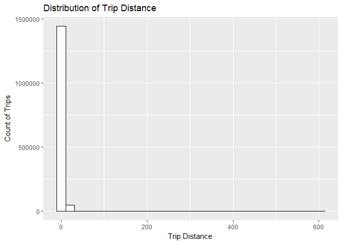

``` r
ggplot(greenTrip, aes(x = Trip_distance)) + 
  geom_histogram(colour = "black", fill = "white") + xlim(c(-1, 150)) +
  labs(title = "Distribution of Trip Distance (0-150 miles)",
       x = "Trip Distance", y = "Count of Trips")
```

    ## `stat_bin()` using `bins = 30`. Pick better value with `binwidth`.

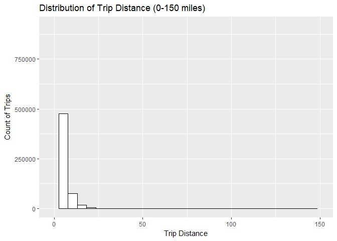

``` r
ggplot(greenTrip,aes(x = Trip_distance))+
  geom_histogram(colour = "black", fill = "white") +
  labs(x="Trip_distance",y="Count of Trips",
       title="Distribution of Trip Distance (0-15 miles)") +
  scale_x_continuous(breaks = scales::pretty_breaks(n=8), limits = c(-1,15)) +
  geom_vline(aes(xintercept = mean(Trip_distance),colour = "mean")
            , linetype = "dotdash", lwd = 1)+
  geom_vline(aes(xintercept = median(Trip_distance),colour = "median")
            , linetype = "twodash", lwd = 1)+
  geom_vline(aes(xintercept = sd(Trip_distance),colour = "sd")
            , linetype = "solid", lwd = 1)+
  geom_vline(aes(xintercept = quantile(Trip_distance, 0.95)
            ,colour = "quantile"), linetype = "dashed", lwd = 1) +
  scale_colour_manual(name="Line Color", 
            values=c(mean="blue", median="cyan", sd="chocolate", quantile="green"))
```

    ## `stat_bin()` using `bins = 30`. Pick better value with `binwidth`.

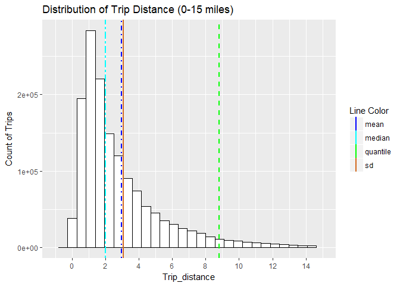

``` r
ggplot(greenTrip,aes(x = log(Trip_distance)))+
  geom_histogram(colour = "black", fill = "white") +
  labs(x="Log(Trip_distance)",y="Count of Trips",
       title="Distribution of Log Transformed Trip Distance") +
  scale_x_continuous(breaks = scales::pretty_breaks(n=8))
```

    ## `stat_bin()` using `bins = 30`. Pick better value with `binwidth`.

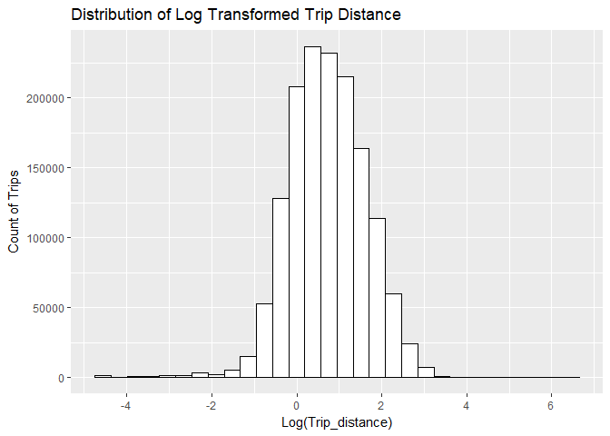

From the histogram of the complete trip distance, I found the most of the data clustered around 0 to 150 miles. But, due to the presence of outliers we are not able to view the complete distribution. Zooming in on trip distance, between 0 and 150 miles, I find the data to be distributed within 15 miles.

Limiting the trip distance to 15 miles and plotting the mean, median, standard deviation and quantiles, I find the distribution asymmetric and positively skewed. The structure of the distribution is lognormal (<http://people.stern.nyu.edu/adamodar/New_Home_Page/StatFile/statdistns.htm> - Figure 6A.9: Lognormal distribution). It's standard deviation is 3.07 miles, which is higher than mean (2.96 miles) and the median (1.98 miles). From the 95th quantile, I found 95% of trip distance to be within 8.8 miles.

From the histogram, I found most of the data to be clustered around 0 to 4 miles. My hypothesis - most people tend to use the green taxis for short range distances as nearly 14000 passengers tend to commute within 8 miles. So, these passengers most often be rushing for work or to airports (distance between Queens and JFK, Queens and LaGuardia airport is nearly 6 miles), where the green taxis operate.

Question 3 - Mean & Median by group
===================================

For the next part of my analysis, I will be looking at the trip distance grouped by the hour of day.

**Assumptions:** The pickUp\_datetime feature contains the date and time a passenger boarded the taxi and will be used for for calculating the hour of day. As we are not considering the travel time, dropOff\_datetime will not be considered for calculating the hour of day.

``` r
pickUpHour = hour(lpep_pickup_datetime)
tripDistance.median = aggregate(Trip_distance ~ pickUpHour, FUN = median, data = greenTrip)
tripDistance.mean = aggregate(Trip_distance ~ pickUpHour, FUN = mean, data = greenTrip)

cat("\n\n Median Trip Distance by Pick-up hour is:\n")
```

    ## 
    ## 
    ##  Median Trip Distance by Pick-up hour is:

``` r
tripDistance.median
```

    ##    pickUpHour Trip_distance
    ## 1           0          2.20
    ## 2           1          2.12
    ## 3           2          2.14
    ## 4           3          2.20
    ## 5           4          2.36
    ## 6           5          2.90
    ## 7           6          2.84
    ## 8           7          2.17
    ## 9           8          1.98
    ## 10          9          1.96
    ## 11         10          1.92
    ## 12         11          1.88
    ## 13         12          1.89
    ## 14         13          1.84
    ## 15         14          1.83
    ## 16         15          1.81
    ## 17         16          1.80
    ## 18         17          1.78
    ## 19         18          1.80
    ## 20         19          1.85
    ## 21         20          1.90
    ## 22         21          2.03
    ## 23         22          2.20
    ## 24         23          2.22

``` r
ggplot(tripDistance.median, aes(x = pickUpHour, y = Trip_distance)) + geom_point() + 
  labs(title = "Median Trip Distance for each Pick-Up Hour",
       x = "Pick-Up Hour", y = "Median Trip Distance")
```

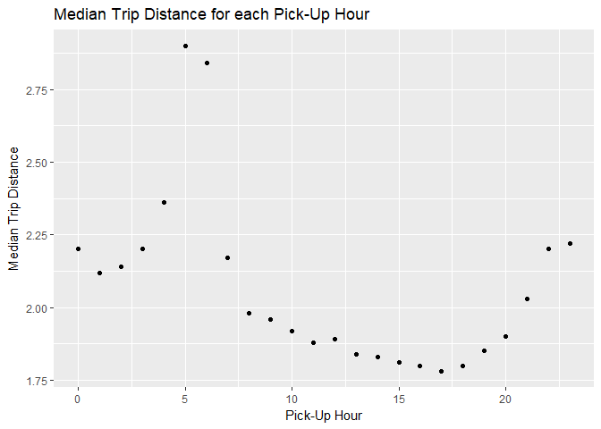

``` r
cat("\n\n Mean Trip Distance by Pick-up hour is:\n")
```

    ## 
    ## 
    ##  Mean Trip Distance by Pick-up hour is:

``` r
tripDistance.mean
```

    ##    pickUpHour Trip_distance
    ## 1           0      3.115276
    ## 2           1      3.017347
    ## 3           2      3.046176
    ## 4           3      3.212945
    ## 5           4      3.526555
    ## 6           5      4.133474
    ## 7           6      4.055149
    ## 8           7      3.284394
    ## 9           8      3.048450
    ## 10          9      2.999105
    ## 11         10      2.944482
    ## 12         11      2.912015
    ## 13         12      2.903065
    ## 14         13      2.878294
    ## 15         14      2.864304
    ## 16         15      2.857040
    ## 17         16      2.779852
    ## 18         17      2.679114
    ## 19         18      2.653222
    ## 20         19      2.715597
    ## 21         20      2.777052
    ## 22         21      2.999189
    ## 23         22      3.185394
    ## 24         23      3.191538

``` r
ggplot(tripDistance.mean, aes(x = pickUpHour, y = Trip_distance)) + geom_point() + 
  labs(title = "Mean Trip Distance for each Pick-Up Hour",
       x = "Pick-Up Hour", y = "Mean Trip Distance")
```

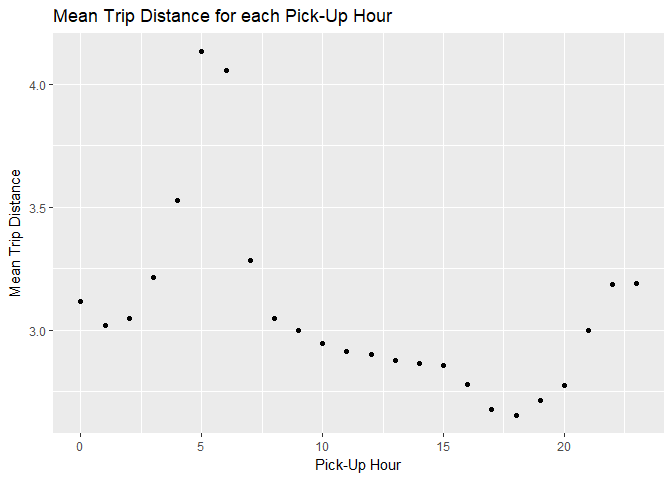

``` r
rm(tripDistance.mean, tripDistance.median)
```

Plotting the mean and median of the trip distance grouping by hour, I find that people tend to travel during the peak hours - early morning between 5:00 AM to 8:00 AM and at night after 8:00 PM.

**My hypothesis** Passengers tend to travel more distance at the early hour peak - say, rushing to catch flights or going to work (early shift or a presentation and don't want to be late), and at night after 8:00 PM - say, after working late hours at office. Based on the <http://www.businessinsider.com/heres-why-new-york-city-air-traffic-is-so-congested-2015-7>, travelers at NYC consider the best time to fly out at early mornings (6:00 AM) which justifies the peak at around 5:00 AM for long distance commute (distance between NYC and Newark is 20 miles).

Question 3 - Airport trip report
================================

Now I will be looking at the characteristics of the trips originating and terminating at the airports.

**Assumptions**

-   Newark airport is generally considered as NYC airport (all google searches yielded this) even though it is in New Jersey

-   <http://www.nyc.gov/html/tlc/html/passenger/taxicab_rate.shtml> - taxi cabs having a RateCodeID of '02' and '03' have pick-up or drop-off points at JFK and Newark airport respectively

-   Got the co-ordinates of Newark, LaGuardia and JFK airports using google and derived a boundary (given below) that covers the area around these airports

JFK Airport:
Minimum Latitude is 40.63
Maximum Latitude is 40.65
Minimum Longitude is -73.82
Maximum Longitude is -73.75

LaGuardia Airport:
Minimum Latitude is 40.76
Maximum Latitude is 40.78
Minimum Longitude is -73.89
Maximum Longitude is -73.85

Newark Airport:
Minimum Latitude is 40.67
Maximum Latitude is 40.71
Minimum Longitude is -74.19
Maximum Longitude is -74.15

Initially, I specified the bounding co-ordinates of the airports for analysis and found the data points to be very less. Looking at the data dictionary (<http://www.nyc.gov/html/tlc/downloads/pdf/data_dictionary_trip_records_green.pdf>), I found the rate code id to be a good indicator for identifying trips that originated or terminated at one of the NYC area airports. Finally, I merged the data from rate code id and co-ordinates to derive the final value.

``` r
jfkLatMin = 40.63
jfkLatMax = 40.65
jfkLongMax = -73.75
jfkLongMin = -73.82
lagLatMin = 40.76
lagLatMax = 40.78
lagLongMin = -73.89
lagLongMax = -73.85
newLatMin = 40.67
newLatMax = 40.71
newLongMin = -74.19
newLongMax = -74.15

airport = subset(greenTrip, (
  (round(Pickup_longitude,2) >= newLongMin & round(Pickup_longitude,2) <= newLongMax 
   & round(Pickup_latitude,2) >= newLatMin & round(Pickup_latitude,2) == newLatMax) |
  (round(Dropoff_longitude,2) >= newLongMin & round(Dropoff_longitude,2) <= newLongMax 
   & round(Dropoff_latitude,2) >= newLatMin & round(Dropoff_latitude,2) == newLatMax) |
    (round(Pickup_longitude,2) >= lagLongMin & round(Pickup_longitude,2) <= lagLatMax 
     & round(Pickup_latitude,2) >= lagLatMin & round(Pickup_latitude,2) == lagLatMax) |
    (round(Dropoff_longitude,2) >= lagLongMin & round(Dropoff_longitude,2) <= lagLatMax 
     & round(Dropoff_longitude,2) >= lagLatMin & round(Dropoff_longitude,2) == lagLatMax) |
    (round(Pickup_longitude,2) >= jfkLongMin & round(Pickup_longitude,2) <= jfkLongMax 
     & round(Pickup_latitude,2) >= jfkLatMin & round(Pickup_latitude,2) == jfkLatMax) |
    (round(Dropoff_longitude,2) >= jfkLongMin & round(Dropoff_longitude,2) <= jfkLongMax 
     & round(Dropoff_longitude,2) >= jfkLatMin & round(Dropoff_longitude,2) == jfkLatMax)))
cat("\n\nNumber of Transactions that originate or terminate at 
    one of the NYC area airports (only latitude & longitude): ", nrow(airport))
```

    ## 
    ## 
    ## Number of Transactions that originate or terminate at 
    ##     one of the NYC area airports (only latitude & longitude):  372

``` r
cat("\n\nAverage fair amount that originate or terminate at 
    one of the NYC area airports per trip (only latitude & longitude): $", mean(airport$Fare_amount))
```

    ## 
    ## 
    ## Average fair amount that originate or terminate at 
    ##     one of the NYC area airports per trip (only latitude & longitude): $ 32.56546

``` r
rm(airport)

airportRateCode = subset(greenTrip, (RateCodeID == '2') | (RateCodeID == '3'), group = "A")
nonAirportRateCode = subset(greenTrip, (RateCodeID != '2') & (RateCodeID != '3'), group = "NA")
cat("\n\nNumber of Transactions that originate or terminate at one of the NYC area airports
    (only rate code id): ", nrow(airportRateCode))
```

    ## 
    ## 
    ## Number of Transactions that originate or terminate at one of the NYC area airports
    ##     (only rate code id):  5552

``` r
cat("\n\nAverage fair amount that originate or terminate at one of the NYC area airports per
    trip (only rate code id): $", mean(airportRateCode$Fare_amount))
```

    ## 
    ## 
    ## Average fair amount that originate or terminate at one of the NYC area airports per
    ##     trip (only rate code id): $ 48.97695

``` r
airport = subset(greenTrip, (
  (((round(Pickup_longitude,2) >= newLongMin & round(Pickup_longitude,2) <= newLongMax 
     & round(Pickup_latitude,2) >= newLatMin & round(Pickup_latitude,2) == newLatMax) |
  (round(Dropoff_longitude,2) >= newLongMin & round(Dropoff_longitude,2) <= newLongMax 
   & round(Dropoff_latitude,2) >= newLatMin & round(Dropoff_latitude,2) == newLatMax)) 
  | (RateCodeID == '3')) |
    (round(Pickup_longitude,2) >= lagLongMin & round(Pickup_longitude,2) <= lagLatMax 
     & round(Pickup_latitude,2) >= lagLatMin & round(Pickup_latitude,2) == lagLatMax) |
    (round(Dropoff_longitude,2) >= lagLongMin & round(Dropoff_longitude,2) <= lagLatMax 
     & round(Dropoff_longitude,2) >= lagLatMin & round(Dropoff_longitude,2) == lagLatMax) |
    (((round(Pickup_longitude,2) >= jfkLongMin & round(Pickup_longitude,2) <= jfkLongMax 
       & round(Pickup_latitude,2) >= jfkLatMin & round(Pickup_latitude,2) == jfkLatMax) |
    (round(Dropoff_longitude,2) >= jfkLongMin & round(Dropoff_longitude,2) <= jfkLongMax 
     & round(Dropoff_longitude,2) >= jfkLatMin & round(Dropoff_longitude,2) == jfkLatMax)) 
    | (RateCodeID == '2'))))
cat("\n\nNumber of Transactions that originate or terminate at 
    one of the NYC area airports (latitude, longitude and rate code id): ", nrow(airport))
```

    ## 
    ## 
    ## Number of Transactions that originate or terminate at 
    ##     one of the NYC area airports (latitude, longitude and rate code id):  5897

``` r
cat("\n\nAverage fair amount that originate or terminate at 
    one of the NYC area airports per trip (latitude, longitude and rate code id): $", mean(airport$Fare_amount))
```

    ## 
    ## 
    ## Average fair amount that originate or terminate at 
    ##     one of the NYC area airports per trip (latitude, longitude and rate code id): $ 47.8928

Other important characteristics considered are:

-   Distribution of Trip Duration

-   Distribution of Trip Distance

-   Distribution of Trip Pick-up hour

``` r
airportN = subset(greenTrip, (
  (round(Pickup_longitude,2) >= newLongMin & round(Pickup_longitude,2) <= newLongMax &
     round(Pickup_latitude,2) >= newLatMin & round(Pickup_latitude,2) == newLatMax) |
  (round(Dropoff_longitude,2) >= newLongMin & round(Dropoff_longitude,2) <= newLongMax 
   & round(Dropoff_latitude,2) >= newLatMin & round(Dropoff_latitude,2) == newLatMax)))

airportL = subset(greenTrip, ((round(Pickup_longitude,2) >= lagLongMin & 
                                 round(Pickup_longitude,2) <= lagLatMax & 
                                 round(Pickup_latitude,2) >= lagLatMin & 
                                 round(Pickup_latitude,2) == lagLatMax) |
    (round(Dropoff_longitude,2) >= lagLongMin & 
       round(Dropoff_longitude,2) <= lagLatMax & 
       round(Dropoff_longitude,2) >= lagLatMin & 
       round(Dropoff_longitude,2) == lagLatMax)))

airportJ = subset(greenTrip, ((round(Pickup_longitude,2) >= jfkLongMin & 
                                 round(Pickup_longitude,2) <= jfkLongMax & 
                                 round(Pickup_latitude,2) >= jfkLatMin & 
                                 round(Pickup_latitude,2) == jfkLatMax) |
    (round(Dropoff_longitude,2) >= jfkLongMin & 
       round(Dropoff_longitude,2) <= jfkLongMax & 
       round(Dropoff_longitude,2) >= jfkLatMin & 
       round(Dropoff_longitude,2) == jfkLatMax)))

par(mfrow=c(1,3))

ggplot(airportN, aes(x = airportN$Trip_distance)) + 
  geom_histogram(colour = "black", fill = "white") + xlim(-1, 40) +
  labs(title = "Distribution of Trip Distance - JFK",
       x = "Trip Distance", y = "Count of Trips")
```

    ## `stat_bin()` using `bins = 30`. Pick better value with `binwidth`.

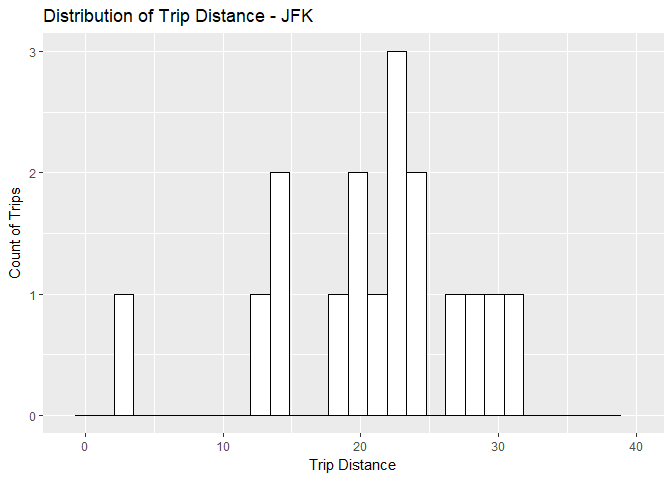

``` r
ggplot(airportL, aes(x = airportL$Trip_distance)) + 
  geom_histogram(colour = "black", fill = "white") + xlim(-1, 40) +
  labs(title = "Distribution of Trip Distance - LaGuardia",
       x = "Trip Distance", y = "Count of Trips")
```

    ## `stat_bin()` using `bins = 30`. Pick better value with `binwidth`.

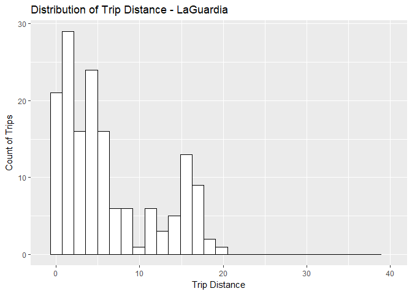

``` r
ggplot(airportJ, aes(x = airportJ$Trip_distance)) + 
  geom_histogram(colour = "black", fill = "white") + xlim(-1, 40) +
  labs(title = "Distribution of Trip Distance - Newark ",
       x = "Trip Distance", y = "Count of Trips")
```

    ## `stat_bin()` using `bins = 30`. Pick better value with `binwidth`.

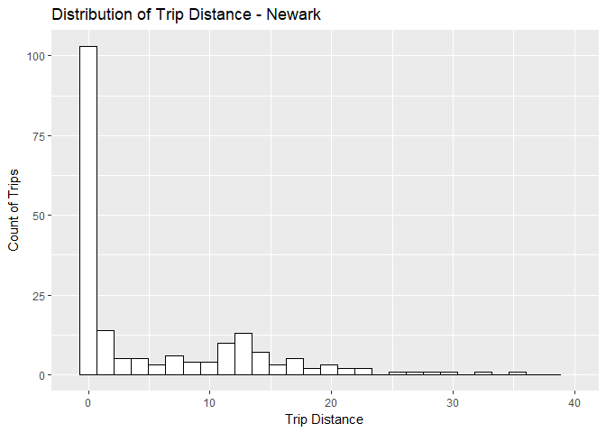

``` r
par(mfrow=c(1,2))

ggplot(airportRateCode, aes(x = airportRateCode$Trip_distance)) + 
  geom_histogram(colour = "black", fill = "white") + xlim(-1, 40) +
  labs(title = "Distribution of Trip Distance - Airport Area",
       x = "Trip Distance", y = "Count of Trips")
```

    ## `stat_bin()` using `bins = 30`. Pick better value with `binwidth`.

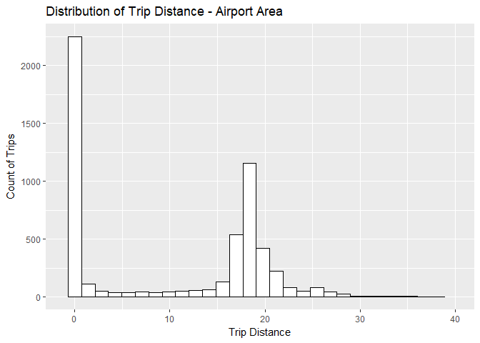

``` r
ggplot(nonAirportRateCode, aes(x = nonAirportRateCode$Trip_distance)) + 
  geom_histogram(colour = "black", fill = "white") + xlim(-1, 20) +
  labs(title = "Distribution of Trip Distance - Non-Airport Area",
       x = "Trip Distance", y = "Count of Trips")
```

    ## `stat_bin()` using `bins = 30`. Pick better value with `binwidth`.

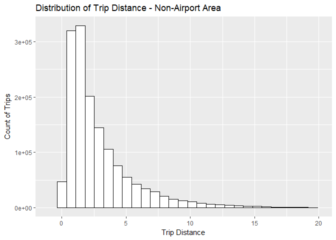

``` r
airportRateCode$airportPickUpHour = hour(airportRateCode$lpep_pickup_datetime)

ggplot(airportRateCode, aes(x = airportRateCode$airportPickUpHour)) + 
  geom_histogram(colour = "black", fill = "white") +
  labs(title = "Distribution of Trip Pick-up hour - Airport Area",
       x = "Trip Pick-up hour(24 hour)", y = "Count of Trips")
```

    ## `stat_bin()` using `bins = 30`. Pick better value with `binwidth`.

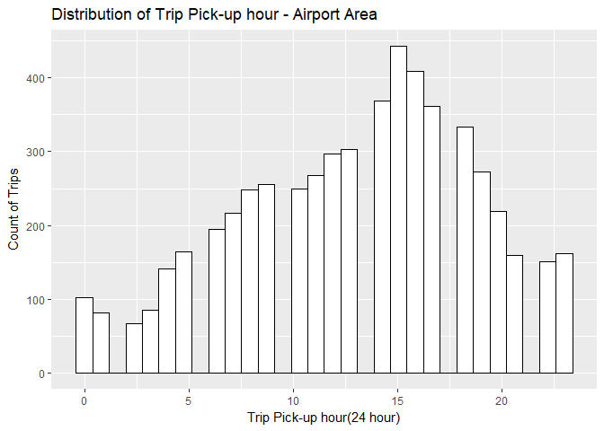

``` r
nonAirportRateCode$airportPickUpHour = hour(nonAirportRateCode$lpep_pickup_datetime)

ggplot(nonAirportRateCode, aes(x = nonAirportRateCode$airportPickUpHour)) + 
  geom_histogram(colour = "black", fill = "white") +
  labs(title = "Distribution of Trip Pick-up hour - Non-Airport Area",
       x = "Trip Pick-up hour(24 hour)", y = "Count of Trips")
```

    ## `stat_bin()` using `bins = 30`. Pick better value with `binwidth`.

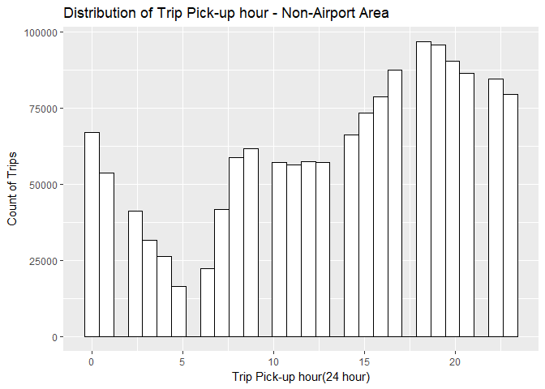

``` r
airportRateCode$duration <- difftime(
  airportRateCode$Lpep_dropoff_datetime,airportRateCode$lpep_pickup_datetime,
  units="mins")

ggplot(airportRateCode, aes(x = airportRateCode$duration)) + 
  geom_histogram(colour = "black", fill = "white") + xlim(-1, 150) + ylim(0,500) +
  labs(title = "Distribution of Trip Duration - Airport Area",
       x = "Trip Duration(mins)", y = "Count of Trips")
```

    ## `stat_bin()` using `bins = 30`. Pick better value with `binwidth`.

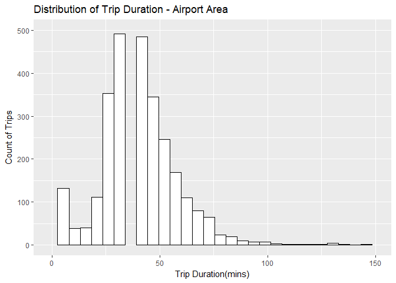

``` r
nonAirportRateCode$duration <- difftime(
  nonAirportRateCode$Lpep_dropoff_datetime,nonAirportRateCode$lpep_pickup_datetime,
  units="mins")

ggplot(nonAirportRateCode, aes(x = nonAirportRateCode$duration)) + 
  geom_histogram(colour = "black", fill = "white") + xlim(-1, 75) +
  labs(title = "Distribution of Trip Duration - Non-Airport Area",
       x = "Trip Duration(mins)", y = "Count of Trips")
```

    ## `stat_bin()` using `bins = 30`. Pick better value with `binwidth`.

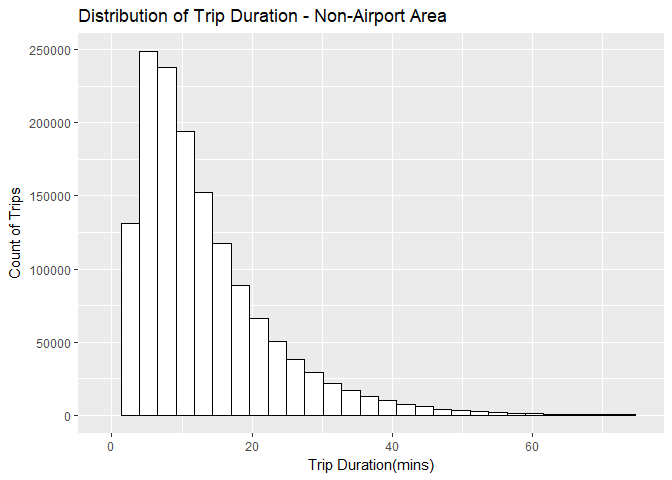

``` r
rm(airport, airportRateCode, nonAirportRateCode, airportL, airportJ, airportN)
```

Based on the graphs above, we can see that

-   Passengers tend to travel to and from LaGuardia using green taxis as they are closer to the NYC boroughs and have a shorter travel distance as well. Passengers using JFK and Newark have a high travel distance and lesser count, comparatively.

-   Trips distances to and from airports tend to be around 20 miles (with a minimum of 12 miles from NYC to LaGuardia and a maximum of 20 miles from NYC to Newark), while trips not originating or terminating at airports cover shorter distances with most travels within 5 miles.

-   The distribution for the pick-up hour is nearly the same for airport and non-airport pick-ups, with airport pick-up hour peaking at 03:00 PM and non-airport pick-ups peaking at around 07:00 PM. I can hypothesise that passengers commuting within city, tend to take taxis when they need late night travel and commuters to airports (based on the <http://www.businessinsider.com/heres-why-new-york-city-air-traffic-is-so-congested-2015-7> report) like to travel from early hours to mid-day, this trend can be found in the graphs.

-   The distribution of trip duration shows how travelling in the city for shorter distances takes shorter time (with most data points around 0 to 20 mins) and the airport trips last longer (with most data points around 50 mins). The longer travel distance for Airport area can be credit to the tourists, most of whom on a tight schedule would want to cover attractions or have a stop-over at friends before their destination, or a passenger opting for a round-about trip while dropping off or picking up their friends or relatives at airports.

Question 4 - Tip Percent
========================

Now I will analyze the derived variable - tip percent, tip amount as a percentage of the total fare amount.

Summarizing the tip percentage, we find 4172 records having 'NA' as their tip percentage.

Decoding further, I found the presence of a data points having the total amount as a negative value (with 0 tip) and 0.

Looking at the NYC taxi minimum fare amount from <http://nymag.com/nymetro/urban/features/taxi/n_20286/> & <http://www.nyc.gov/html/tlc/html/passenger/taxicab_rate.shtml> - I found an initial charge of $2.00 charged for a ride (with airports having a minimum fixed cost), which had been increased to 2.50$.

And so, I filter on the total amount that have a value either equal or more than the initial charge.

``` r
greenTrip$percTip = Tip_amount * 100 / Total_amount
summary(greenTrip$percTip)
```

    ##    Min. 1st Qu.  Median    Mean 3rd Qu.    Max.    NA's 
    ##   0.000   0.000   0.000   6.654  16.667 100.000    4172

``` r
attach(greenTrip)
```

    ## The following objects are masked from greenTrip (pos = 3):
    ## 
    ##     Dropoff_latitude, Dropoff_longitude, Ehail_fee, Extra,
    ##     Fare_amount, improvement_surcharge, Lpep_dropoff_datetime,
    ##     lpep_pickup_datetime, MTA_tax, Passenger_count, Payment_type,
    ##     Pickup_latitude, Pickup_longitude, RateCodeID,
    ##     Store_and_fwd_flag, Tip_amount, Tolls_amount, Total_amount,
    ##     Trip_distance, Trip_type, VendorID

``` r
minFare = subset(greenTrip, Total_amount>=2)
minFare$percTip = minFare$Tip_amount * 100 / minFare$Total_amount
summary(minFare$percTip)
```

    ##    Min. 1st Qu.  Median    Mean 3rd Qu.    Max. 
    ##   0.000   0.000   0.000   6.666  16.667 100.000

``` r
nrow(minFare)
```

    ## [1] 1487889

``` r
mean(minFare$percTip)
```

    ## [1] 6.665601

``` r
sd(minFare$percTip)
```

    ## [1] 8.876661

``` r
hist(minFare$percTip, xlab = "Percentage Tip", ylab = "Count",
     main = "Histogram of Percentage Tip", xlim = c(0, 40), breaks = 50)
```

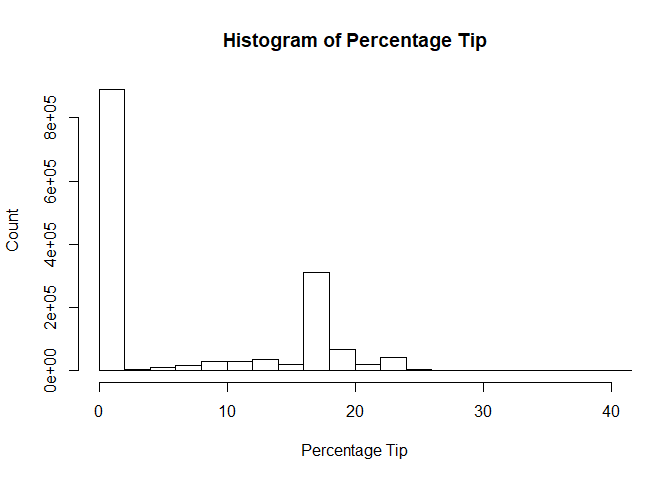

Looking at the data distribution, I find most of the passengers giving no tip and mean of tip percent at 17%, which is a good predictor of USA's tipping culture, generally people tend to tip around 20% for good service.

Question 4 - Predictive Model
=============================

Now I begin building the predictive model for tip percentage.

As the first step, I will start performing data cleansing.

Displaying the statistical information of green taxis data -

``` r
stat.desc(greenTrip)
```

    ##                  VendorID lpep_pickup_datetime Lpep_dropoff_datetime
    ## nbr.val      1.494926e+06                   NA                    NA
    ## nbr.null     0.000000e+00                   NA                    NA
    ## nbr.na       0.000000e+00                   NA                    NA
    ## min          1.000000e+00                   NA                    NA
    ## max          2.000000e+00                   NA                    NA
    ## range        1.000000e+00                   NA                    NA
    ## sum          2.664025e+06                   NA                    NA
    ## median       2.000000e+00                   NA                    NA
    ## mean         1.782045e+00                   NA                    NA
    ## SE.mean      3.376679e-04                   NA                    NA
    ## CI.mean.0.95 6.618175e-04                   NA                    NA
    ## var          1.704509e-01                   NA                    NA
    ## std.dev      4.128570e-01                   NA                    NA
    ## coef.var     2.316760e-01                   NA                    NA
    ##              Store_and_fwd_flag   RateCodeID Pickup_longitude
    ## nbr.val                      NA 1.494926e+06     1.494926e+06
    ## nbr.null                     NA 0.000000e+00     2.110000e+03
    ## nbr.na                       NA 0.000000e+00     0.000000e+00
    ## min                          NA 1.000000e+00    -8.331908e+01
    ## max                          NA 9.900000e+01     0.000000e+00
    ## range                        NA 9.800000e+01     8.331908e+01
    ## sum                          NA 1.640910e+06    -1.103716e+08
    ## median                       NA 1.000000e+00    -7.394536e+01
    ## mean                         NA 1.097653e+00    -7.383084e+01
    ## SE.mean                      NA 5.201263e-04     2.270505e-03
    ## CI.mean.0.95                 NA 1.019430e-03     4.450111e-03
    ## var                          NA 4.044245e-01     7.706630e+00
    ## std.dev                      NA 6.359437e-01     2.776082e+00
    ## coef.var                     NA 5.793668e-01    -3.760057e-02
    ##              Pickup_latitude Dropoff_longitude Dropoff_latitude
    ## nbr.val         1.494926e+06      1.494926e+06     1.494926e+06
    ## nbr.null        2.110000e+03      1.963000e+03     1.963000e+03
    ## nbr.na          0.000000e+00      0.000000e+00     0.000000e+00
    ## min             0.000000e+00     -8.342784e+01     0.000000e+00
    ## max             4.317726e+01      0.000000e+00     4.279934e+01
    ## range           4.317726e+01      8.342784e+01     4.279934e+01
    ## sum             6.083025e+07     -1.103813e+08     6.083288e+07
    ## median          4.074674e+01     -7.394504e+01     4.074728e+01
    ## mean            4.069114e+01     -7.383728e+01     4.069291e+01
    ## SE.mean         1.252079e-03      2.190213e-03     1.207763e-03
    ## CI.mean.0.95    2.454032e-03      4.292742e-03     2.367175e-03
    ## var             2.343600e+00      7.171209e+00     2.180637e+00
    ## std.dev         1.530882e+00      2.677911e+00     1.476698e+00
    ## coef.var        3.762199e-02     -3.626774e-02     3.628883e-02
    ##              Passenger_count Trip_distance   Fare_amount         Extra
    ## nbr.val         1.494926e+06  1.494926e+06  1.494926e+06  1.494926e+06
    ## nbr.null        4.400000e+02  2.059200e+04  4.468000e+03  6.845240e+05
    ## nbr.na          0.000000e+00  0.000000e+00  0.000000e+00  0.000000e+00
    ## min             0.000000e+00  0.000000e+00 -4.750000e+02 -1.000000e+00
    ## max             9.000000e+00  6.031000e+02  5.805000e+02  1.200000e+01
    ## range           9.000000e+00  6.031000e+02  1.055500e+03  1.300000e+01
    ## sum             2.048942e+06  4.437151e+06  1.875115e+07  5.251376e+05
    ## median          1.000000e+00  1.980000e+00  9.500000e+00  5.000000e-01
    ## mean            1.370598e+00  2.968141e+00  1.254320e+01  3.512800e-01
    ## SE.mean         8.501270e-04  2.516310e-03  8.246516e-03  2.995977e-04
    ## CI.mean.0.95    1.666220e-03  4.931881e-03  1.616289e-02  5.872012e-04
    ## var             1.080407e+00  9.465596e+00  1.016625e+02  1.341828e-01
    ## std.dev         1.039426e+00  3.076621e+00  1.008278e+01  3.663096e-01
    ## coef.var        7.583744e-01  1.036548e+00  8.038446e-01  1.042785e+00
    ##                    MTA_tax    Tip_amount  Tolls_amount Ehail_fee
    ## nbr.val       1.494926e+06  1.494926e+06  1.494926e+06        NA
    ## nbr.null      3.556800e+04  8.921560e+05  1.463043e+06        NA
    ## nbr.na        0.000000e+00  0.000000e+00  0.000000e+00        NA
    ## min          -5.000000e-01 -5.000000e+01 -1.529000e+01        NA
    ## max           5.000000e-01  3.000000e+02  9.575000e+01        NA
    ## range         1.000000e+00  3.500000e+02  1.110400e+02        NA
    ## sum           7.274920e+05  1.847320e+06  1.840324e+05        NA
    ## median        5.000000e-01  0.000000e+00  0.000000e+00        NA
    ## mean          4.866408e-01  1.235727e+00  1.231047e-01        NA
    ## SE.mean       6.955647e-05  1.988658e-03  7.287432e-04        NA
    ## CI.mean.0.95  1.363283e-04  3.897701e-03  1.428312e-03        NA
    ## var           7.232606e-03  5.912075e+00  7.939054e-01        NA
    ## std.dev       8.504473e-02  2.431476e+00  8.910137e-01        NA
    ## coef.var      1.747587e-01  1.967649e+00  7.237855e+00        NA
    ##              improvement_surcharge  Total_amount Payment_type    Trip_type
    ## nbr.val               1.494926e+06  1.494926e+06 1.494926e+06 1.494922e+06
    ## nbr.null              3.494100e+04  4.172000e+03 0.000000e+00 0.000000e+00
    ## nbr.na                0.000000e+00  0.000000e+00 0.000000e+00 4.000000e+00
    ## min                  -3.000000e-01 -4.750000e+02 1.000000e+00 1.000000e+00
    ## max                   3.000000e-01  5.813000e+02 5.000000e+00 2.000000e+00
    ## range                 6.000000e-01  1.056300e+03 4.000000e+00 1.000000e+00
    ## sum                   4.366665e+05  2.247195e+07 2.303021e+06 1.528338e+06
    ## median                3.000000e-01  1.176000e+01 2.000000e+00 1.000000e+00
    ## mean                  2.920991e-01  1.503215e+01 1.540559e+00 1.022353e+00
    ## SE.mean               4.149936e-05  9.449107e-03 4.279918e-04 1.209066e-04
    ## CI.mean.0.95          8.133732e-05  1.851992e-02 8.388492e-04 2.369727e-04
    ## var                   2.574557e-03  1.334754e+02 2.738360e-01 2.185336e-02
    ## std.dev               5.074009e-02  1.155316e+01 5.232935e-01 1.478288e-01
    ## coef.var              1.737085e-01  7.685633e-01 3.396778e-01 1.445967e-01
    ##                   percTip
    ## nbr.val      1.490754e+06
    ## nbr.null     8.879840e+05
    ## nbr.na       4.172000e+03
    ## min          0.000000e+00
    ## max          1.000000e+02
    ## range        1.000000e+02
    ## sum          9.919218e+06
    ## median       0.000000e+00
    ## mean         6.653826e+00
    ## SE.mean      7.268974e-03
    ## CI.mean.0.95 1.424694e-02
    ## var          7.876843e+01
    ## std.dev      8.875158e+00
    ## coef.var     1.333843e+00

As we can see from the statistical information, the data for ehail\_fee is all N/A, we can drop the feature from dataset.

``` r
hist(Payment_type, xlab = "Payment type", ylab = "Count",
     main = "Histogram of Payment type")
```


``` r
plot(Payment_type, percTip, xlab = "Payment type", ylab = "Tip Percent",
     main = "Plot of Payment type vs Tip Percent")
```


``` r
modelData = subset(greenTrip, 
                   select=c(VendorID,lpep_pickup_datetime,Lpep_dropoff_datetime,RateCodeID,
                            Pickup_longitude,Pickup_latitude,Dropoff_longitude,Dropoff_latitude,
                            Passenger_count,Trip_distance,Fare_amount,Extra,MTA_tax,Tip_amount,
                            Tolls_amount,improvement_surcharge,Total_amount,Payment_type,Trip_type))

modelData <- modelData[(modelData$Payment_type == 1),]

modelData = subset(modelData, 
                   select=c(VendorID,lpep_pickup_datetime,Lpep_dropoff_datetime,RateCodeID,
                            Pickup_longitude,Pickup_latitude,Dropoff_longitude,Dropoff_latitude,
                            Passenger_count,Trip_distance,Fare_amount,Extra,MTA_tax,Tip_amount,
                            Tolls_amount,improvement_surcharge,Total_amount,Trip_type))

rm(minFare)
```

Analyzing the dataset I found approximately 40% of the transactions having a tip. Looking at the scatter plot of payment type against the tip percentage, I found more than 90% of the tip received has been from credit card.

There are hardly any passengers tipping by cash. We will not consider payment type 3, 4 or 5 as they do not charge the customer, have a dispute or voided trip. None of these payment types (2, 3, 4 or 5) will contribute to a tip. Any tip wherein the customer is not charged for the ride can be considered as a "gesture of good will", but it not a good explanatory parameter.

And so, I have dropped the payment method field after filtering the data on credit card.

Next, I move on to cleansing the amount fields since the amounts cannot be negative. No additioanl information is available so as why the amount is negative, the below filters are applied:

-   NYC taxi minimum fare amount from <http://nymag.com/nymetro/urban/features/taxi/n_20286/> & <http://www.nyc.gov/html/tlc/html/passenger/taxicab_rate.shtml> - initial charge of $2.00 charged for a ride. (0.49% of data has negative amount)

-   Analyzing on the Tip\_amount, I found nearly 2000 records have tip amount more than the total charge (Fare\_amount+Extra+MTA\_tax+improvement\_surcharge). These might have happened by chance (someone must have gotten lucky or it could be an outlier). These records are filtered.

After applying the above filter, I found no negative amounts in improvement\_surcharge, MTA\_tax, Tolls\_amount and so no filters are applied on these fields.

Percentage tip is re-calculated for the new subset of data as a derivative of fare\_amount, MTA\_tax and improvement surcharge (I have not used the total\_amount as the total\_amount is inclusive of tip amount).

``` r
modelData <- modelData[(modelData$Fare_amount >= 2),]
hist(modelData$improvement_surcharge, xlab = "Improvement Surcharge", ylab = "Count",
     main = "Histogram of Improvement Surcharge")
```


``` r
hist(modelData$MTA_tax, xlab = "MTA tax", ylab = "Count",
     main = "Histogram of MTA tax")
```


``` r
hist(modelData$Tolls_amount, xlab = "Tolls Amount", ylab = "Count",
     main = "Histogram of Tolls Amount")
```


``` r
hist(modelData$Tip_amount, xlab = "Tip Amount", ylab = "Count",
     main = "Histogram of Tip Amount")
```


``` r
tipDisc = modelData$Tip_amount[modelData$Tip_amount>
                                 (modelData$Fare_amount+modelData$MTA_tax+modelData$improvement_surcharge)]
modelData <- modelData[!(modelData$Tip_amount>
                           (modelData$Fare_amount+modelData$MTA_tax+modelData$improvement_surcharge)),]

modelData$percTip=modelData$Tip_amount*100/(modelData$Fare_amount+modelData$MTA_tax+modelData$improvement_surcharge)

hist(modelData$percTip, xlab = "Tip Percent", ylab = "Count", 
     main = "Histogram of Tip Percent")
```


The scatter plot of tip percent against trip distance shows that, as the distance increases, which in turn increases the fare amount, the number of passengers and trip percent decrease.

Next I move on to cleansing the rate code id, passenger count and geographic co-ordinates fields,

-   Count of passengers with RateCodeID greater than 4 are 473 with 81 of them tipping, a tiny sample

-   Count of passengers in group of 6 or more are 36 with 28 of them tipping, a tiny sample

-   New York City does not encompass longitude and latitudes of 0 degree (this can be due to a faulty device or incorrect caliberation)

-   Using <http://www.mapdevelopers.com/geocode_bounding_box.php>, the bounding co-ordinates of New York city are determined

Records matching the above conditions are filtered out.

``` r
plot(modelData$RateCodeID, modelData$percTip, 
     xlab = "Rate Code ID", ylab = "Tip Percent", 
     main = "Plot of Rate Code ID vs Tip Percent", 
     xlim = c(0,7))
```


``` r
plot(modelData$Trip_distance, modelData$percTip, 
     xlab = "Trip Distance", ylab = "Tip Percent", 
     main = "Plot of Trip Distance ID vs Tip Percent")
```


``` r
hist(modelData$Passenger_count, 
     xlab = "Passenger Count", ylab = "Count", 
     main = "Histogram of Passenger Count")
```


``` r
rateCodeTip = modelData$percTip[modelData$RateCodeID == 4 | modelData$RateCodeID>=6]
cat ("\nNumber of transactions with rate code id 4 & greater than 6: ", length(rateCodeTip))
```

    ## 
    ## Number of transactions with rate code id 4 & greater than 6:  473

``` r
cat ("\nNumber of transactions with rate code id 4 & greater than 6 who tip: ", length(rateCodeTip[rateCodeTip>0]))
```

    ## 
    ## Number of transactions with rate code id 4 & greater than 6 who tip:  392

``` r
passCntTip = modelData$percTip[modelData$Passenger_count>6]
cat ("\nNumber of transactions with more than 6 passengers: ", length(passCntTip))
```

    ## 
    ## Number of transactions with more than 6 passengers:  36

``` r
cat ("\nNumber of transactions with more than 6 passengers who tip: ", length(passCntTip[passCntTip>0]))
```

    ## 
    ## Number of transactions with more than 6 passengers who tip:  8

``` r
modelData <- modelData[!(modelData$RateCodeID == 4 | modelData$RateCodeID>=6),]
modelData <- modelData[!(modelData$Passenger_count>6),]

modelData <- modelData[!(modelData$Pickup_latitude == 0 |
                           modelData$Pickup_longitude == 0 |
                           modelData$Dropoff_longitude == 0 |
                           modelData$Dropoff_latitude == 0),]

modelData <- modelData[(modelData$Pickup_latitude >= 40.477399 
                        & modelData$Pickup_latitude <= 40.917577) & 
                         (modelData$Pickup_longitude >= -74.259090 
                          & modelData$Pickup_longitude <= -73.700272) & 
                         (modelData$Dropoff_latitude >= 40.477399 
                          & modelData$Dropoff_latitude <= 40.917577) & 
                         (modelData$Dropoff_longitude >= -74.259090 
                          & modelData$Dropoff_longitude <= -73.700272),]
```

As part of feature engineering, the below fields are derived:

-   trip\_duration - difference of drop-off and pick-up times in minutes

-   dayOfWeek - of the trip

-   dayOfMonth - of the trip

-   hour - of the trip

-   speed - of the trip in miles per hour

The below filters are applied on derived variables:

-   Trips longer than 200 minutes are discarded as these may be tourist trips, out of city trips which can be considered as outliers

-   The maximum speed limit in New York City is 50 mph and in United States is 137 mph. Trips with Speed more than 140 miles per hour are discarded as this can be attributed to a faulty device or incorrect calibration, and the sample size is small.

``` r
modelData$duration <- as.numeric(difftime(
  modelData$Lpep_dropoff_datetime,modelData$lpep_pickup_datetime,units="mins"))

hist(as.numeric(modelData$duration), xlab = "Duration", ylab = "Count",
     main = "Histogram of Duration", xlim = c(0,200))
```


``` r
cat ("\nNumber of transactions with duration greater than 200 miles: ", length(modelData$duration[modelData$duration>200]))
```

    ## 
    ## Number of transactions with duration greater than 200 miles:  3556

``` r
modelData <- modelData[(modelData$duration<=200),]

hist(modelData$Trip_distance, xlab = "Trip Distance", ylab = "Count",
     main = "Histogram of Trip Distance", xlim=c(0,25))
```


``` r
modelData$Speed <- modelData$Trip_distance/(as.numeric(modelData$duration)/60)
modelData$day = day(modelData$lpep_pickup_datetime)
modelData$hour = hour(modelData$lpep_pickup_datetime)
modelData$dayOfWeek = wday(modelData$lpep_pickup_datetime)

modelData <- modelData[!(modelData$Extra<0),]

cat ("\nNumber of transactions with Speed greater than 140 miles: ", length(modelData$Speed[!(is.finite(modelData$Speed) & is.na(modelData$Speed) & modelData$Speed > 140)]))
```

    ## 
    ## Number of transactions with Speed greater than 140 miles:  692520

``` r
modelData <- modelData[((is.finite(modelData$Speed) & !is.na(modelData$Speed) & modelData$Speed <= 140)),]
modelData$willTip[modelData$Tip_amount > 0] <- 1
modelData$willTip[modelData$percTip == 0] <- 0

modelData <- subset(modelData,
                    select=c(VendorID,RateCodeID,Pickup_longitude,Pickup_latitude,
                             Dropoff_longitude,Dropoff_latitude,Passenger_count,
                             Trip_distance,Fare_amount,Extra,MTA_tax,Tolls_amount,
                             improvement_surcharge,duration,Speed,day,hour,dayOfWeek,
                             willTip,percTip,Total_amount,Trip_type))
```

**Building the model: **

Now that data cleansing and engineering is complete, I begin to test the data for linearity.

The scatter plot of tip\_percent against rate code id, trip distance and payment type (displayed during data analysis), show that the independent and the dependent variables are not linearly related. Histogram of explanatory variables - payment\_type, trip\_distance and amount fields show the data points to be log linearly distributed.

To confirm linear regression model doesn't fit, I rum lm function on the features and determine the value of r-squared to be 0.04, which is too low for accuracy prediction.

**Code** for making predictions (logistic and loglinear) is provided in the rmd file along with instructions to run at the top of this file.

``` r
summary(lm(percTip ~ VendorID+RateCodeID+Pickup_longitude+Pickup_latitude
           +Dropoff_longitude+Dropoff_latitude+Passenger_count+Trip_distance
           +Fare_amount+Extra+MTA_tax+Tolls_amount+improvement_surcharge+
             duration+Speed+day+hour+dayOfWeek+Trip_type, data=modelData))
```

    ## 
    ## Call:
    ## lm(formula = percTip ~ VendorID + RateCodeID + Pickup_longitude + 
    ##     Pickup_latitude + Dropoff_longitude + Dropoff_latitude + 
    ##     Passenger_count + Trip_distance + Fare_amount + Extra + MTA_tax + 
    ##     Tolls_amount + improvement_surcharge + duration + Speed + 
    ##     day + hour + dayOfWeek + Trip_type, data = modelData)
    ## 
    ## Residuals:
    ##     Min      1Q  Median      3Q     Max 
    ## -85.939  -4.914   2.105   4.534  94.455 
    ## 
    ## Coefficients:
    ##                         Estimate Std. Error t value Pr(>|t|)    
    ## (Intercept)           -5.564e+02  2.707e+01 -20.558  < 2e-16 ***
    ## VendorID              -2.887e-01  2.818e-02 -10.243  < 2e-16 ***
    ## RateCodeID            -6.060e-01  1.254e-01  -4.834 1.34e-06 ***
    ## Pickup_longitude      -1.108e+01  3.879e-01 -28.568  < 2e-16 ***
    ## Pickup_latitude       -9.625e+00  3.442e-01 -27.963  < 2e-16 ***
    ## Dropoff_longitude     -6.810e+00  3.087e-01 -22.059  < 2e-16 ***
    ## Dropoff_latitude      -8.852e+00  3.472e-01 -25.496  < 2e-16 ***
    ## Passenger_count        7.733e-02  1.109e-02   6.976 3.04e-12 ***
    ## Trip_distance         -4.866e-02  1.146e-02  -4.248 2.16e-05 ***
    ## Fare_amount           -1.734e-02  3.039e-03  -5.706 1.15e-08 ***
    ## Extra                  1.231e+00  3.337e-02  36.898  < 2e-16 ***
    ## MTA_tax                9.496e+00  1.015e+00   9.355  < 2e-16 ***
    ## Tolls_amount           8.326e-01  1.202e-02  69.262  < 2e-16 ***
    ## improvement_surcharge  2.397e+00  1.514e+00   1.584  0.11322    
    ## duration              -6.042e-02  2.376e-03 -25.431  < 2e-16 ***
    ## Speed                  8.554e-03  3.036e-03   2.817  0.00485 ** 
    ## day                    1.089e-02  1.355e-03   8.038 9.18e-16 ***
    ## hour                   2.056e-02  1.742e-03  11.801  < 2e-16 ***
    ## dayOfWeek             -1.278e-02  5.642e-03  -2.265  0.02348 *  
    ## Trip_type             -1.888e-01  6.338e-01  -0.298  0.76583    
    ## ---
    ## Signif. codes:  0 '***' 0.001 '**' 0.01 '*' 0.05 '.' 0.1 ' ' 1
    ## 
    ## Residual standard error: 9.522 on 691754 degrees of freedom
    ## Multiple R-squared:  0.045,  Adjusted R-squared:  0.04497 
    ## F-statistic:  1715 on 19 and 691754 DF,  p-value: < 2.2e-16

``` r
qqnorm(modelData$percTip[modelData$percTip>0], main = "QQ Plot for Tip Percent")
```

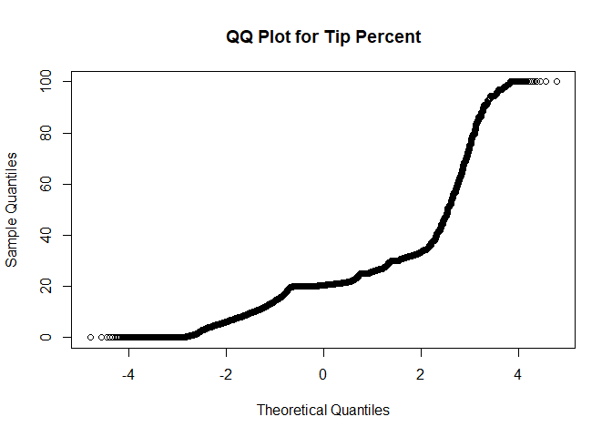

``` r
qqnorm(log(modelData$percTip[modelData$percTip>0]), main = "QQ Plot for Log transfmored Tip Percent")
```

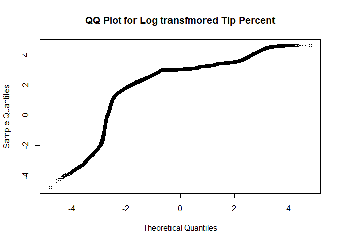

The qqplot of tip percentage indicates that data is not normal. Applying a log transformation on the data, we can see that the tip percent approaches normality.

Analyzing the data, we find that most of the data points have a tip of 0. This prompted me to build a logistic regression model to predict if passengers are likely to tip and then apply loglinear models to predict the percentage of tip.

Conditional Probability is used to determine the final tip percent:

P(A) = P(A|B) \* P(B)

where,

P(A|B) - tip percent given the customer tips

P(B) - customer tips

**Logistic Model**

-   A classification model is used for predicting whether a passenger will tip.

-   A factor variable "willTip" is created to know if the passenger will tip - set to "1" if tip\_amount is greater than zero, else 1.

-   Logistic regression model is used for training and making predictions.

-   A random sample of 80% of the data from the input dataset is used for training and 20% for testing.

-   We use stepAIC function to derive the final list of features that can be used for improving the accuracy of the model. Before applying the stepAIC, AIC value was 421009 and after applying the function stepAIC reduced to 421000.

    -   stepAIC - Performs stepwise model selection by AIC. The model specified is re-run each time with a feature eliminated to determine, which model gives a good prediction for tip percentage.

-   Based on the output of stepAIC the best features used for prediction are - VendorID, RateCodeID, Pickup\_longitude, Pickup\_latitude, Dropoff\_longitude, Dropoff\_latitude, Passenger\_count, Trip\_distance, Extra, MTA\_tax Tolls\_amount, duration, Speed, day, hour, dayOfWeek, and Trip\_type.

-   The features specified by stepAIC make sense -

    -   one vendor may provide better service,

    -   passengers from certain area may be more leaned towards tipping,

    -   passengers travelling at rush hour may tend to tip when they reach destination on time,

    -   if the driver drives rashly passengers do not tend to tip.

-   Using the testing data set, we make predictions if the customer will tip.

``` r
modelData$willTip <- as.factor(modelData$willTip)

trainSample <- sample(1:nrow(modelData),.8*nrow(modelData))
train = modelData[trainSample,]

test = modelData[-trainSample,]

link = glm(formula=willTip~VendorID+RateCodeID+Pickup_longitude+Pickup_latitude+
             Dropoff_longitude+Dropoff_latitude+Passenger_count+Trip_distance+
             Fare_amount+Extra+MTA_tax+Tolls_amount+improvement_surcharge+duration+
             Speed+day+hour+dayOfWeek+Trip_type, data=train, family=binomial(link="logit"))
summary(link)
```

    ## 
    ## Call:
    ## glm(formula = willTip ~ VendorID + RateCodeID + Pickup_longitude + 
    ##     Pickup_latitude + Dropoff_longitude + Dropoff_latitude + 
    ##     Passenger_count + Trip_distance + Fare_amount + Extra + MTA_tax + 
    ##     Tolls_amount + improvement_surcharge + duration + Speed + 
    ##     day + hour + dayOfWeek + Trip_type, family = binomial(link = "logit"), 
    ##     data = train)
    ## 
    ## Deviance Residuals: 
    ##     Min       1Q   Median       3Q      Max  
    ## -3.8332   0.3949   0.4730   0.5737   2.1960  
    ## 
    ## Coefficients:
    ##                         Estimate Std. Error z value Pr(>|z|)    
    ## (Intercept)           -4.231e+02  8.159e+00 -51.864  < 2e-16 ***
    ## VendorID              -3.290e-01  1.073e-02 -30.659  < 2e-16 ***
    ## RateCodeID            -1.458e-01  3.428e-02  -4.253 2.11e-05 ***
    ## Pickup_longitude      -2.827e+00  1.341e-01 -21.078  < 2e-16 ***
    ## Pickup_latitude       -1.781e+00  1.291e-01 -13.802  < 2e-16 ***
    ## Dropoff_longitude     -5.322e+00  1.109e-01 -47.996  < 2e-16 ***
    ## Dropoff_latitude      -2.615e+00  1.288e-01 -20.295  < 2e-16 ***
    ## Passenger_count        2.427e-02  3.944e-03   6.154 7.56e-10 ***
    ## Trip_distance          3.812e-02  3.613e-03  10.550  < 2e-16 ***
    ## Fare_amount            2.346e-04  7.687e-04   0.305  0.76024    
    ## Extra                 -4.853e-02  1.158e-02  -4.193 2.76e-05 ***
    ## MTA_tax                2.645e+00  3.490e-01   7.580 3.45e-14 ***
    ## Tolls_amount           5.588e-02  4.942e-03  11.306  < 2e-16 ***
    ## improvement_surcharge  8.822e-01  4.915e-01   1.795  0.07266 .  
    ## duration              -3.083e-03  7.594e-04  -4.059 4.92e-05 ***
    ## Speed                  1.190e-02  9.274e-04  12.826  < 2e-16 ***
    ## day                    4.714e-03  4.720e-04   9.986  < 2e-16 ***
    ## hour                   7.980e-03  6.093e-04  13.096  < 2e-16 ***
    ## dayOfWeek             -6.011e-03  1.993e-03  -3.015  0.00257 ** 
    ## Trip_type              3.567e-01  2.051e-01   1.739  0.08203 .  
    ## ---
    ## Signif. codes:  0 '***' 0.001 '**' 0.01 '*' 0.05 '.' 0.1 ' ' 1
    ## 
    ## (Dispersion parameter for binomial family taken to be 1)
    ## 
    ##     Null deviance: 445291  on 553418  degrees of freedom
    ## Residual deviance: 421224  on 553399  degrees of freedom
    ## AIC: 421264
    ## 
    ## Number of Fisher Scoring iterations: 5

``` r
stepAIC(link, scale = 0, direction = "both")
```

    ## Start:  AIC=421263.6
    ## willTip ~ VendorID + RateCodeID + Pickup_longitude + Pickup_latitude + 
    ##     Dropoff_longitude + Dropoff_latitude + Passenger_count + 
    ##     Trip_distance + Fare_amount + Extra + MTA_tax + Tolls_amount + 
    ##     improvement_surcharge + duration + Speed + day + hour + dayOfWeek + 
    ##     Trip_type
    ## 
    ##                         Df Deviance    AIC
    ## - Fare_amount            1   421224 421262
    ## <none>                       421224 421264
    ## - Trip_type              1   421227 421265
    ## - improvement_surcharge  1   421227 421265
    ## - dayOfWeek              1   421233 421271
    ## - duration               1   421240 421278
    ## - Extra                  1   421241 421279
    ## - RateCodeID             1   421241 421279
    ## - Passenger_count        1   421262 421300
    ## - MTA_tax                1   421277 421315
    ## - day                    1   421323 421361
    ## - Trip_distance          1   421333 421371
    ## - Tolls_amount           1   421360 421398
    ## - Speed                  1   421392 421430
    ## - hour                   1   421394 421432
    ## - Pickup_latitude        1   421415 421453
    ## - Dropoff_latitude       1   421631 421669
    ## - Pickup_longitude       1   421660 421698
    ## - VendorID               1   422213 422251
    ## - Dropoff_longitude      1   423522 423560
    ## 
    ## Step:  AIC=421261.7
    ## willTip ~ VendorID + RateCodeID + Pickup_longitude + Pickup_latitude + 
    ##     Dropoff_longitude + Dropoff_latitude + Passenger_count + 
    ##     Trip_distance + Extra + MTA_tax + Tolls_amount + improvement_surcharge + 
    ##     duration + Speed + day + hour + dayOfWeek + Trip_type
    ## 
    ##                         Df Deviance    AIC
    ## <none>                       421224 421262
    ## - Trip_type              1   421227 421263
    ## - improvement_surcharge  1   421227 421263
    ## + Fare_amount            1   421224 421264
    ## - dayOfWeek              1   421233 421269
    ## - duration               1   421240 421276
    ## - Extra                  1   421241 421277
    ## - RateCodeID             1   421241 421277
    ## - Passenger_count        1   421262 421298
    ## - MTA_tax                1   421277 421313
    ## - day                    1   421323 421359
    ## - Tolls_amount           1   421361 421397
    ## - Trip_distance          1   421364 421400
    ## - Speed                  1   421392 421428
    ## - hour                   1   421394 421430
    ## - Pickup_latitude        1   421415 421451
    ## - Dropoff_latitude       1   421631 421667
    ## - Pickup_longitude       1   421660 421696
    ## - VendorID               1   422213 422249
    ## - Dropoff_longitude      1   423523 423559

    ## 
    ## Call:  glm(formula = willTip ~ VendorID + RateCodeID + Pickup_longitude + 
    ##     Pickup_latitude + Dropoff_longitude + Dropoff_latitude + 
    ##     Passenger_count + Trip_distance + Extra + MTA_tax + Tolls_amount + 
    ##     improvement_surcharge + duration + Speed + day + hour + dayOfWeek + 
    ##     Trip_type, family = binomial(link = "logit"), data = train)
    ## 
    ## Coefficients:
    ##           (Intercept)               VendorID             RateCodeID  
    ##            -4.231e+02             -3.290e-01             -1.450e-01  
    ##      Pickup_longitude        Pickup_latitude      Dropoff_longitude  
    ##            -2.827e+00             -1.783e+00             -5.322e+00  
    ##      Dropoff_latitude        Passenger_count          Trip_distance  
    ##            -2.615e+00              2.428e-02              3.862e-02  
    ##                 Extra                MTA_tax           Tolls_amount  
    ##            -4.858e-02              2.642e+00              5.590e-02  
    ## improvement_surcharge               duration                  Speed  
    ##             8.783e-01             -3.018e-03              1.188e-02  
    ##                   day                   hour              dayOfWeek  
    ##             4.713e-03              7.980e-03             -6.011e-03  
    ##             Trip_type  
    ##             3.544e-01  
    ## 
    ## Degrees of Freedom: 553418 Total (i.e. Null);  553400 Residual
    ## Null Deviance:       445300 
    ## Residual Deviance: 421200    AIC: 421300

``` r
link = glm(formula=willTip~VendorID+RateCodeID+Pickup_longitude+Pickup_latitude+
             Dropoff_longitude+Dropoff_latitude+Passenger_count+Trip_distance+
             Extra+MTA_tax+Tolls_amount+duration+Speed+day+hour, 
           data=train, family=binomial(link="logit"))
summary(link)
```

    ## 
    ## Call:
    ## glm(formula = willTip ~ VendorID + RateCodeID + Pickup_longitude + 
    ##     Pickup_latitude + Dropoff_longitude + Dropoff_latitude + 
    ##     Passenger_count + Trip_distance + Extra + MTA_tax + Tolls_amount + 
    ##     duration + Speed + day + hour, family = binomial(link = "logit"), 
    ##     data = train)
    ## 
    ## Deviance Residuals: 
    ##     Min       1Q   Median       3Q      Max  
    ## -3.8306   0.3949   0.4729   0.5739   2.2061  
    ## 
    ## Coefficients:
    ##                     Estimate Std. Error z value Pr(>|z|)    
    ## (Intercept)       -4.226e+02  8.148e+00 -51.873  < 2e-16 ***
    ## VendorID          -3.282e-01  1.072e-02 -30.611  < 2e-16 ***
    ## RateCodeID        -1.425e-01  3.313e-02  -4.302 1.70e-05 ***
    ## Pickup_longitude  -2.826e+00  1.340e-01 -21.082  < 2e-16 ***
    ## Pickup_latitude   -1.781e+00  1.290e-01 -13.810  < 2e-16 ***
    ## Dropoff_longitude -5.324e+00  1.108e-01 -48.054  < 2e-16 ***
    ## Dropoff_latitude  -2.613e+00  1.288e-01 -20.288  < 2e-16 ***
    ## Passenger_count    2.428e-02  3.944e-03   6.157 7.39e-10 ***
    ## Trip_distance      3.845e-02  3.223e-03  11.928  < 2e-16 ***
    ## Extra             -4.872e-02  1.157e-02  -4.210 2.55e-05 ***
    ## MTA_tax            2.481e+00  2.649e-01   9.364  < 2e-16 ***
    ## Tolls_amount       5.552e-02  4.917e-03  11.292  < 2e-16 ***
    ## duration          -3.003e-03  7.297e-04  -4.115 3.87e-05 ***
    ## Speed              1.200e-02  9.260e-04  12.956  < 2e-16 ***
    ## day                4.832e-03  4.703e-04  10.274  < 2e-16 ***
    ## hour               7.895e-03  6.088e-04  12.968  < 2e-16 ***
    ## ---
    ## Signif. codes:  0 '***' 0.001 '**' 0.01 '*' 0.05 '.' 0.1 ' ' 1
    ## 
    ## (Dispersion parameter for binomial family taken to be 1)
    ## 
    ##     Null deviance: 445291  on 553418  degrees of freedom
    ## Residual deviance: 421236  on 553403  degrees of freedom
    ## AIC: 421268
    ## 
    ## Number of Fisher Scoring iterations: 5

``` r
test$response=predict.glm(link, newdata = test, type = "response")
trainlm <- train[(train$willTip=="1"),]
```

**Log Linear Model: **

-   A regression model is used for predicting tip percentage.

-   Loglinear model with gaussian distribution used as the predictor is a continous variable.

-   The training and testing data set from logistic regression is reused for making prediction the percentage of tip, if passenger will tip.

-   We use stepAIC function to derive the final list of features that can be used for improving the accuracy of the model. AIC reduced from 3205026 to 3205000.

-   Using the testing data set, we make predictions the percentage of tip from the passenger.

``` r
glmlog = glm(formula=percTip~VendorID+RateCodeID+Pickup_longitude+
               Pickup_latitude+Dropoff_longitude+Dropoff_latitude+
               Passenger_count+Trip_distance+Fare_amount+Extra+
               MTA_tax+Tolls_amount+duration+Speed+Trip_type, data=trainlm, 
             family=gaussian(link="log"))
summary(glmlog)
```

    ## 
    ## Call:
    ## glm(formula = percTip ~ VendorID + RateCodeID + Pickup_longitude + 
    ##     Pickup_latitude + Dropoff_longitude + Dropoff_latitude + 
    ##     Passenger_count + Trip_distance + Fare_amount + Extra + MTA_tax + 
    ##     Tolls_amount + duration + Speed + Trip_type, family = gaussian(link = "log"), 
    ##     data = trainlm)
    ## 
    ## Deviance Residuals: 
    ##     Min       1Q   Median       3Q      Max  
    ## -69.766   -1.719   -0.093    2.750   87.340  
    ## 
    ## Coefficients:
    ##                     Estimate Std. Error t value Pr(>|t|)    
    ## (Intercept)       40.4633303  1.1771288  34.375  < 2e-16 ***
    ## VendorID           0.0251298  0.0012028  20.892  < 2e-16 ***
    ## RateCodeID         0.0108216  0.0059013   1.834  0.06669 .  
    ## Pickup_longitude  -0.1159340  0.0173935  -6.665 2.64e-11 ***
    ## Pickup_latitude   -0.4027876  0.0157282 -25.609  < 2e-16 ***
    ## Dropoff_longitude  0.3401213  0.0140924  24.135  < 2e-16 ***
    ## Dropoff_latitude  -0.1104077  0.0159267  -6.932 4.15e-12 ***
    ## Passenger_count    0.0010412  0.0004666   2.231  0.02566 *  
    ## Trip_distance     -0.0026472  0.0006723  -3.937 8.24e-05 ***
    ## Fare_amount       -0.0019042  0.0002221  -8.574  < 2e-16 ***
    ## Extra              0.0752115  0.0013523  55.618  < 2e-16 ***
    ## MTA_tax            0.1430218  0.0459971   3.109  0.00188 ** 
    ## Tolls_amount       0.0379986  0.0004310  88.155  < 2e-16 ***
    ## duration          -0.0043039  0.0001394 -30.880  < 2e-16 ***
    ## Speed             -0.0023560  0.0001563 -15.070  < 2e-16 ***
    ## Trip_type          0.0143685  0.0223974   0.642  0.52118    
    ## ---
    ## Signif. codes:  0 '***' 0.001 '**' 0.01 '*' 0.05 '.' 0.1 ' ' 1
    ## 
    ## (Dispersion parameter for gaussian family taken to be 48.61773)
    ## 
    ##     Null deviance: 24506999  on 476746  degrees of freedom
    ## Residual deviance: 23177555  on 476731  degrees of freedom
    ## AIC: 3204647
    ## 
    ## Number of Fisher Scoring iterations: 7

``` r
stepAIC(glmlog, scale = 0, direction = "both")
```

    ## Start:  AIC=3204647
    ## percTip ~ VendorID + RateCodeID + Pickup_longitude + Pickup_latitude + 
    ##     Dropoff_longitude + Dropoff_latitude + Passenger_count + 
    ##     Trip_distance + Fare_amount + Extra + MTA_tax + Tolls_amount + 
    ##     duration + Speed + Trip_type
    ## 
    ##                     Df Deviance     AIC
    ## - Trip_type          1 23177576 3204645
    ## <none>                 23177555 3204647
    ## - RateCodeID         1 23177723 3204648
    ## - Passenger_count    1 23177797 3204650
    ## - MTA_tax            1 23178043 3204655
    ## - Trip_distance      1 23178177 3204657
    ## - Pickup_longitude   1 23179685 3204688
    ## - Dropoff_latitude   1 23179874 3204692
    ## - Fare_amount        1 23181378 3204723
    ## - Speed              1 23188040 3204860
    ## - VendorID           1 23199067 3205087
    ## - Dropoff_longitude  1 23205327 3205216
    ## - Pickup_latitude    1 23209179 3205295
    ## - duration           1 23212846 3205370
    ## - Extra              1 23326616 3207701
    ## - Tolls_amount       1 23475161 3210727
    ## 
    ## Step:  AIC=3204645
    ## percTip ~ VendorID + RateCodeID + Pickup_longitude + Pickup_latitude + 
    ##     Dropoff_longitude + Dropoff_latitude + Passenger_count + 
    ##     Trip_distance + Fare_amount + Extra + MTA_tax + Tolls_amount + 
    ##     duration + Speed
    ## 
    ##                     Df Deviance     AIC
    ## <none>                 23177576 3204645
    ## + Trip_type          1 23177555 3204647
    ## - Passenger_count    1 23177817 3204648
    ## - RateCodeID         1 23177861 3204649
    ## - MTA_tax            1 23178076 3204653
    ## - Trip_distance      1 23178203 3204656
    ## - Pickup_longitude   1 23179714 3204687
    ## - Dropoff_latitude   1 23179879 3204690
    ## - Fare_amount        1 23181455 3204723
    ## - Speed              1 23188053 3204859
    ## - VendorID           1 23199099 3205086
    ## - Dropoff_longitude  1 23205492 3205217
    ## - Pickup_latitude    1 23209312 3205295
    ## - duration           1 23213404 3205379
    ## - Extra              1 23326618 3207699
    ## - Tolls_amount       1 23481334 3210851

    ## 
    ## Call:  glm(formula = percTip ~ VendorID + RateCodeID + Pickup_longitude + 
    ##     Pickup_latitude + Dropoff_longitude + Dropoff_latitude + 
    ##     Passenger_count + Trip_distance + Fare_amount + Extra + MTA_tax + 
    ##     Tolls_amount + duration + Speed, family = gaussian(link = "log"), 
    ##     data = trainlm)
    ## 
    ## Coefficients:
    ##       (Intercept)           VendorID         RateCodeID  
    ##         40.496128           0.025136           0.012524  
    ##  Pickup_longitude    Pickup_latitude  Dropoff_longitude  
    ##         -0.116140          -0.403192           0.340577  
    ##  Dropoff_latitude    Passenger_count      Trip_distance  
    ##         -0.109878           0.001041          -0.002662  
    ##       Fare_amount              Extra            MTA_tax  
    ##         -0.001918           0.075204           0.129327  
    ##      Tolls_amount           duration              Speed  
    ##          0.037956          -0.004291          -0.002348  
    ## 
    ## Degrees of Freedom: 476746 Total (i.e. Null);  476732 Residual
    ## Null Deviance:       24510000 
    ## Residual Deviance: 23180000  AIC: 3205000

``` r
glmlog = glm(formula=percTip~VendorID+Pickup_longitude+Pickup_latitude
                     +Dropoff_longitude+Dropoff_latitude+             
                       Fare_amount+Tolls_amount+duration+Speed, 
                     data=trainlm, family=gaussian(link="log"))
summary(glmlog)
```

    ## 
    ## Call:
    ## glm(formula = percTip ~ VendorID + Pickup_longitude + Pickup_latitude + 
    ##     Dropoff_longitude + Dropoff_latitude + Fare_amount + Tolls_amount + 
    ##     duration + Speed, family = gaussian(link = "log"), data = trainlm)
    ## 
    ## Deviance Residuals: 
    ##     Min       1Q   Median       3Q      Max  
    ## -68.478   -2.195    0.008    2.650   87.541  
    ## 
    ## Coefficients:
    ##                     Estimate Std. Error t value Pr(>|t|)    
    ## (Intercept)       44.6502222  1.1738280  38.038  < 2e-16 ***
    ## VendorID           0.0262841  0.0012012  21.882  < 2e-16 ***
    ## Pickup_longitude  -0.1069584  0.0172763  -6.191 5.98e-10 ***
    ## Pickup_latitude   -0.4111136  0.0156246 -26.312  < 2e-16 ***
    ## Dropoff_longitude  0.3630561  0.0137927  26.322  < 2e-16 ***
    ## Dropoff_latitude  -0.1437358  0.0158063  -9.094  < 2e-16 ***
    ## Fare_amount       -0.0031728  0.0001539 -20.611  < 2e-16 ***
    ## Tolls_amount       0.0373442  0.0004234  88.203  < 2e-16 ***
    ## duration          -0.0040813  0.0001247 -32.721  < 2e-16 ***
    ## Speed             -0.0024580  0.0001154 -21.300  < 2e-16 ***
    ## ---
    ## Signif. codes:  0 '***' 0.001 '**' 0.01 '*' 0.05 '.' 0.1 ' ' 1
    ## 
    ## (Dispersion parameter for gaussian family taken to be 48.93396)
    ## 
    ##     Null deviance: 24506999  on 476746  degrees of freedom
    ## Residual deviance: 23328571  on 476737  degrees of freedom
    ## AIC: 3207731
    ## 
    ## Number of Fisher Scoring iterations: 6

``` r
test$tipResponse=predict.glm(glmlog, newdata = test, type = "response")

test$predTipPerc=test$response*test$tipResponse
predict<-subset(test,select=c(Fare_amount,Speed,Trip_distance,percTip,predTipPerc))

predictTable<-gather(predict,type,value,percTip:predTipPerc,factor_key = TRUE)

ggplot(predictTable, aes(x=Speed,y=value,group=type, color=type))+geom_smooth() +
  labs(title = "Plot of Actual vs Predicted",
       x = "Speed", y = "Tip Percentage")
```

    ## `geom_smooth()` using method = 'gam'

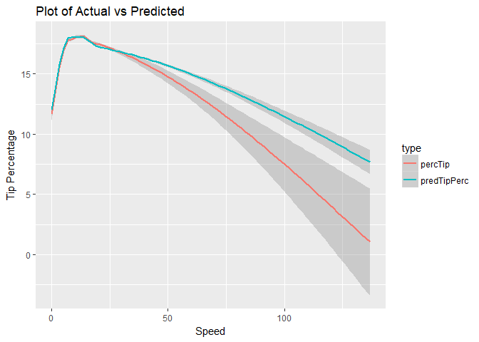

``` r
ggplot(predictTable, aes(x=Trip_distance,y=value,group=type, color=type))+geom_smooth() +
  labs(title = "Plot of Actual vs Predicted",
       x = "Trip Distance", y = "Tip Percentage")
```

    ## `geom_smooth()` using method = 'gam'

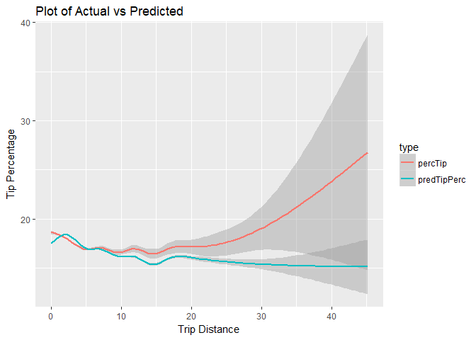

``` r
rm(predictTable, glmlog, link, train, test, trainlm)
```

-   Response variable from logistic and log linear regression models in stored in test dataset.

-   The tip percentage is calculated by multiplying the response value of logistic with log linear regression, using the conditional probability defined.

-   We then, plot the actual vs the predicted tip percentage and can see that,

    -   The model does a good job of predicting values that have low standard deviation in the actual data

    -   Points where the actual data has high standard deviation, there model is predicting low values of tip. This is again valid, as from the scatter plot of Fare Amount against Percentage Tip, we found most of the passengers tend to tip a either no or a lower amount as the duration increases (which in turn increases the trip fare amount).

**Future direction:**

As part of future work, I would prefer to do predictions using random forest model with stratified cross validation to achieve a better accuracy. Below is sample execution of random forest and random forest with cross validation.

-   The below testing is performed using 1% of random sample cleansed data that is not a good representation of the overall data set.

-   Currently, the models are generating a very low r^2 (or) % variance explained. Using a bigger dataset with atleast 10 cross validations, we would be able to achieve a better predictive model.

Also, as the dependent variable is not perfectly normal, it would be a good idea to use a generalized additive model with gamma distribution.

Given more time and better processor, we can also run random forest with cross validation to generate models with higher accuracy.

``` r
trainSample <- sample(1:nrow(modelData),.05*nrow(modelData))
train = modelData[trainSample,]
model <- randomForest(percTip ~ VendorID+RateCodeID+Pickup_longitude+Pickup_latitude+Dropoff_longitude+Dropoff_latitude+Passenger_count+Trip_distance+Fare_amount+Extra+MTA_tax+Tolls_amount+improvement_surcharge+duration+Speed+day+hour+dayOfWeek, data=train, importance=TRUE, ntree=250)
model
```

    ## 
    ## Call:
    ##  randomForest(formula = percTip ~ VendorID + RateCodeID + Pickup_longitude +      Pickup_latitude + Dropoff_longitude + Dropoff_latitude +      Passenger_count + Trip_distance + Fare_amount + Extra + MTA_tax +      Tolls_amount + improvement_surcharge + duration + Speed +      day + hour + dayOfWeek, data = train, importance = TRUE,      ntree = 250) 
    ##                Type of random forest: regression
    ##                      Number of trees: 250
    ## No. of variables tried at each split: 6
    ## 
    ##           Mean of squared residuals: 88.03519
    ##                     % Var explained: 6.71

``` r
gc()
```

    ##            used  (Mb) gc trigger   (Mb)  max used   (Mb)
    ## Ncells  3713595 198.4    8273852  441.9   8273852  441.9
    ## Vcells 84556244 645.2  270045065 2060.3 337531876 2575.2

``` r
trainSample <- sample(1:nrow(modelData),.01*nrow(modelData))
train = modelData[trainSample,]
model <- train(percTip~VendorID+RateCodeID+Pickup_longitude+Pickup_latitude+Dropoff_longitude+Dropoff_latitude+Passenger_count+Trip_distance+Fare_amount+Extra+MTA_tax+Tolls_amount+improvement_surcharge+duration+Speed+day+hour+dayOfWeek, data=train, trControl=trainControl(method = "cv", number = 5, allowParallel=TRUE), method="rf")
model
```

    ## Random Forest 
    ## 
    ## 6917 samples
    ##   18 predictor
    ## 
    ## No pre-processing
    ## Resampling: Cross-Validated (5 fold) 
    ## Summary of sample sizes: 5534, 5531, 5535, 5534, 5534 
    ## Resampling results across tuning parameters:
    ## 
    ##   mtry  RMSE      Rsquared    MAE     
    ##    2    9.318937  0.05712350  6.831370
    ##   10    9.399882  0.05235505  6.871701
    ##   18    9.429893  0.04985537  6.891532
    ## 
    ## RMSE was used to select the optimal model using the smallest value.
    ## The final value used for the model was mtry = 2.

``` r
gc()
```

    ##            used  (Mb) gc trigger   (Mb)  max used   (Mb)
    ## Ncells  3723687 198.9    8273852  441.9   8273852  441.9
    ## Vcells 68288552 521.1  216036052 1648.3 337531876 2575.2

``` r
rm(modelData, predmatrix)
```

Question 5 - Distribution - Average Speed
=========================================

Now I derive Speed, distance (trip\_distance) by time (trip\_duration), a new explanatory variable for analysis.

The derived variable has nearly 4000 records as NA's or infinite. This is associated to most of the trips having 0 trip distance. Speed also has a maximum value of 2000 mph.

Using google search, I found the maximum speed limit in New York City to be 50 mph and in United States to be 137 mph. And so, data is cleansed to include records having Speed within 140 miles per hour.

``` r
minDate = min(date(lpep_pickup_datetime))
greenTrip$duration <- difftime(Lpep_dropoff_datetime,lpep_pickup_datetime,units="mins")
for (i in seq(1, 5, 1)){
  currRange = minDate + 7
  greenTrip$week[(date(lpep_pickup_datetime) >= minDate) & (date(lpep_pickup_datetime) < currRange)] <- i
  minDate = currRange
}
greenTrip$Speed <- Trip_distance/(as.numeric(greenTrip$duration)/60)

speedSubset = subset(greenTrip, (is.finite(greenTrip$Speed) & !is.na(greenTrip$Speed) & greenTrip$Speed <= 140))

week.mean = aggregate(speedSubset$Speed ~ speedSubset$week, FUN = mean, data = speedSubset)
week.mean
```

    ##   speedSubset$week speedSubset$Speed
    ## 1                1          13.46063
    ## 2                2          12.47781
    ## 3                3          12.54530
    ## 4                4          13.15193
    ## 5                5          12.19162

``` r
week.sd = aggregate(speedSubset$Speed ~ speedSubset$week, FUN = sd, data = speedSubset)
week.sd
```

    ##   speedSubset$week speedSubset$Speed
    ## 1                1          6.406365
    ## 2                2          6.112889
    ## 3                3          6.074027
    ## 4                4          6.298078
    ## 5                5          5.882751

``` r
rm(week.mean, week.sd)

boxplot(speedSubset$Speed ~ speedSubset$week, ylim = c(0,20))
```

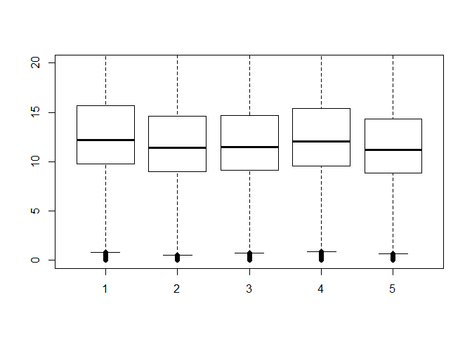

**Analyzing** :

If the average trip speeds are materially the same in all weeks of September.

**Test Used:**

I have used ANOVA test with the null hypothesis that the average trip speeds are same in all weeks.

``` r
summary(aov(speedSubset$Speed ~ speedSubset$week))
```

    ##                       Df   Sum Sq Mean Sq F value Pr(>F)    
    ## speedSubset$week       1    39237   39237    1016 <2e-16 ***
    ## Residuals        1491223 57571674      39                   
    ## ---
    ## Signif. codes:  0 '***' 0.001 '**' 0.01 '*' 0.05 '.' 0.1 ' ' 1

``` r
for (i in seq(1,5,1)){
  j = i+1
  while (j<=5){
    cat ("\n\nt.test(Speed[week == ", i,"], Speed[week == ", j,"])\n\n")
    x = speedSubset$Speed[speedSubset$week == i]
    y = speedSubset$Speed[speedSubset$week == j]
    print (t.test(x, y))
    j = j + 1
  }
}
```

    ## 
    ## 
    ## t.test(Speed[week ==  1 ], Speed[week ==  2 ])
    ## 
    ## 
    ##  Welch Two Sample t-test
    ## 
    ## data:  x and y
    ## t = 65.639, df = 693560, p-value < 2.2e-16
    ## alternative hypothesis: true difference in means is not equal to 0
    ## 95 percent confidence interval:
    ##  0.9534768 1.0121708
    ## sample estimates:
    ## mean of x mean of y 
    ##  13.46063  12.47781 
    ## 
    ## 
    ## 
    ## t.test(Speed[week ==  1 ], Speed[week ==  3 ])
    ## 
    ## 
    ##  Welch Two Sample t-test
    ## 
    ## data:  x and y
    ## t = 61.391, df = 693780, p-value < 2.2e-16
    ## alternative hypothesis: true difference in means is not equal to 0
    ## 95 percent confidence interval:
    ##  0.8861069 0.9445526
    ## sample estimates:
    ## mean of x mean of y 
    ##  13.46063  12.54530 
    ## 
    ## 
    ## 
    ## t.test(Speed[week ==  1 ], Speed[week ==  4 ])
    ## 
    ## 
    ##  Welch Two Sample t-test
    ## 
    ## data:  x and y
    ## t = 20.013, df = 678340, p-value < 2.2e-16
    ## alternative hypothesis: true difference in means is not equal to 0
    ## 95 percent confidence interval:
    ##  0.2784646 0.3389286
    ## sample estimates:
    ## mean of x mean of y 
    ##  13.46063  13.15193 
    ## 
    ## 
    ## 
    ## t.test(Speed[week ==  1 ], Speed[week ==  5 ])
    ## 
    ## 
    ##  Welch Two Sample t-test
    ## 
    ## data:  x and y
    ## t = 56.483, df = 151460, p-value < 2.2e-16
    ## alternative hypothesis: true difference in means is not equal to 0
    ## 95 percent confidence interval:
    ##  1.224977 1.313047
    ## sample estimates:
    ## mean of x mean of y 
    ##  13.46063  12.19162 
    ## 
    ## 
    ## 
    ## t.test(Speed[week ==  2 ], Speed[week ==  3 ])
    ## 
    ## 
    ##  Welch Two Sample t-test
    ## 
    ## data:  x and y
    ## t = -4.7083, df = 722660, p-value = 2.498e-06
    ## alternative hypothesis: true difference in means is not equal to 0
    ## 95 percent confidence interval:
    ##  -0.09559046 -0.03939765
    ## sample estimates:
    ## mean of x mean of y 
    ##  12.47781  12.54530 
    ## 
    ## 
    ## 
    ## t.test(Speed[week ==  2 ], Speed[week ==  4 ])
    ## 
    ## 
    ##  Welch Two Sample t-test
    ## 
    ## data:  x and y
    ## t = -45.335, df = 692000, p-value < 2.2e-16
    ## alternative hypothesis: true difference in means is not equal to 0
    ## 95 percent confidence interval:
    ##  -0.7032717 -0.6449826
    ## sample estimates:
    ## mean of x mean of y 
    ##  12.47781  13.15193 
    ## 
    ## 
    ## 
    ## t.test(Speed[week ==  2 ], Speed[week ==  5 ])
    ## 
    ## 
    ##  Welch Two Sample t-test
    ## 
    ## data:  x and y
    ## t = 12.956, df = 142620, p-value < 2.2e-16
    ## alternative hypothesis: true difference in means is not equal to 0
    ## 95 percent confidence interval:
    ##  0.2428921 0.3294839
    ## sample estimates:
    ## mean of x mean of y 
    ##  12.47781  12.19162 
    ## 
    ## 
    ## 
    ## t.test(Speed[week ==  3 ], Speed[week ==  4 ])
    ## 
    ## 
    ##  Welch Two Sample t-test
    ## 
    ## data:  x and y
    ## t = -40.972, df = 692370, p-value < 2.2e-16
    ## alternative hypothesis: true difference in means is not equal to 0
    ## 95 percent confidence interval:
    ##  -0.6356527 -0.5776136
    ## sample estimates:
    ## mean of x mean of y 
    ##  12.54530  13.15193 
    ## 
    ## 
    ## 
    ## t.test(Speed[week ==  3 ], Speed[week ==  5 ])
    ## 
    ## 
    ##  Welch Two Sample t-test
    ## 
    ## data:  x and y
    ## t = 16.042, df = 141620, p-value < 2.2e-16
    ## alternative hypothesis: true difference in means is not equal to 0
    ## 95 percent confidence interval:
    ##  0.3104702 0.3968939
    ## sample estimates:
    ## mean of x mean of y 
    ##  12.54530  12.19162 
    ## 
    ## 
    ## 
    ## t.test(Speed[week ==  4 ], Speed[week ==  5 ])
    ## 
    ## 
    ##  Welch Two Sample t-test
    ## 
    ## data:  x and y
    ## t = 42.874, df = 149770, p-value < 2.2e-16
    ## alternative hypothesis: true difference in means is not equal to 0
    ## 95 percent confidence interval:
    ##  0.9164146 1.0042157
    ## sample estimates:
    ## mean of x mean of y 
    ##  13.15193  12.19162

The p-value of the ANOVA test is very small and close to 0. Thus, the null hypothesis is rejected - the average trip speeds are not same in all weeks.

A 2-sample t-test, with significance value set at 0.05, is performed on all the weeks, to check if the means are same between any two weeks, but the p-vale is again close to 0 for all t-tests and no two weeks have the same means.

My hypothesis for average speed variation (based on the boxplot) is below:

-   Week 1 - Includes the Labor Day (September 7) long weekend. People would be entering or leaving the city for vacation on different dates. There would be less than normal traffic on these dates causing the average speed to be higher comparatively.

-   Week 2 - People would be returning or leaving from vacation after the long weekend, causing traffic jam on Tuesday, whereby reducing the average speed of the week

-   Week 3 - Most of the people would have returned to their daily routine and few people would still be returning from a long vacation, average speed of the week would be returning to normal

-   Week 4 - People would have returned to their daily routines and traffic would be less as daily commuters in NYC tend to take public transports and so the average speed is more compared to previous weeks. This would be a good approximate of the average speed of the week

-   Week 5 - Has only two days with peak Monday traffic which is why the average traffic is more.

To analyze, if the average trip speeds are same in the hours of day, I have used ANOVA test with the null hypothesis that the average trip speeds are same in all hours.

``` r
speedSubset$hour = hour(speedSubset$lpep_pickup_datetime)
boxplot(speedSubset$Speed ~ speedSubset$hour, ylim = c(5,25))
```


``` r
summary(aov(speedSubset$Speed ~ speedSubset$hour))
```

    ##                       Df   Sum Sq Mean Sq F value Pr(>F)    
    ## speedSubset$hour       1   611985  611985   16011 <2e-16 ***
    ## Residuals        1491223 56998926      38                   
    ## ---
    ## Signif. codes:  0 '***' 0.001 '**' 0.01 '*' 0.05 '.' 0.1 ' ' 1

``` r
for (i in seq(0,23,1)){
  j = i+1
  while (j<=23){
    cat ("\n\nt.test(Speed[hour == ", i,"], Speed[hour == ", j,"])\n\n")
    x = speedSubset$Speed[speedSubset$hour == i]
    y = speedSubset$Speed[speedSubset$hour == j]
    print (t.test(x, y))
    j = j + 1
  }
}
```

    ## 
    ## 
    ## t.test(Speed[hour ==  0 ], Speed[hour ==  1 ])
    ## 
    ## 
    ##  Welch Two Sample t-test
    ## 
    ## data:  x and y
    ## t = -6.6388, df = 113400, p-value = 3.177e-11
    ## alternative hypothesis: true difference in means is not equal to 0
    ## 95 percent confidence interval:
    ##  -0.3219430 -0.1751774
    ## sample estimates:
    ## mean of x mean of y 
    ##  14.56728  14.81584 
    ## 
    ## 
    ## 
    ## t.test(Speed[hour ==  0 ], Speed[hour ==  2 ])
    ## 
    ## 
    ##  Welch Two Sample t-test
    ## 
    ## data:  x and y
    ## t = -10.62, df = 85070, p-value < 2.2e-16
    ## alternative hypothesis: true difference in means is not equal to 0
    ## 95 percent confidence interval:
    ##  -0.5097389 -0.3509069
    ## sample estimates:
    ## mean of x mean of y 
    ##  14.56728  14.99760 
    ## 
    ## 
    ## 
    ## t.test(Speed[hour ==  0 ], Speed[hour ==  3 ])
    ## 
    ## 
    ##  Welch Two Sample t-test
    ## 
    ## data:  x and y
    ## t = -17.521, df = 56899, p-value < 2.2e-16
    ## alternative hypothesis: true difference in means is not equal to 0
    ## 95 percent confidence interval:
    ##  -0.9034305 -0.7216389
    ## sample estimates:
    ## mean of x mean of y 
    ##  14.56728  15.37981 
    ## 
    ## 
    ## 
    ## t.test(Speed[hour ==  0 ], Speed[hour ==  4 ])
    ## 
    ## 
    ##  Welch Two Sample t-test
    ## 
    ## data:  x and y
    ## t = -29.786, df = 40127, p-value < 2.2e-16
    ## alternative hypothesis: true difference in means is not equal to 0
    ## 95 percent confidence interval:
    ##  -1.745432 -1.529901
    ## sample estimates:
    ## mean of x mean of y 
    ##  14.56728  16.20494 
    ## 
    ## 
    ## 
    ## t.test(Speed[hour ==  0 ], Speed[hour ==  5 ])
    ## 
    ## 
    ##  Welch Two Sample t-test
    ## 
    ## data:  x and y
    ## t = -46.23, df = 20959, p-value < 2.2e-16
    ## alternative hypothesis: true difference in means is not equal to 0
    ## 95 percent confidence interval:
    ##  -3.552364 -3.263385
    ## sample estimates:
    ## mean of x mean of y 
    ##  14.56728  17.97515 
    ## 
    ## 
    ## 
    ## t.test(Speed[hour ==  0 ], Speed[hour ==  6 ])
    ## 
    ## 
    ##  Welch Two Sample t-test
    ## 
    ## data:  x and y
    ## t = -41.086, df = 32760, p-value < 2.2e-16
    ## alternative hypothesis: true difference in means is not equal to 0
    ## 95 percent confidence interval:
    ##  -2.523921 -2.294077
    ## sample estimates:
    ## mean of x mean of y 
    ##  14.56728  16.97628 
    ## 
    ## 
    ## 
    ## t.test(Speed[hour ==  0 ], Speed[hour ==  7 ])
    ## 
    ## 
    ##  Welch Two Sample t-test
    ## 
    ## data:  x and y
    ## t = 26.051, df = 82220, p-value < 2.2e-16
    ## alternative hypothesis: true difference in means is not equal to 0
    ## 95 percent confidence interval:
    ##  1.017176 1.182686
    ## sample estimates:
    ## mean of x mean of y 
    ##  14.56728  13.46735 
    ## 
    ## 
    ## 
    ## t.test(Speed[hour ==  0 ], Speed[hour ==  8 ])
    ## 
    ## 
    ##  Welch Two Sample t-test
    ## 
    ## data:  x and y
    ## t = 63.462, df = 123260, p-value < 2.2e-16
    ## alternative hypothesis: true difference in means is not equal to 0
    ## 95 percent confidence interval:
    ##  2.224413 2.366191
    ## sample estimates:
    ## mean of x mean of y 
    ##  14.56728  12.27198 
    ## 
    ## 
    ## 
    ## t.test(Speed[hour ==  0 ], Speed[hour ==  9 ])
    ## 
    ## 
    ##  Welch Two Sample t-test
    ## 
    ## data:  x and y
    ## t = 55.991, df = 127070, p-value < 2.2e-16
    ## alternative hypothesis: true difference in means is not equal to 0
    ## 95 percent confidence interval:
    ##  1.953407 2.095127
    ## sample estimates:
    ## mean of x mean of y 
    ##  14.56728  12.54301 
    ## 
    ## 
    ## 
    ## t.test(Speed[hour ==  0 ], Speed[hour ==  10 ])
    ## 
    ## 
    ##  Welch Two Sample t-test
    ## 
    ## data:  x and y
    ## t = 57.103, df = 121420, p-value < 2.2e-16
    ## alternative hypothesis: true difference in means is not equal to 0
    ## 95 percent confidence interval:
    ##  1.991616 2.133194
    ## sample estimates:
    ## mean of x mean of y 
    ##  14.56728  12.50487 
    ## 
    ## 
    ## 
    ## t.test(Speed[hour ==  0 ], Speed[hour ==  11 ])
    ## 
    ## 
    ##  Welch Two Sample t-test
    ## 
    ## data:  x and y
    ## t = 65.227, df = 120780, p-value < 2.2e-16
    ## alternative hypothesis: true difference in means is not equal to 0
    ## 95 percent confidence interval:
    ##  2.277553 2.418669
    ## sample estimates:
    ## mean of x mean of y 
    ##  14.56728  12.21917 
    ## 
    ## 
    ## 
    ## t.test(Speed[hour ==  0 ], Speed[hour ==  12 ])
    ## 
    ## 
    ##  Welch Two Sample t-test
    ## 
    ## data:  x and y
    ## t = 69.654, df = 123240, p-value < 2.2e-16
    ## alternative hypothesis: true difference in means is not equal to 0
    ## 95 percent confidence interval:
    ##  2.388750 2.527076
    ## sample estimates:
    ## mean of x mean of y 
    ##  14.56728  12.10937 
    ## 
    ## 
    ## 
    ## t.test(Speed[hour ==  0 ], Speed[hour ==  13 ])
    ## 
    ## 
    ##  Welch Two Sample t-test
    ## 
    ## data:  x and y
    ## t = 71.904, df = 122760, p-value < 2.2e-16
    ## alternative hypothesis: true difference in means is not equal to 0
    ## 95 percent confidence interval:
    ##  2.471749 2.610276
    ## sample estimates:
    ## mean of x mean of y 
    ##  14.56728  12.02627 
    ## 
    ## 
    ## 
    ## t.test(Speed[hour ==  0 ], Speed[hour ==  14 ])
    ## 
    ## 
    ##  Welch Two Sample t-test
    ## 
    ## data:  x and y
    ## t = 91.856, df = 132110, p-value < 2.2e-16
    ## alternative hypothesis: true difference in means is not equal to 0
    ## 95 percent confidence interval:
    ##  2.974063 3.103749
    ## sample estimates:
    ## mean of x mean of y 
    ##  14.56728  11.52837 
    ## 
    ## 
    ## 
    ## t.test(Speed[hour ==  0 ], Speed[hour ==  15 ])
    ## 
    ## 
    ##  Welch Two Sample t-test
    ## 
    ## data:  x and y
    ## t = 108.44, df = 131280, p-value < 2.2e-16
    ## alternative hypothesis: true difference in means is not equal to 0
    ## 95 percent confidence interval:
    ##  3.353215 3.476661
    ## sample estimates:
    ## mean of x mean of y 
    ##  14.56728  11.15234 
    ## 
    ## 
    ## 
    ## t.test(Speed[hour ==  0 ], Speed[hour ==  16 ])
    ## 
    ## 
    ##  Welch Two Sample t-test
    ## 
    ## data:  x and y
    ## t = 118.03, df = 129800, p-value < 2.2e-16
    ## alternative hypothesis: true difference in means is not equal to 0
    ## 95 percent confidence interval:
    ##  3.581497 3.702450
    ## sample estimates:
    ## mean of x mean of y 
    ##  14.56728  10.92530 
    ## 
    ## 
    ## 
    ## t.test(Speed[hour ==  0 ], Speed[hour ==  17 ])
    ## 
    ## 
    ##  Welch Two Sample t-test
    ## 
    ## data:  x and y
    ## t = 124.01, df = 121820, p-value < 2.2e-16
    ## alternative hypothesis: true difference in means is not equal to 0
    ## 95 percent confidence interval:
    ##  3.610165 3.726118
    ## sample estimates:
    ## mean of x mean of y 
    ##  14.56728  10.89914 
    ## 
    ## 
    ## 
    ## t.test(Speed[hour ==  0 ], Speed[hour ==  18 ])
    ## 
    ## 
    ##  Welch Two Sample t-test
    ## 
    ## data:  x and y
    ## t = 105, df = 121450, p-value < 2.2e-16
    ## alternative hypothesis: true difference in means is not equal to 0
    ## 95 percent confidence interval:
    ##  3.028330 3.143541
    ## sample estimates:
    ## mean of x mean of y 
    ##  14.56728  11.48134 
    ## 
    ## 
    ## 
    ## t.test(Speed[hour ==  0 ], Speed[hour ==  19 ])
    ## 
    ## 
    ##  Welch Two Sample t-test
    ## 
    ## data:  x and y
    ## t = 84.866, df = 125600, p-value < 2.2e-16
    ## alternative hypothesis: true difference in means is not equal to 0
    ## 95 percent confidence interval:
    ##  2.472340 2.589236
    ## sample estimates:
    ## mean of x mean of y 
    ##  14.56728  12.03649 
    ## 
    ## 
    ## 
    ## t.test(Speed[hour ==  0 ], Speed[hour ==  20 ])
    ## 
    ## 
    ##  Welch Two Sample t-test
    ## 
    ## data:  x and y
    ## t = 59.864, df = 131970, p-value < 2.2e-16
    ## alternative hypothesis: true difference in means is not equal to 0
    ## 95 percent confidence interval:
    ##  1.775138 1.895310
    ## sample estimates:
    ## mean of x mean of y 
    ##  14.56728  12.73205 
    ## 
    ## 
    ## 
    ## t.test(Speed[hour ==  0 ], Speed[hour ==  21 ])
    ## 
    ## 
    ##  Welch Two Sample t-test
    ## 
    ## data:  x and y
    ## t = 31.593, df = 136410, p-value < 2.2e-16
    ## alternative hypothesis: true difference in means is not equal to 0
    ## 95 percent confidence interval:
    ##  0.9314992 1.0547196
    ## sample estimates:
    ## mean of x mean of y 
    ##  14.56728  13.57417 
    ## 
    ## 
    ## 
    ## t.test(Speed[hour ==  0 ], Speed[hour ==  22 ])
    ## 
    ## 
    ##  Welch Two Sample t-test
    ## 
    ## data:  x and y
    ## t = 16.231, df = 139760, p-value < 2.2e-16
    ## alternative hypothesis: true difference in means is not equal to 0
    ## 95 percent confidence interval:
    ##  0.4582726 0.5841466
    ## sample estimates:
    ## mean of x mean of y 
    ##  14.56728  14.04607 
    ## 
    ## 
    ## 
    ## t.test(Speed[hour ==  0 ], Speed[hour ==  23 ])
    ## 
    ## 
    ##  Welch Two Sample t-test
    ## 
    ## data:  x and y
    ## t = 7.2732, df = 140440, p-value = 3.529e-13
    ## alternative hypothesis: true difference in means is not equal to 0
    ## 95 percent confidence interval:
    ##  0.1743982 0.3030648
    ## sample estimates:
    ## mean of x mean of y 
    ##  14.56728  14.32855 
    ## 
    ## 
    ## 
    ## t.test(Speed[hour ==  1 ], Speed[hour ==  2 ])
    ## 
    ## 
    ##  Welch Two Sample t-test
    ## 
    ## data:  x and y
    ## t = -4.2419, df = 88437, p-value = 2.218e-05
    ## alternative hypothesis: true difference in means is not equal to 0
    ## 95 percent confidence interval:
    ##  -0.26574660 -0.09777881
    ## sample estimates:
    ## mean of x mean of y 
    ##  14.81584  14.99760 
    ## 
    ## 
    ## 
    ## t.test(Speed[hour ==  1 ], Speed[hour ==  3 ])
    ## 
    ## 
    ##  Welch Two Sample t-test
    ## 
    ## data:  x and y
    ## t = -11.646, df = 62683, p-value < 2.2e-16
    ## alternative hypothesis: true difference in means is not equal to 0
    ## 95 percent confidence interval:
    ##  -0.6588872 -0.4690618
    ## sample estimates:
    ## mean of x mean of y 
    ##  14.81584  15.37981 
    ## 
    ## 
    ## 
    ## t.test(Speed[hour ==  1 ], Speed[hour ==  4 ])
    ## 
    ## 
    ##  Welch Two Sample t-test
    ## 
    ## data:  x and y
    ## t = -24.49, df = 44202, p-value < 2.2e-16
    ## alternative hypothesis: true difference in means is not equal to 0
    ## 95 percent confidence interval:
    ##  -1.500281 -1.277932
    ## sample estimates:
    ## mean of x mean of y 
    ##  14.81584  16.20494 
    ## 
    ## 
    ## 
    ## t.test(Speed[hour ==  1 ], Speed[hour ==  5 ])
    ## 
    ## 
    ##  Welch Two Sample t-test
    ## 
    ## data:  x and y
    ## t = -42.112, df = 22383, p-value < 2.2e-16
    ## alternative hypothesis: true difference in means is not equal to 0
    ## 95 percent confidence interval:
    ##  -3.306363 -3.012265
    ## sample estimates:
    ## mean of x mean of y 
    ##  14.81584  17.97515 
    ## 
    ## 
    ## 
    ## t.test(Speed[hour ==  1 ], Speed[hour ==  6 ])
    ## 
    ## 
    ##  Welch Two Sample t-test
    ## 
    ## data:  x and y
    ## t = -35.848, df = 35927, p-value < 2.2e-16
    ## alternative hypothesis: true difference in means is not equal to 0
    ## 95 percent confidence interval:
    ##  -2.278563 -2.042314
    ## sample estimates:
    ## mean of x mean of y 
    ##  14.81584  16.97628 
    ## 
    ## 
    ## 
    ## t.test(Speed[hour ==  1 ], Speed[hour ==  7 ])
    ## 
    ## 
    ##  Welch Two Sample t-test
    ## 
    ## data:  x and y
    ## t = 30.328, df = 86688, p-value < 2.2e-16
    ## alternative hypothesis: true difference in means is not equal to 0
    ## 95 percent confidence interval:
    ##  1.261343 1.435639
    ## sample estimates:
    ## mean of x mean of y 
    ##  14.81584  13.46735 
    ## 
    ## 
    ## 
    ## t.test(Speed[hour ==  1 ], Speed[hour ==  8 ])
    ## 
    ## 
    ##  Welch Two Sample t-test
    ## 
    ## data:  x and y
    ## t = 65.629, df = 111100, p-value < 2.2e-16
    ## alternative hypothesis: true difference in means is not equal to 0
    ## 95 percent confidence interval:
    ##  2.467891 2.619833
    ## sample estimates:
    ## mean of x mean of y 
    ##  14.81584  12.27198 
    ## 
    ## 
    ## 
    ## t.test(Speed[hour ==  1 ], Speed[hour ==  9 ])
    ## 
    ## 
    ##  Welch Two Sample t-test
    ## 
    ## data:  x and y
    ## t = 58.658, df = 113390, p-value < 2.2e-16
    ## alternative hypothesis: true difference in means is not equal to 0
    ## 95 percent confidence interval:
    ##  2.196883 2.348771
    ## sample estimates:
    ## mean of x mean of y 
    ##  14.81584  12.54301 
    ## 
    ## 
    ## 
    ## t.test(Speed[hour ==  1 ], Speed[hour ==  10 ])
    ## 
    ## 
    ##  Welch Two Sample t-test
    ## 
    ## data:  x and y
    ## t = 59.694, df = 109850, p-value < 2.2e-16
    ## alternative hypothesis: true difference in means is not equal to 0
    ## 95 percent confidence interval:
    ##  2.235087 2.386843
    ## sample estimates:
    ## mean of x mean of y 
    ##  14.81584  12.50487 
    ## 
    ## 
    ## 
    ## t.test(Speed[hour ==  1 ], Speed[hour ==  11 ])
    ## 
    ## 
    ##  Welch Two Sample t-test
    ## 
    ## data:  x and y
    ## t = 67.265, df = 109190, p-value < 2.2e-16
    ## alternative hypothesis: true difference in means is not equal to 0
    ## 95 percent confidence interval:
    ##  2.521009 2.672334
    ## sample estimates:
    ## mean of x mean of y 
    ##  14.81584  12.21917 
    ## 
    ## 
    ## 
    ## t.test(Speed[hour ==  1 ], Speed[hour ==  12 ])
    ## 
    ## 
    ##  Welch Two Sample t-test
    ## 
    ## data:  x and y
    ## t = 71.334, df = 108970, p-value < 2.2e-16
    ## alternative hypothesis: true difference in means is not equal to 0
    ## 95 percent confidence interval:
    ##  2.632110 2.780837
    ## sample estimates:
    ## mean of x mean of y 
    ##  14.81584  12.10937 
    ## 
    ## 
    ## 
    ## t.test(Speed[hour ==  1 ], Speed[hour ==  13 ])
    ## 
    ## 
    ##  Welch Two Sample t-test
    ## 
    ## data:  x and y
    ## t = 73.432, df = 108820, p-value < 2.2e-16
    ## alternative hypothesis: true difference in means is not equal to 0
    ## 95 percent confidence interval:
    ##  2.715116 2.864029
    ## sample estimates:
    ## mean of x mean of y 
    ##  14.81584  12.02627 
    ## 
    ## 
    ## 
    ## t.test(Speed[hour ==  1 ], Speed[hour ==  14 ])
    ## 
    ## 
    ##  Welch Two Sample t-test
    ## 
    ## data:  x and y
    ## t = 91.573, df = 107150, p-value < 2.2e-16
    ## alternative hypothesis: true difference in means is not equal to 0
    ## 95 percent confidence interval:
    ##  3.217103 3.357829
    ## sample estimates:
    ## mean of x mean of y 
    ##  14.81584  11.52837 
    ## 
    ## 
    ## 
    ## t.test(Speed[hour ==  1 ], Speed[hour ==  15 ])
    ## 
    ## 
    ##  Welch Two Sample t-test
    ## 
    ## data:  x and y
    ## t = 106.38, df = 101010, p-value < 2.2e-16
    ## alternative hypothesis: true difference in means is not equal to 0
    ## 95 percent confidence interval:
    ##  3.595999 3.730998
    ## sample estimates:
    ## mean of x mean of y 
    ##  14.81584  11.15234 
    ## 
    ## 
    ## 
    ## t.test(Speed[hour ==  1 ], Speed[hour ==  16 ])
    ## 
    ## 
    ##  Welch Two Sample t-test
    ## 
    ## data:  x and y
    ## t = 114.91, df = 97940, p-value < 2.2e-16
    ## alternative hypothesis: true difference in means is not equal to 0
    ## 95 percent confidence interval:
    ##  3.824173 3.956895
    ## sample estimates:
    ## mean of x mean of y 
    ##  14.81584  10.92530 
    ## 
    ## 
    ## 
    ## t.test(Speed[hour ==  1 ], Speed[hour ==  17 ])
    ## 
    ## 
    ##  Welch Two Sample t-test
    ## 
    ## data:  x and y
    ## t = 119.78, df = 89895, p-value < 2.2e-16
    ## alternative hypothesis: true difference in means is not equal to 0
    ## 95 percent confidence interval:
    ##  3.852611 3.980793
    ## sample estimates:
    ## mean of x mean of y 
    ##  14.81584  10.89914 
    ## 
    ## 
    ## 
    ## t.test(Speed[hour ==  1 ], Speed[hour ==  18 ])
    ## 
    ## 
    ##  Welch Two Sample t-test
    ## 
    ## data:  x and y
    ## t = 102.51, df = 89012, p-value < 2.2e-16
    ## alternative hypothesis: true difference in means is not equal to 0
    ## 95 percent confidence interval:
    ##  3.270740 3.398251
    ## sample estimates:
    ## mean of x mean of y 
    ##  14.81584  11.48134 
    ## 
    ## 
    ## 
    ## t.test(Speed[hour ==  1 ], Speed[hour ==  19 ])
    ## 
    ## 
    ##  Welch Two Sample t-test
    ## 
    ## data:  x and y
    ## t = 84.433, df = 92229, p-value < 2.2e-16
    ## alternative hypothesis: true difference in means is not equal to 0
    ## 95 percent confidence interval:
    ##  2.714830 2.843867
    ## sample estimates:
    ## mean of x mean of y 
    ##  14.81584  12.03649 
    ## 
    ## 
    ## 
    ## t.test(Speed[hour ==  1 ], Speed[hour ==  20 ])
    ## 
    ## 
    ##  Welch Two Sample t-test
    ## 
    ## data:  x and y
    ## t = 61.876, df = 97980, p-value < 2.2e-16
    ## alternative hypothesis: true difference in means is not equal to 0
    ## 95 percent confidence interval:
    ##  2.017778 2.149790
    ## sample estimates:
    ## mean of x mean of y 
    ##  14.81584  12.73205 
    ## 
    ## 
    ## 
    ## t.test(Speed[hour ==  1 ], Speed[hour ==  21 ])
    ## 
    ## 
    ##  Welch Two Sample t-test
    ## 
    ## data:  x and y
    ## t = 36.11, df = 102860, p-value < 2.2e-16
    ## alternative hypothesis: true difference in means is not equal to 0
    ## 95 percent confidence interval:
    ##  1.174273 1.309066
    ## sample estimates:
    ## mean of x mean of y 
    ##  14.81584  13.57417 
    ## 
    ## 
    ## 
    ## t.test(Speed[hour ==  1 ], Speed[hour ==  22 ])
    ## 
    ## 
    ##  Welch Two Sample t-test
    ## 
    ## data:  x and y
    ## t = 21.99, df = 106940, p-value < 2.2e-16
    ## alternative hypothesis: true difference in means is not equal to 0
    ## 95 percent confidence interval:
    ##  0.7011587 0.8383809
    ## sample estimates:
    ## mean of x mean of y 
    ##  14.81584  14.04607 
    ## 
    ## 
    ## 
    ## t.test(Speed[hour ==  1 ], Speed[hour ==  23 ])
    ## 
    ## 
    ##  Welch Two Sample t-test
    ## 
    ## data:  x and y
    ## t = 13.665, df = 110020, p-value < 2.2e-16
    ## alternative hypothesis: true difference in means is not equal to 0
    ## 95 percent confidence interval:
    ##  0.4173976 0.5571858
    ## sample estimates:
    ## mean of x mean of y 
    ##  14.81584  14.32855 
    ## 
    ## 
    ## 
    ## t.test(Speed[hour ==  2 ], Speed[hour ==  3 ])
    ## 
    ## 
    ##  Welch Two Sample t-test
    ## 
    ## data:  x and y
    ## t = -7.5176, df = 65456, p-value = 5.649e-14
    ## alternative hypothesis: true difference in means is not equal to 0
    ## 95 percent confidence interval:
    ##  -0.4818624 -0.2825612
    ## sample estimates:
    ## mean of x mean of y 
    ##  14.99760  15.37981 
    ## 
    ## 
    ## 
    ## t.test(Speed[hour ==  2 ], Speed[hour ==  4 ])
    ## 
    ## 
    ##  Welch Two Sample t-test
    ## 
    ## data:  x and y
    ## t = -20.534, df = 48093, p-value < 2.2e-16
    ## alternative hypothesis: true difference in means is not equal to 0
    ## 95 percent confidence interval:
    ##  -1.322589 -1.092098
    ## sample estimates:
    ## mean of x mean of y 
    ##  14.99760  16.20494 
    ## 
    ## 
    ## 
    ## t.test(Speed[hour ==  2 ], Speed[hour ==  5 ])
    ## 
    ## 
    ##  Welch Two Sample t-test
    ## 
    ## data:  x and y
    ## t = -38.869, df = 24088, p-value < 2.2e-16
    ## alternative hypothesis: true difference in means is not equal to 0
    ## 95 percent confidence interval:
    ##  -3.127702 -2.827401
    ## sample estimates:
    ## mean of x mean of y 
    ##  14.99760  17.97515 
    ## 
    ## 
    ## 
    ## t.test(Speed[hour ==  2 ], Speed[hour ==  6 ])
    ## 
    ## 
    ##  Welch Two Sample t-test
    ## 
    ## data:  x and y
    ## t = -31.798, df = 39295, p-value < 2.2e-16
    ## alternative hypothesis: true difference in means is not equal to 0
    ## 95 percent confidence interval:
    ##  -2.100640 -1.856712
    ## sample estimates:
    ## mean of x mean of y 
    ##  14.99760  16.97628 
    ## 
    ## 
    ## 
    ## t.test(Speed[hour ==  2 ], Speed[hour ==  7 ])
    ## 
    ## 
    ##  Welch Two Sample t-test
    ## 
    ## data:  x and y
    ## t = 32.5, df = 82683, p-value < 2.2e-16
    ## alternative hypothesis: true difference in means is not equal to 0
    ## 95 percent confidence interval:
    ##  1.437968 1.622539
    ## sample estimates:
    ## mean of x mean of y 
    ##  14.99760  13.46735 
    ## 
    ## 
    ## 
    ## t.test(Speed[hour ==  2 ], Speed[hour ==  8 ])
    ## 
    ## 
    ##  Welch Two Sample t-test
    ## 
    ## data:  x and y
    ## t = 65.297, df = 87557, p-value < 2.2e-16
    ## alternative hypothesis: true difference in means is not equal to 0
    ## 95 percent confidence interval:
    ##  2.643811 2.807439
    ## sample estimates:
    ## mean of x mean of y 
    ##  14.99760  12.27198 
    ## 
    ## 
    ## 
    ## t.test(Speed[hour ==  2 ], Speed[hour ==  9 ])
    ## 
    ## 
    ##  Welch Two Sample t-test
    ## 
    ## data:  x and y
    ## t = 58.822, df = 88571, p-value < 2.2e-16
    ## alternative hypothesis: true difference in means is not equal to 0
    ## 95 percent confidence interval:
    ##  2.372802 2.536378
    ## sample estimates:
    ## mean of x mean of y 
    ##  14.99760  12.54301 
    ## 
    ## 
    ## 
    ## t.test(Speed[hour ==  2 ], Speed[hour ==  10 ])
    ## 
    ## 
    ##  Welch Two Sample t-test
    ## 
    ## data:  x and y
    ## t = 59.781, df = 86860, p-value < 2.2e-16
    ## alternative hypothesis: true difference in means is not equal to 0
    ## 95 percent confidence interval:
    ##  2.411000 2.574455
    ## sample estimates:
    ## mean of x mean of y 
    ##  14.99760  12.50487 
    ## 
    ## 
    ## 
    ## t.test(Speed[hour ==  2 ], Speed[hour ==  11 ])
    ## 
    ## 
    ##  Welch Two Sample t-test
    ## 
    ## data:  x and y
    ## t = 66.796, df = 86283, p-value < 2.2e-16
    ## alternative hypothesis: true difference in means is not equal to 0
    ## 95 percent confidence interval:
    ##  2.696907 2.859961
    ## sample estimates:
    ## mean of x mean of y 
    ##  14.99760  12.21917 
    ## 
    ## 
    ## 
    ## t.test(Speed[hour ==  2 ], Speed[hour ==  12 ])
    ## 
    ## 
    ##  Welch Two Sample t-test
    ## 
    ## data:  x and y
    ## t = 70.477, df = 84521, p-value < 2.2e-16
    ## alternative hypothesis: true difference in means is not equal to 0
    ## 95 percent confidence interval:
    ##  2.807913 2.968559
    ## sample estimates:
    ## mean of x mean of y 
    ##  14.99760  12.10937 
    ## 
    ## 
    ## 
    ## t.test(Speed[hour ==  2 ], Speed[hour ==  13 ])
    ## 
    ## 
    ##  Welch Two Sample t-test
    ## 
    ## data:  x and y
    ## t = 72.427, df = 84574, p-value < 2.2e-16
    ## alternative hypothesis: true difference in means is not equal to 0
    ## 95 percent confidence interval:
    ##  2.890926 3.051745
    ## sample estimates:
    ## mean of x mean of y 
    ##  14.99760  12.02627 
    ## 
    ## 
    ## 
    ## t.test(Speed[hour ==  2 ], Speed[hour ==  14 ])
    ## 
    ## 
    ##  Welch Two Sample t-test
    ## 
    ## data:  x and y
    ## t = 88.729, df = 78274, p-value < 2.2e-16
    ## alternative hypothesis: true difference in means is not equal to 0
    ## 95 percent confidence interval:
    ##  3.392594 3.545863
    ## sample estimates:
    ## mean of x mean of y 
    ##  14.99760  11.52837 
    ## 
    ## 
    ## 
    ## t.test(Speed[hour ==  2 ], Speed[hour ==  15 ])
    ## 
    ## 
    ##  Welch Two Sample t-test
    ## 
    ## data:  x and y
    ## t = 101.83, df = 71898, p-value < 2.2e-16
    ## alternative hypothesis: true difference in means is not equal to 0
    ## 95 percent confidence interval:
    ##  3.771247 3.919275
    ## sample estimates:
    ## mean of x mean of y 
    ##  14.99760  11.15234 
    ## 
    ## 
    ## 
    ## t.test(Speed[hour ==  2 ], Speed[hour ==  16 ])
    ## 
    ## 
    ##  Welch Two Sample t-test
    ## 
    ## data:  x and y
    ## t = 109.37, df = 69198, p-value < 2.2e-16
    ## alternative hypothesis: true difference in means is not equal to 0
    ## 95 percent confidence interval:
    ##  3.999319 4.145274
    ## sample estimates:
    ## mean of x mean of y 
    ##   14.9976   10.9253 
    ## 
    ## 
    ## 
    ## t.test(Speed[hour ==  2 ], Speed[hour ==  17 ])
    ## 
    ## 
    ##  Welch Two Sample t-test
    ## 
    ## data:  x and y
    ## t = 113.27, df = 63310, p-value < 2.2e-16
    ## alternative hypothesis: true difference in means is not equal to 0
    ## 95 percent confidence interval:
    ##  4.027545 4.169384
    ## sample estimates:
    ## mean of x mean of y 
    ##  14.99760  10.89914 
    ## 
    ## 
    ## 
    ## t.test(Speed[hour ==  2 ], Speed[hour ==  18 ])
    ## 
    ## 
    ##  Welch Two Sample t-test
    ## 
    ## data:  x and y
    ## t = 97.596, df = 62559, p-value < 2.2e-16
    ## alternative hypothesis: true difference in means is not equal to 0
    ## 95 percent confidence interval:
    ##  3.445642 3.586875
    ## sample estimates:
    ## mean of x mean of y 
    ##  14.99760  11.48134 
    ## 
    ## 
    ## 
    ## t.test(Speed[hour ==  2 ], Speed[hour ==  19 ])
    ## 
    ## 
    ##  Welch Two Sample t-test
    ## 
    ## data:  x and y
    ## t = 81.393, df = 64672, p-value < 2.2e-16
    ## alternative hypothesis: true difference in means is not equal to 0
    ## 95 percent confidence interval:
    ##  2.889805 3.032417
    ## sample estimates:
    ## mean of x mean of y 
    ##  14.99760  12.03649 
    ## 
    ## 
    ## 
    ## t.test(Speed[hour ==  2 ], Speed[hour ==  20 ])
    ## 
    ## 
    ##  Welch Two Sample t-test
    ## 
    ## data:  x and y
    ## t = 61.118, df = 68699, p-value < 2.2e-16
    ## alternative hypothesis: true difference in means is not equal to 0
    ## 95 percent confidence interval:
    ##  2.192893 2.338201
    ## sample estimates:
    ## mean of x mean of y 
    ##  14.99760  12.73205 
    ## 
    ## 
    ## 
    ## t.test(Speed[hour ==  2 ], Speed[hour ==  21 ])
    ## 
    ## 
    ##  Welch Two Sample t-test
    ## 
    ## data:  x and y
    ## t = 37.743, df = 72389, p-value < 2.2e-16
    ## alternative hypothesis: true difference in means is not equal to 0
    ## 95 percent confidence interval:
    ##  1.349513 1.497352
    ## sample estimates:
    ## mean of x mean of y 
    ##  14.99760  13.57417 
    ## 
    ## 
    ## 
    ## t.test(Speed[hour ==  2 ], Speed[hour ==  22 ])
    ## 
    ## 
    ##  Welch Two Sample t-test
    ## 
    ## data:  x and y
    ## t = 24.857, df = 75615, p-value < 2.2e-16
    ## alternative hypothesis: true difference in means is not equal to 0
    ## 95 percent confidence interval:
    ##  0.8765035 1.0265615
    ## sample estimates:
    ## mean of x mean of y 
    ##  14.99760  14.04607 
    ## 
    ## 
    ## 
    ## t.test(Speed[hour ==  2 ], Speed[hour ==  23 ])
    ## 
    ## 
    ##  Welch Two Sample t-test
    ## 
    ## data:  x and y
    ## t = 17.208, df = 78645, p-value < 2.2e-16
    ## alternative hypothesis: true difference in means is not equal to 0
    ## 95 percent confidence interval:
    ##  0.5928504 0.7452585
    ## sample estimates:
    ## mean of x mean of y 
    ##  14.99760  14.32855 
    ## 
    ## 
    ## 
    ## t.test(Speed[hour ==  3 ], Speed[hour ==  4 ])
    ## 
    ## 
    ##  Welch Two Sample t-test
    ## 
    ## data:  x and y
    ## t = -13.102, df = 52763, p-value < 2.2e-16
    ## alternative hypothesis: true difference in means is not equal to 0
    ## 95 percent confidence interval:
    ##  -0.9485680 -0.7016953
    ## sample estimates:
    ## mean of x mean of y 
    ##  15.37981  16.20494 
    ## 
    ## 
    ## 
    ## t.test(Speed[hour ==  3 ], Speed[hour ==  5 ])
    ## 
    ## 
    ##  Welch Two Sample t-test
    ## 
    ## data:  x and y
    ## t = -32.5, df = 27493, p-value < 2.2e-16
    ## alternative hypothesis: true difference in means is not equal to 0
    ## 95 percent confidence interval:
    ##  -2.751864 -2.438815
    ## sample estimates:
    ## mean of x mean of y 
    ##  15.37981  17.97515 
    ## 
    ## 
    ## 
    ## t.test(Speed[hour ==  3 ], Speed[hour ==  6 ])
    ## 
    ## 
    ##  Welch Two Sample t-test
    ## 
    ## data:  x and y
    ## t = -24.12, df = 44515, p-value < 2.2e-16
    ## alternative hypothesis: true difference in means is not equal to 0
    ## 95 percent confidence interval:
    ##  -1.726195 -1.466733
    ## sample estimates:
    ## mean of x mean of y 
    ##  15.37981  16.97628 
    ## 
    ## 
    ## 
    ## t.test(Speed[hour ==  3 ], Speed[hour ==  7 ])
    ## 
    ## 
    ##  Welch Two Sample t-test
    ## 
    ## data:  x and y
    ## t = 36.63, df = 68137, p-value < 2.2e-16
    ## alternative hypothesis: true difference in means is not equal to 0
    ## 95 percent confidence interval:
    ##  1.810134 2.014797
    ## sample estimates:
    ## mean of x mean of y 
    ##  15.37981  13.46735 
    ## 
    ## 
    ## 
    ## t.test(Speed[hour ==  3 ], Speed[hour ==  8 ])
    ## 
    ## 
    ##  Welch Two Sample t-test
    ## 
    ## data:  x and y
    ## t = 65.5, df = 60137, p-value < 2.2e-16
    ## alternative hypothesis: true difference in means is not equal to 0
    ## 95 percent confidence interval:
    ##  3.014839 3.200835
    ## sample estimates:
    ## mean of x mean of y 
    ##  15.37981  12.27198 
    ## 
    ## 
    ## 
    ## t.test(Speed[hour ==  3 ], Speed[hour ==  9 ])
    ## 
    ## 
    ##  Welch Two Sample t-test
    ## 
    ## data:  x and y
    ## t = 59.802, df = 60394, p-value < 2.2e-16
    ## alternative hypothesis: true difference in means is not equal to 0
    ## 95 percent confidence interval:
    ##  2.743826 2.929778
    ## sample estimates:
    ## mean of x mean of y 
    ##  15.37981  12.54301 
    ## 
    ## 
    ## 
    ## t.test(Speed[hour ==  3 ], Speed[hour ==  10 ])
    ## 
    ## 
    ##  Welch Two Sample t-test
    ## 
    ## data:  x and y
    ## t = 60.641, df = 59847, p-value < 2.2e-16
    ## alternative hypothesis: true difference in means is not equal to 0
    ## 95 percent confidence interval:
    ##  2.782017 2.967861
    ## sample estimates:
    ## mean of x mean of y 
    ##  15.37981  12.50487 
    ## 
    ## 
    ## 
    ## t.test(Speed[hour ==  3 ], Speed[hour ==  11 ])
    ## 
    ## 
    ##  Welch Two Sample t-test
    ## 
    ## data:  x and y
    ## t = 66.794, df = 59472, p-value < 2.2e-16
    ## alternative hypothesis: true difference in means is not equal to 0
    ## 95 percent confidence interval:
    ##  3.067900 3.253392
    ## sample estimates:
    ## mean of x mean of y 
    ##  15.37981  12.21917 
    ## 
    ## 
    ## 
    ## t.test(Speed[hour ==  3 ], Speed[hour ==  12 ])
    ## 
    ## 
    ##  Welch Two Sample t-test
    ## 
    ## data:  x and y
    ## t = 69.911, df = 57714, p-value < 2.2e-16
    ## alternative hypothesis: true difference in means is not equal to 0
    ## 95 percent confidence interval:
    ##  3.178758 3.362137
    ## sample estimates:
    ## mean of x mean of y 
    ##  15.37981  12.10937 
    ## 
    ## 
    ## 
    ## t.test(Speed[hour ==  3 ], Speed[hour ==  13 ])
    ## 
    ## 
    ##  Welch Two Sample t-test
    ## 
    ## data:  x and y
    ## t = 71.628, df = 57819, p-value < 2.2e-16
    ## alternative hypothesis: true difference in means is not equal to 0
    ## 95 percent confidence interval:
    ##  3.261782 3.445312
    ## sample estimates:
    ## mean of x mean of y 
    ##  15.37981  12.02627 
    ## 
    ## 
    ## 
    ## t.test(Speed[hour ==  3 ], Speed[hour ==  14 ])
    ## 
    ## 
    ##  Welch Two Sample t-test
    ## 
    ## data:  x and y
    ## t = 85.321, df = 52251, p-value < 2.2e-16
    ## alternative hypothesis: true difference in means is not equal to 0
    ## 95 percent confidence interval:
    ##  3.762965 3.939917
    ## sample estimates:
    ## mean of x mean of y 
    ##  15.37981  11.52837 
    ## 
    ## 
    ## 
    ## t.test(Speed[hour ==  3 ], Speed[hour ==  15 ])
    ## 
    ## 
    ##  Welch Two Sample t-test
    ## 
    ## data:  x and y
    ## t = 96.106, df = 48066, p-value < 2.2e-16
    ## alternative hypothesis: true difference in means is not equal to 0
    ## 95 percent confidence interval:
    ##  4.141256 4.313689
    ## sample estimates:
    ## mean of x mean of y 
    ##  15.37981  11.15234 
    ## 
    ## 
    ## 
    ## t.test(Speed[hour ==  3 ], Speed[hour ==  16 ])
    ## 
    ## 
    ##  Welch Two Sample t-test
    ## 
    ## data:  x and y
    ## t = 102.32, df = 46419, p-value < 2.2e-16
    ## alternative hypothesis: true difference in means is not equal to 0
    ## 95 percent confidence interval:
    ##  4.369181 4.539836
    ## sample estimates:
    ## mean of x mean of y 
    ##  15.37981  10.92530 
    ## 
    ## 
    ## 
    ## t.test(Speed[hour ==  3 ], Speed[hour ==  17 ])
    ## 
    ## 
    ##  Welch Two Sample t-test
    ## 
    ## data:  x and y
    ## t = 105.08, df = 43109, p-value < 2.2e-16
    ## alternative hypothesis: true difference in means is not equal to 0
    ## 95 percent confidence interval:
    ##  4.397102 4.564251
    ## sample estimates:
    ## mean of x mean of y 
    ##  15.37981  10.89914 
    ## 
    ## 
    ## 
    ## t.test(Speed[hour ==  3 ], Speed[hour ==  18 ])
    ## 
    ## 
    ##  Welch Two Sample t-test
    ## 
    ## data:  x and y
    ## t = 91.71, df = 42659, p-value < 2.2e-16
    ## alternative hypothesis: true difference in means is not equal to 0
    ## 95 percent confidence interval:
    ##  3.815153 3.981788
    ## sample estimates:
    ## mean of x mean of y 
    ##  15.37981  11.48134 
    ## 
    ## 
    ## 
    ## t.test(Speed[hour ==  3 ], Speed[hour ==  19 ])
    ## 
    ## 
    ##  Welch Two Sample t-test
    ## 
    ## data:  x and y
    ## t = 78.102, df = 43783, p-value < 2.2e-16
    ## alternative hypothesis: true difference in means is not equal to 0
    ## 95 percent confidence interval:
    ##  3.259420 3.427226
    ## sample estimates:
    ## mean of x mean of y 
    ##  15.37981  12.03649 
    ## 
    ## 
    ## 
    ## t.test(Speed[hour ==  3 ], Speed[hour ==  20 ])
    ## 
    ## 
    ##  Welch Two Sample t-test
    ## 
    ## data:  x and y
    ## t = 61.017, df = 45994, p-value < 2.2e-16
    ## alternative hypothesis: true difference in means is not equal to 0
    ## 95 percent confidence interval:
    ##  2.562707 2.732811
    ## sample estimates:
    ## mean of x mean of y 
    ##  15.37981  12.73205 
    ## 
    ## 
    ## 
    ## t.test(Speed[hour ==  3 ], Speed[hour ==  21 ])
    ## 
    ## 
    ##  Welch Two Sample t-test
    ## 
    ## data:  x and y
    ## t = 41.088, df = 48093, p-value < 2.2e-16
    ## alternative hypothesis: true difference in means is not equal to 0
    ## 95 percent confidence interval:
    ##  1.719509 1.891779
    ## sample estimates:
    ## mean of x mean of y 
    ##  15.37981  13.57417 
    ## 
    ## 
    ## 
    ## t.test(Speed[hour ==  3 ], Speed[hour ==  22 ])
    ## 
    ## 
    ##  Welch Two Sample t-test
    ## 
    ## data:  x and y
    ## t = 30.017, df = 49969, p-value < 2.2e-16
    ## alternative hypothesis: true difference in means is not equal to 0
    ## 95 percent confidence interval:
    ##  1.246655 1.420833
    ## sample estimates:
    ## mean of x mean of y 
    ##  15.37981  14.04607 
    ## 
    ## 
    ## 
    ## t.test(Speed[hour ==  3 ], Speed[hour ==  23 ])
    ## 
    ## 
    ##  Welch Two Sample t-test
    ## 
    ## data:  x and y
    ## t = 23.387, df = 51901, p-value < 2.2e-16
    ## alternative hypothesis: true difference in means is not equal to 0
    ## 95 percent confidence interval:
    ##  0.9631628 1.1393697
    ## sample estimates:
    ## mean of x mean of y 
    ##  15.37981  14.32855 
    ## 
    ## 
    ## 
    ## t.test(Speed[hour ==  4 ], Speed[hour ==  5 ])
    ## 
    ## 
    ##  Welch Two Sample t-test
    ## 
    ## data:  x and y
    ## t = -20.791, df = 32328, p-value < 2.2e-16
    ## alternative hypothesis: true difference in means is not equal to 0
    ## 95 percent confidence interval:
    ##  -1.937094 -1.603322
    ## sample estimates:
    ## mean of x mean of y 
    ##  16.20494  17.97515 
    ## 
    ## 
    ## 
    ## t.test(Speed[hour ==  4 ], Speed[hour ==  6 ])
    ## 
    ## 
    ##  Welch Two Sample t-test
    ## 
    ## data:  x and y
    ## t = -10.642, df = 47778, p-value < 2.2e-16
    ## alternative hypothesis: true difference in means is not equal to 0
    ## 95 percent confidence interval:
    ##  -0.9133933 -0.6292715
    ## sample estimates:
    ## mean of x mean of y 
    ##  16.20494  16.97628 
    ## 
    ## 
    ## 
    ## t.test(Speed[hour ==  4 ], Speed[hour ==  7 ])
    ## 
    ## 
    ##  Welch Two Sample t-test
    ## 
    ## data:  x and y
    ## t = 45.638, df = 50674, p-value < 2.2e-16
    ## alternative hypothesis: true difference in means is not equal to 0
    ## 95 percent confidence interval:
    ##  2.620026 2.855168
    ## sample estimates:
    ## mean of x mean of y 
    ##  16.20494  13.46735 
    ## 
    ## 
    ## 
    ## t.test(Speed[hour ==  4 ], Speed[hour ==  8 ])
    ## 
    ## 
    ##  Welch Two Sample t-test
    ## 
    ## data:  x and y
    ## t = 70.371, df = 42288, p-value < 2.2e-16
    ## alternative hypothesis: true difference in means is not equal to 0
    ## 95 percent confidence interval:
    ##  3.823424 4.042513
    ## sample estimates:
    ## mean of x mean of y 
    ##  16.20494  12.27198 
    ## 
    ## 
    ## 
    ## t.test(Speed[hour ==  4 ], Speed[hour ==  9 ])
    ## 
    ## 
    ##  Welch Two Sample t-test
    ## 
    ## data:  x and y
    ## t = 65.532, df = 42339, p-value < 2.2e-16
    ## alternative hypothesis: true difference in means is not equal to 0
    ## 95 percent confidence interval:
    ##  3.552408 3.771459
    ## sample estimates:
    ## mean of x mean of y 
    ##  16.20494  12.54301 
    ## 
    ## 
    ## 
    ## t.test(Speed[hour ==  4 ], Speed[hour ==  10 ])
    ## 
    ## 
    ##  Welch Two Sample t-test
    ## 
    ## data:  x and y
    ## t = 66.243, df = 42164, p-value < 2.2e-16
    ## alternative hypothesis: true difference in means is not equal to 0
    ## 95 percent confidence interval:
    ##  3.590591 3.809551
    ## sample estimates:
    ## mean of x mean of y 
    ##  16.20494  12.50487 
    ## 
    ## 
    ## 
    ## t.test(Speed[hour ==  4 ], Speed[hour ==  11 ])
    ## 
    ## 
    ##  Welch Two Sample t-test
    ## 
    ## data:  x and y
    ## t = 71.455, df = 41955, p-value < 2.2e-16
    ## alternative hypothesis: true difference in means is not equal to 0
    ## 95 percent confidence interval:
    ##  3.876447 4.095108
    ## sample estimates:
    ## mean of x mean of y 
    ##  16.20494  12.21917 
    ## 
    ## 
    ## 
    ## t.test(Speed[hour ==  4 ], Speed[hour ==  12 ])
    ## 
    ## 
    ##  Welch Two Sample t-test
    ## 
    ## data:  x and y
    ## t = 74.029, df = 40832, p-value < 2.2e-16
    ## alternative hypothesis: true difference in means is not equal to 0
    ## 95 percent confidence interval:
    ##  3.987144 4.204015
    ## sample estimates:
    ## mean of x mean of y 
    ##  16.20494  12.10937 
    ## 
    ## 
    ## 
    ## t.test(Speed[hour ==  4 ], Speed[hour ==  13 ])
    ## 
    ## 
    ##  Welch Two Sample t-test
    ## 
    ## data:  x and y
    ## t = 75.487, df = 40907, p-value < 2.2e-16
    ## alternative hypothesis: true difference in means is not equal to 0
    ## 95 percent confidence interval:
    ##  4.070179 4.287178
    ## sample estimates:
    ## mean of x mean of y 
    ##  16.20494  12.02627 
    ## 
    ## 
    ## 
    ## t.test(Speed[hour ==  4 ], Speed[hour ==  14 ])
    ## 
    ## 
    ##  Welch Two Sample t-test
    ## 
    ## data:  x and y
    ## t = 86.693, df = 37484, p-value < 2.2e-16
    ## alternative hypothesis: true difference in means is not equal to 0
    ## 95 percent confidence interval:
    ##  4.570840 4.782305
    ## sample estimates:
    ## mean of x mean of y 
    ##  16.20494  11.52837 
    ## 
    ## 
    ## 
    ## t.test(Speed[hour ==  4 ], Speed[hour ==  15 ])
    ## 
    ## 
    ##  Welch Two Sample t-test
    ## 
    ## data:  x and y
    ## t = 95.362, df = 35128, p-value < 2.2e-16
    ## alternative hypothesis: true difference in means is not equal to 0
    ## 95 percent confidence interval:
    ##  4.948755 5.156453
    ## sample estimates:
    ## mean of x mean of y 
    ##  16.20494  11.15234 
    ## 
    ## 
    ## 
    ## t.test(Speed[hour ==  4 ], Speed[hour ==  16 ])
    ## 
    ## 
    ##  Welch Two Sample t-test
    ## 
    ## data:  x and y
    ## t = 100.36, df = 34220, p-value < 2.2e-16
    ## alternative hypothesis: true difference in means is not equal to 0
    ## 95 percent confidence interval:
    ##  5.176527 5.382753
    ## sample estimates:
    ## mean of x mean of y 
    ##  16.20494  10.92530 
    ## 
    ## 
    ## 
    ## t.test(Speed[hour ==  4 ], Speed[hour ==  17 ])
    ## 
    ## 
    ##  Welch Two Sample t-test
    ## 
    ## data:  x and y
    ## t = 102.29, df = 32441, p-value < 2.2e-16
    ## alternative hypothesis: true difference in means is not equal to 0
    ## 95 percent confidence interval:
    ##  5.204141 5.407475
    ## sample estimates:
    ## mean of x mean of y 
    ##  16.20494  10.89914 
    ## 
    ## 
    ## 
    ## t.test(Speed[hour ==  4 ], Speed[hour ==  18 ])
    ## 
    ## 
    ##  Welch Two Sample t-test
    ## 
    ## data:  x and y
    ## t = 91.256, df = 32193, p-value < 2.2e-16
    ## alternative hypothesis: true difference in means is not equal to 0
    ## 95 percent confidence interval:
    ##  4.622146 4.825057
    ## sample estimates:
    ## mean of x mean of y 
    ##  16.20494  11.48134 
    ## 
    ## 
    ## 
    ## t.test(Speed[hour ==  4 ], Speed[hour ==  19 ])
    ## 
    ## 
    ##  Welch Two Sample t-test
    ## 
    ## data:  x and y
    ## t = 80.151, df = 32786, p-value < 2.2e-16
    ## alternative hypothesis: true difference in means is not equal to 0
    ## 95 percent confidence interval:
    ##  4.066518 4.270391
    ## sample estimates:
    ## mean of x mean of y 
    ##  16.20494  12.03649 
    ## 
    ## 
    ## 
    ## t.test(Speed[hour ==  4 ], Speed[hour ==  20 ])
    ## 
    ## 
    ##  Welch Two Sample t-test
    ## 
    ## data:  x and y
    ## t = 66.162, df = 33962, p-value < 2.2e-16
    ## alternative hypothesis: true difference in means is not equal to 0
    ## 95 percent confidence interval:
    ##  3.370006 3.575775
    ## sample estimates:
    ## mean of x mean of y 
    ##  16.20494  12.73205 
    ## 
    ## 
    ## 
    ## t.test(Speed[hour ==  4 ], Speed[hour ==  21 ])
    ## 
    ## 
    ##  Welch Two Sample t-test
    ## 
    ## data:  x and y
    ## t = 49.685, df = 35090, p-value < 2.2e-16
    ## alternative hypothesis: true difference in means is not equal to 0
    ## 95 percent confidence interval:
    ##  2.526994 2.734557
    ## sample estimates:
    ## mean of x mean of y 
    ##  16.20494  13.57417 
    ## 
    ## 
    ## 
    ## t.test(Speed[hour ==  4 ], Speed[hour ==  22 ])
    ## 
    ## 
    ##  Welch Two Sample t-test
    ## 
    ## data:  x and y
    ## t = 40.464, df = 36102, p-value < 2.2e-16
    ## alternative hypothesis: true difference in means is not equal to 0
    ## 95 percent confidence interval:
    ##  2.054301 2.263451
    ## sample estimates:
    ## mean of x mean of y 
    ##  16.20494  14.04607 
    ## 
    ## 
    ## 
    ## t.test(Speed[hour ==  4 ], Speed[hour ==  23 ])
    ## 
    ## 
    ##  Welch Two Sample t-test
    ## 
    ## data:  x and y
    ## t = 34.887, df = 37176, p-value < 2.2e-16
    ## alternative hypothesis: true difference in means is not equal to 0
    ## 95 percent confidence interval:
    ##  1.770977 1.981819
    ## sample estimates:
    ## mean of x mean of y 
    ##  16.20494  14.32855 
    ## 
    ## 
    ## 
    ## t.test(Speed[hour ==  5 ], Speed[hour ==  6 ])
    ## 
    ## 
    ##  Welch Two Sample t-test
    ## 
    ## data:  x and y
    ## t = 11.41, df = 33400, p-value < 2.2e-16
    ## alternative hypothesis: true difference in means is not equal to 0
    ## 95 percent confidence interval:
    ##  0.8272815 1.1704694
    ## sample estimates:
    ## mean of x mean of y 
    ##  17.97515  16.97628 
    ## 
    ## 
    ## 
    ## t.test(Speed[hour ==  5 ], Speed[hour ==  7 ])
    ## 
    ## 
    ##  Welch Two Sample t-test
    ## 
    ## data:  x and y
    ## t = 58.151, df = 25136, p-value < 2.2e-16
    ## alternative hypothesis: true difference in means is not equal to 0
    ## 95 percent confidence interval:
    ##  4.355862 4.659748
    ## sample estimates:
    ## mean of x mean of y 
    ##  17.97515  13.46735 
    ## 
    ## 
    ## 
    ## t.test(Speed[hour ==  5 ], Speed[hour ==  8 ])
    ## 
    ## 
    ##  Welch Two Sample t-test
    ## 
    ## data:  x and y
    ## t = 76.66, df = 21697, p-value < 2.2e-16
    ## alternative hypothesis: true difference in means is not equal to 0
    ## 95 percent confidence interval:
    ##  5.557355 5.848997
    ## sample estimates:
    ## mean of x mean of y 
    ##  17.97515  12.27198 
    ## 
    ## 
    ## 
    ## t.test(Speed[hour ==  5 ], Speed[hour ==  9 ])
    ## 
    ## 
    ##  Welch Two Sample t-test
    ## 
    ## data:  x and y
    ## t = 73.024, df = 21695, p-value < 2.2e-16
    ## alternative hypothesis: true difference in means is not equal to 0
    ## 95 percent confidence interval:
    ##  5.286335 5.577948
    ## sample estimates:
    ## mean of x mean of y 
    ##  17.97515  12.54301 
    ## 
    ## 
    ## 
    ## t.test(Speed[hour ==  5 ], Speed[hour ==  10 ])
    ## 
    ## 
    ##  Welch Two Sample t-test
    ## 
    ## data:  x and y
    ## t = 73.554, df = 21666, p-value < 2.2e-16
    ## alternative hypothesis: true difference in means is not equal to 0
    ## 95 percent confidence interval:
    ##  5.324507 5.616051
    ## sample estimates:
    ## mean of x mean of y 
    ##  17.97515  12.50487 
    ## 
    ## 
    ## 
    ## t.test(Speed[hour ==  5 ], Speed[hour ==  11 ])
    ## 
    ## 
    ##  Welch Two Sample t-test
    ## 
    ## data:  x and y
    ## t = 77.455, df = 21601, p-value < 2.2e-16
    ## alternative hypothesis: true difference in means is not equal to 0
    ## 95 percent confidence interval:
    ##  5.610325 5.901646
    ## sample estimates:
    ## mean of x mean of y 
    ##  17.97515  12.21917 
    ## 
    ## 
    ## 
    ## t.test(Speed[hour ==  5 ], Speed[hour ==  12 ])
    ## 
    ## 
    ##  Welch Two Sample t-test
    ## 
    ## data:  x and y
    ## t = 79.298, df = 21226, p-value < 2.2e-16
    ## alternative hypothesis: true difference in means is not equal to 0
    ## 95 percent confidence interval:
    ##  5.720797 6.010777
    ## sample estimates:
    ## mean of x mean of y 
    ##  17.97515  12.10937 
    ## 
    ## 
    ## 
    ## t.test(Speed[hour ==  5 ], Speed[hour ==  13 ])
    ## 
    ## 
    ##  Welch Two Sample t-test
    ## 
    ## data:  x and y
    ## t = 80.395, df = 21252, p-value < 2.2e-16
    ## alternative hypothesis: true difference in means is not equal to 0
    ## 95 percent confidence interval:
    ##  5.803849 6.093924
    ## sample estimates:
    ## mean of x mean of y 
    ##  17.97515  12.02627 
    ## 
    ## 
    ## 
    ## t.test(Speed[hour ==  5 ], Speed[hour ==  14 ])
    ## 
    ## 
    ##  Welch Two Sample t-test
    ## 
    ## data:  x and y
    ## t = 88.378, df = 20123, p-value < 2.2e-16
    ## alternative hypothesis: true difference in means is not equal to 0
    ## 95 percent confidence interval:
    ##  6.303801 6.589760
    ## sample estimates:
    ## mean of x mean of y 
    ##  17.97515  11.52837 
    ## 
    ## 
    ## 
    ## t.test(Speed[hour ==  5 ], Speed[hour ==  15 ])
    ## 
    ## 
    ##  Welch Two Sample t-test
    ## 
    ## data:  x and y
    ## t = 94.449, df = 19375, p-value < 2.2e-16
    ## alternative hypothesis: true difference in means is not equal to 0
    ## 95 percent confidence interval:
    ##  6.681220 6.964405
    ## sample estimates:
    ## mean of x mean of y 
    ##  17.97515  11.15234 
    ## 
    ## 
    ## 
    ## t.test(Speed[hour ==  5 ], Speed[hour ==  16 ])
    ## 
    ## 
    ##  Welch Two Sample t-test
    ## 
    ## data:  x and y
    ## t = 97.965, df = 19088, p-value < 2.2e-16
    ## alternative hypothesis: true difference in means is not equal to 0
    ## 95 percent confidence interval:
    ##  6.908795 7.190901
    ## sample estimates:
    ## mean of x mean of y 
    ##  17.97515  10.92530 
    ## 
    ## 
    ## 
    ## t.test(Speed[hour ==  5 ], Speed[hour ==  17 ])
    ## 
    ## 
    ##  Welch Two Sample t-test
    ## 
    ## data:  x and y
    ## t = 99.069, df = 18533, p-value < 2.2e-16
    ## alternative hypothesis: true difference in means is not equal to 0
    ## 95 percent confidence interval:
    ##  6.936016 7.216016
    ## sample estimates:
    ## mean of x mean of y 
    ##  17.97515  10.89914 
    ## 
    ## 
    ## 
    ## t.test(Speed[hour ==  5 ], Speed[hour ==  18 ])
    ## 
    ## 
    ##  Welch Two Sample t-test
    ## 
    ## data:  x and y
    ## t = 91.017, df = 18454, p-value < 2.2e-16
    ## alternative hypothesis: true difference in means is not equal to 0
    ## 95 percent confidence interval:
    ##  6.353963 6.633656
    ## sample estimates:
    ## mean of x mean of y 
    ##  17.97515  11.48134 
    ## 
    ## 
    ## 
    ## t.test(Speed[hour ==  5 ], Speed[hour ==  19 ])
    ## 
    ## 
    ##  Welch Two Sample t-test
    ## 
    ## data:  x and y
    ## t = 83.029, df = 18637, p-value < 2.2e-16
    ## alternative hypothesis: true difference in means is not equal to 0
    ## 95 percent confidence interval:
    ##  5.798466 6.078858
    ## sample estimates:
    ## mean of x mean of y 
    ##  17.97515  12.03649 
    ## 
    ## 
    ## 
    ## t.test(Speed[hour ==  5 ], Speed[hour ==  20 ])
    ## 
    ## 
    ##  Welch Two Sample t-test
    ## 
    ## data:  x and y
    ## t = 72.945, df = 19002, p-value < 2.2e-16
    ## alternative hypothesis: true difference in means is not equal to 0
    ## 95 percent confidence interval:
    ##  5.102212 5.383985
    ## sample estimates:
    ## mean of x mean of y 
    ##  17.97515  12.73205 
    ## 
    ## 
    ## 
    ## t.test(Speed[hour ==  5 ], Speed[hour ==  21 ])
    ## 
    ## 
    ##  Welch Two Sample t-test
    ## 
    ## data:  x and y
    ## t = 60.945, df = 19352, p-value < 2.2e-16
    ## alternative hypothesis: true difference in means is not equal to 0
    ## 95 percent confidence interval:
    ##  4.259440 4.542527
    ## sample estimates:
    ## mean of x mean of y 
    ##  17.97515  13.57417 
    ## 
    ## 
    ## 
    ## t.test(Speed[hour ==  5 ], Speed[hour ==  22 ])
    ## 
    ## 
    ##  Welch Two Sample t-test
    ## 
    ## data:  x and y
    ## t = 54.187, df = 19667, p-value < 2.2e-16
    ## alternative hypothesis: true difference in means is not equal to 0
    ## 95 percent confidence interval:
    ##  3.786958 4.071209
    ## sample estimates:
    ## mean of x mean of y 
    ##  17.97515  14.04607 
    ## 
    ## 
    ## 
    ## t.test(Speed[hour ==  5 ], Speed[hour ==  23 ])
    ## 
    ## 
    ##  Welch Two Sample t-test
    ## 
    ## data:  x and y
    ## t = 50.071, df = 20005, p-value < 2.2e-16
    ## alternative hypothesis: true difference in means is not equal to 0
    ## 95 percent confidence interval:
    ##  3.503856 3.789355
    ## sample estimates:
    ## mean of x mean of y 
    ##  17.97515  14.32855 
    ## 
    ## 
    ## 
    ## t.test(Speed[hour ==  6 ], Speed[hour ==  7 ])
    ## 
    ## 
    ##  Welch Two Sample t-test
    ## 
    ## data:  x and y
    ## t = 55.391, df = 41450, p-value < 2.2e-16
    ## alternative hypothesis: true difference in means is not equal to 0
    ## 95 percent confidence interval:
    ##  3.384765 3.633093
    ## sample estimates:
    ## mean of x mean of y 
    ##  16.97628  13.46735 
    ## 
    ## 
    ## 
    ## t.test(Speed[hour ==  6 ], Speed[hour ==  8 ])
    ## 
    ## 
    ##  Welch Two Sample t-test
    ## 
    ## data:  x and y
    ## t = 79.084, df = 34421, p-value < 2.2e-16
    ## alternative hypothesis: true difference in means is not equal to 0
    ## 95 percent confidence interval:
    ##  4.587709 4.820893
    ## sample estimates:
    ## mean of x mean of y 
    ##  16.97628  12.27198 
    ## 
    ## 
    ## 
    ## t.test(Speed[hour ==  6 ], Speed[hour ==  9 ])
    ## 
    ## 
    ##  Welch Two Sample t-test
    ## 
    ## data:  x and y
    ## t = 74.539, df = 34441, p-value < 2.2e-16
    ## alternative hypothesis: true difference in means is not equal to 0
    ## 95 percent confidence interval:
    ##  4.316692 4.549840
    ## sample estimates:
    ## mean of x mean of y 
    ##  16.97628  12.54301 
    ## 
    ## 
    ## 
    ## t.test(Speed[hour ==  6 ], Speed[hour ==  10 ])
    ## 
    ## 
    ##  Welch Two Sample t-test
    ## 
    ## data:  x and y
    ## t = 75.208, df = 34337, p-value < 2.2e-16
    ## alternative hypothesis: true difference in means is not equal to 0
    ## 95 percent confidence interval:
    ##  4.354872 4.587935
    ## sample estimates:
    ## mean of x mean of y 
    ##  16.97628  12.50487 
    ## 
    ## 
    ## 
    ## t.test(Speed[hour ==  6 ], Speed[hour ==  11 ])
    ## 
    ## 
    ##  Welch Two Sample t-test
    ## 
    ## data:  x and y
    ## t = 80.11, df = 34182, p-value < 2.2e-16
    ## alternative hypothesis: true difference in means is not equal to 0
    ## 95 percent confidence interval:
    ##  4.640719 4.873501
    ## sample estimates:
    ## mean of x mean of y 
    ##  16.97628  12.21917 
    ## 
    ## 
    ## 
    ## t.test(Speed[hour ==  6 ], Speed[hour ==  12 ])
    ## 
    ## 
    ##  Welch Two Sample t-test
    ## 
    ## data:  x and y
    ## t = 82.555, df = 33327, p-value < 2.2e-16
    ## alternative hypothesis: true difference in means is not equal to 0
    ## 95 percent confidence interval:
    ##  4.751361 4.982463
    ## sample estimates:
    ## mean of x mean of y 
    ##  16.97628  12.10937 
    ## 
    ## 
    ## 
    ## t.test(Speed[hour ==  6 ], Speed[hour ==  13 ])
    ## 
    ## 
    ##  Welch Two Sample t-test
    ## 
    ## data:  x and y
    ## t = 83.921, df = 33385, p-value < 2.2e-16
    ## alternative hypothesis: true difference in means is not equal to 0
    ## 95 percent confidence interval:
    ##  4.834400 5.065622
    ## sample estimates:
    ## mean of x mean of y 
    ##  16.97628  12.02627 
    ## 
    ## 
    ## 
    ## t.test(Speed[hour ==  6 ], Speed[hour ==  14 ])
    ## 
    ## 
    ##  Welch Two Sample t-test
    ## 
    ## data:  x and y
    ## t = 94.482, df = 30798, p-value < 2.2e-16
    ## alternative hypothesis: true difference in means is not equal to 0
    ## 95 percent confidence interval:
    ##  5.334887 5.560923
    ## sample estimates:
    ## mean of x mean of y 
    ##  16.97628  11.52837 
    ## 
    ## 
    ## 
    ## t.test(Speed[hour ==  6 ], Speed[hour ==  15 ])
    ## 
    ## 
    ##  Welch Two Sample t-test
    ## 
    ## data:  x and y
    ## t = 102.6, df = 29051, p-value < 2.2e-16
    ## alternative hypothesis: true difference in means is not equal to 0
    ## 95 percent confidence interval:
    ##  5.712679 5.935195
    ## sample estimates:
    ## mean of x mean of y 
    ##  16.97628  11.15234 
    ## 
    ## 
    ## 
    ## t.test(Speed[hour ==  6 ], Speed[hour ==  16 ])
    ## 
    ## 
    ##  Welch Two Sample t-test
    ## 
    ## data:  x and y
    ## t = 107.26, df = 28380, p-value < 2.2e-16
    ## alternative hypothesis: true difference in means is not equal to 0
    ## 95 percent confidence interval:
    ##  5.940401 6.161543
    ## sample estimates:
    ## mean of x mean of y 
    ##  16.97628  10.92530 
    ## 
    ## 
    ## 
    ## t.test(Speed[hour ==  6 ], Speed[hour ==  17 ])
    ## 
    ## 
    ##  Welch Two Sample t-test
    ## 
    ## data:  x and y
    ## t = 109.06, df = 27075, p-value < 2.2e-16
    ## alternative hypothesis: true difference in means is not equal to 0
    ## 95 percent confidence interval:
    ##  5.967917 6.186364
    ## sample estimates:
    ## mean of x mean of y 
    ##  16.97628  10.89914 
    ## 
    ## 
    ## 
    ## t.test(Speed[hour ==  6 ], Speed[hour ==  18 ])
    ## 
    ## 
    ##  Welch Two Sample t-test
    ## 
    ## data:  x and y
    ## t = 98.786, df = 26891, p-value < 2.2e-16
    ## alternative hypothesis: true difference in means is not equal to 0
    ## 95 percent confidence interval:
    ##  5.385907 5.603962
    ## sample estimates:
    ## mean of x mean of y 
    ##  16.97628  11.48134 
    ## 
    ## 
    ## 
    ## t.test(Speed[hour ==  6 ], Speed[hour ==  19 ])
    ## 
    ## 
    ##  Welch Two Sample t-test
    ## 
    ## data:  x and y
    ## t = 88.442, df = 27324, p-value < 2.2e-16
    ## alternative hypothesis: true difference in means is not equal to 0
    ## 95 percent confidence interval:
    ##  4.830312 5.049262
    ## sample estimates:
    ## mean of x mean of y 
    ##  16.97628  12.03649 
    ## 
    ## 
    ## 
    ## t.test(Speed[hour ==  6 ], Speed[hour ==  20 ])
    ## 
    ## 
    ##  Welch Two Sample t-test
    ## 
    ## data:  x and y
    ## t = 75.381, df = 28185, p-value < 2.2e-16
    ## alternative hypothesis: true difference in means is not equal to 0
    ## 95 percent confidence interval:
    ##  4.133865 4.354581
    ## sample estimates:
    ## mean of x mean of y 
    ##  16.97628  12.73205 
    ## 
    ## 
    ## 
    ## t.test(Speed[hour ==  6 ], Speed[hour ==  21 ])
    ## 
    ## 
    ##  Welch Two Sample t-test
    ## 
    ## data:  x and y
    ## t = 59.969, df = 29012, p-value < 2.2e-16
    ## alternative hypothesis: true difference in means is not equal to 0
    ## 95 percent confidence interval:
    ##  3.290913 3.513303
    ## sample estimates:
    ## mean of x mean of y 
    ##  16.97628  13.57417 
    ## 
    ## 
    ## 
    ## t.test(Speed[hour ==  6 ], Speed[hour ==  22 ])
    ## 
    ## 
    ##  Welch Two Sample t-test
    ## 
    ## data:  x and y
    ## t = 51.309, df = 29756, p-value < 2.2e-16
    ## alternative hypothesis: true difference in means is not equal to 0
    ## 95 percent confidence interval:
    ##  2.818273 3.042144
    ## sample estimates:
    ## mean of x mean of y 
    ##  16.97628  14.04607 
    ## 
    ## 
    ## 
    ## t.test(Speed[hour ==  6 ], Speed[hour ==  23 ])
    ## 
    ## 
    ##  Welch Two Sample t-test
    ## 
    ## data:  x and y
    ## t = 46.038, df = 30550, p-value < 2.2e-16
    ## alternative hypothesis: true difference in means is not equal to 0
    ## 95 percent confidence interval:
    ##  2.535004 2.760457
    ## sample estimates:
    ## mean of x mean of y 
    ##  16.97628  14.32855 
    ## 
    ## 
    ## 
    ## t.test(Speed[hour ==  7 ], Speed[hour ==  8 ])
    ## 
    ## 
    ##  Welch Two Sample t-test
    ## 
    ## data:  x and y
    ## t = 27.545, df = 85176, p-value < 2.2e-16
    ## alternative hypothesis: true difference in means is not equal to 0
    ## 95 percent confidence interval:
    ##  1.110313 1.280430
    ## sample estimates:
    ## mean of x mean of y 
    ##  13.46735  12.27198 
    ## 
    ## 
    ## 
    ## t.test(Speed[hour ==  7 ], Speed[hour ==  9 ])
    ## 
    ## 
    ##  Welch Two Sample t-test
    ## 
    ## data:  x and y
    ## t = 21.305, df = 85986, p-value < 2.2e-16
    ## alternative hypothesis: true difference in means is not equal to 0
    ## 95 percent confidence interval:
    ##  0.8393022 1.0093708
    ## sample estimates:
    ## mean of x mean of y 
    ##  13.46735  12.54301 
    ## 
    ## 
    ## 
    ## t.test(Speed[hour ==  7 ], Speed[hour ==  10 ])
    ## 
    ## 
    ##  Welch Two Sample t-test
    ## 
    ## data:  x and y
    ## t = 22.2, df = 84579, p-value < 2.2e-16
    ## alternative hypothesis: true difference in means is not equal to 0
    ## 95 percent confidence interval:
    ##  0.8774985 1.0474495
    ## sample estimates:
    ## mean of x mean of y 
    ##  13.46735  12.50487 
    ## 
    ## 
    ## 
    ## t.test(Speed[hour ==  7 ], Speed[hour ==  11 ])
    ## 
    ## 
    ##  Welch Two Sample t-test
    ## 
    ## data:  x and y
    ## t = 28.855, df = 84034, p-value < 2.2e-16
    ## alternative hypothesis: true difference in means is not equal to 0
    ## 95 percent confidence interval:
    ##  1.163398 1.332964
    ## sample estimates:
    ## mean of x mean of y 
    ##  13.46735  12.21917 
    ## 
    ## 
    ## 
    ## t.test(Speed[hour ==  7 ], Speed[hour ==  12 ])
    ## 
    ## 
    ##  Welch Two Sample t-test
    ## 
    ## data:  x and y
    ## t = 31.828, df = 82149, p-value < 2.2e-16
    ## alternative hypothesis: true difference in means is not equal to 0
    ## 95 percent confidence interval:
    ##  1.274357 1.441608
    ## sample estimates:
    ## mean of x mean of y 
    ##  13.46735  12.10937 
    ## 
    ## 
    ## 
    ## t.test(Speed[hour ==  7 ], Speed[hour ==  13 ])
    ## 
    ## 
    ##  Welch Two Sample t-test
    ## 
    ## data:  x and y
    ## t = 33.742, df = 82225, p-value < 2.2e-16
    ## alternative hypothesis: true difference in means is not equal to 0
    ## 95 percent confidence interval:
    ##  1.357373 1.524790
    ## sample estimates:
    ## mean of x mean of y 
    ##  13.46735  12.02627 
    ## 
    ## 
    ## 
    ## t.test(Speed[hour ==  7 ], Speed[hour ==  14 ])
    ## 
    ## 
    ##  Welch Two Sample t-test
    ## 
    ## data:  x and y
    ## t = 47.452, df = 75704, p-value < 2.2e-16
    ## alternative hypothesis: true difference in means is not equal to 0
    ## 95 percent confidence interval:
    ##  1.858886 2.019065
    ## sample estimates:
    ## mean of x mean of y 
    ##  13.46735  11.52837 
    ## 
    ## 
    ## 
    ## t.test(Speed[hour ==  7 ], Speed[hour ==  15 ])
    ## 
    ## 
    ##  Welch Two Sample t-test
    ## 
    ## data:  x and y
    ## t = 58.483, df = 69652, p-value < 2.2e-16
    ## alternative hypothesis: true difference in means is not equal to 0
    ## 95 percent confidence interval:
    ##  2.237421 2.392593
    ## sample estimates:
    ## mean of x mean of y 
    ##  13.46735  11.15234 
    ## 
    ## 
    ## 
    ## t.test(Speed[hour ==  7 ], Speed[hour ==  16 ])
    ## 
    ## 
    ##  Welch Two Sample t-test
    ## 
    ## data:  x and y
    ## t = 65.047, df = 67138, p-value < 2.2e-16
    ## alternative hypothesis: true difference in means is not equal to 0
    ## 95 percent confidence interval:
    ##  2.465446 2.618640
    ## sample estimates:
    ## mean of x mean of y 
    ##  13.46735  10.92530 
    ## 
    ## 
    ## 
    ## t.test(Speed[hour ==  7 ], Speed[hour ==  17 ])
    ## 
    ## 
    ##  Welch Two Sample t-test
    ## 
    ## data:  x and y
    ## t = 67.44, df = 61775, p-value < 2.2e-16
    ## alternative hypothesis: true difference in means is not equal to 0
    ## 95 percent confidence interval:
    ##  2.493572 2.642850
    ## sample estimates:
    ## mean of x mean of y 
    ##  13.46735  10.89914 
    ## 
    ## 
    ## 
    ## t.test(Speed[hour ==  7 ], Speed[hour ==  18 ])
    ## 
    ## 
    ##  Welch Two Sample t-test
    ## 
    ## data:  x and y
    ## t = 52.354, df = 61079, p-value < 2.2e-16
    ## alternative hypothesis: true difference in means is not equal to 0
    ## 95 percent confidence interval:
    ##  1.911653 2.060356
    ## sample estimates:
    ## mean of x mean of y 
    ##  13.46735  11.48134 
    ## 
    ## 
    ## 
    ## t.test(Speed[hour ==  7 ], Speed[hour ==  19 ])
    ## 
    ## 
    ##  Welch Two Sample t-test
    ## 
    ## data:  x and y
    ## t = 37.39, df = 62978, p-value < 2.2e-16
    ## alternative hypothesis: true difference in means is not equal to 0
    ## 95 percent confidence interval:
    ##  1.355851 1.505864
    ## sample estimates:
    ## mean of x mean of y 
    ##  13.46735  12.03649 
    ## 
    ## 
    ## 
    ## t.test(Speed[hour ==  7 ], Speed[hour ==  20 ])
    ## 
    ## 
    ##  Welch Two Sample t-test
    ## 
    ## data:  x and y
    ## t = 18.891, df = 66623, p-value < 2.2e-16
    ## alternative hypothesis: true difference in means is not equal to 0
    ## 95 percent confidence interval:
    ##  0.6590035 0.8115832
    ## sample estimates:
    ## mean of x mean of y 
    ##  13.46735  12.73205 
    ## 
    ## 
    ## 
    ## t.test(Speed[hour ==  7 ], Speed[hour ==  21 ])
    ## 
    ## 
    ##  Welch Two Sample t-test
    ## 
    ## data:  x and y
    ## t = -2.7017, df = 69993, p-value = 0.006901
    ## alternative hypothesis: true difference in means is not equal to 0
    ## 95 percent confidence interval:
    ##  -0.18431703 -0.02932543
    ## sample estimates:
    ## mean of x mean of y 
    ##  13.46735  13.57417 
    ## 
    ## 
    ## 
    ## t.test(Speed[hour ==  7 ], Speed[hour ==  22 ])
    ## 
    ## 
    ##  Welch Two Sample t-test
    ## 
    ## data:  x and y
    ## t = -14.44, df = 72958, p-value < 2.2e-16
    ## alternative hypothesis: true difference in means is not equal to 0
    ## 95 percent confidence interval:
    ##  -0.6572757 -0.5001664
    ## sample estimates:
    ## mean of x mean of y 
    ##  13.46735  14.04607 
    ## 
    ## 
    ## 
    ## t.test(Speed[hour ==  7 ], Speed[hour ==  23 ])
    ## 
    ## 
    ##  Welch Two Sample t-test
    ## 
    ## data:  x and y
    ## t = -21.185, df = 75811, p-value < 2.2e-16
    ## alternative hypothesis: true difference in means is not equal to 0
    ## 95 percent confidence interval:
    ##  -0.9408768 -0.7815214
    ## sample estimates:
    ## mean of x mean of y 
    ##  13.46735  14.32855 
    ## 
    ## 
    ## 
    ## t.test(Speed[hour ==  8 ], Speed[hour ==  9 ])
    ## 
    ## 
    ##  Welch Two Sample t-test
    ## 
    ## data:  x and y
    ## t = -7.2239, df = 120580, p-value = 5.081e-13
    ## alternative hypothesis: true difference in means is not equal to 0
    ## 95 percent confidence interval:
    ##  -0.3445717 -0.1974980
    ## sample estimates:
    ## mean of x mean of y 
    ##  12.27198  12.54301 
    ## 
    ## 
    ## 
    ## t.test(Speed[hour ==  8 ], Speed[hour ==  10 ])
    ## 
    ## 
    ##  Welch Two Sample t-test
    ## 
    ## data:  x and y
    ## t = -6.2132, df = 116110, p-value = 5.21e-10
    ## alternative hypothesis: true difference in means is not equal to 0
    ## 95 percent confidence interval:
    ##  -0.3063662 -0.1594284
    ## sample estimates:
    ## mean of x mean of y 
    ##  12.27198  12.50487 
    ## 
    ## 
    ## 
    ## t.test(Speed[hour ==  8 ], Speed[hour ==  11 ])
    ## 
    ## 
    ##  Welch Two Sample t-test
    ## 
    ## data:  x and y
    ## t = 1.4131, df = 115450, p-value = 0.1576
    ## alternative hypothesis: true difference in means is not equal to 0
    ## 95 percent confidence interval:
    ##  -0.0204369  0.1260554
    ## sample estimates:
    ## mean of x mean of y 
    ##  12.27198  12.21917 
    ## 
    ## 
    ## 
    ## t.test(Speed[hour ==  8 ], Speed[hour ==  12 ])
    ## 
    ## 
    ##  Welch Two Sample t-test
    ## 
    ## data:  x and y
    ## t = 4.4325, df = 116320, p-value = 9.321e-06
    ## alternative hypothesis: true difference in means is not equal to 0
    ## 95 percent confidence interval:
    ##  0.09070756 0.23451462
    ## sample estimates:
    ## mean of x mean of y 
    ##  12.27198  12.10937 
    ## 
    ## 
    ## 
    ## t.test(Speed[hour ==  8 ], Speed[hour ==  13 ])
    ## 
    ## 
    ##  Welch Two Sample t-test
    ## 
    ## data:  x and y
    ## t = 6.6887, df = 116040, p-value = 2.261e-11
    ## alternative hypothesis: true difference in means is not equal to 0
    ## 95 percent confidence interval:
    ##  0.1737102 0.3177103
    ## sample estimates:
    ## mean of x mean of y 
    ##  12.27198  12.02627 
    ## 
    ## 
    ## 
    ## t.test(Speed[hour ==  8 ], Speed[hour ==  14 ])
    ## 
    ## 
    ##  Welch Two Sample t-test
    ## 
    ## data:  x and y
    ## t = 21.51, df = 118460, p-value < 2.2e-16
    ## alternative hypothesis: true difference in means is not equal to 0
    ## 95 percent confidence interval:
    ##  0.6758459 0.8113621
    ## sample estimates:
    ## mean of x mean of y 
    ##  12.27198  11.52837 
    ## 
    ## 
    ## 
    ## t.test(Speed[hour ==  8 ], Speed[hour ==  15 ])
    ## 
    ## 
    ##  Welch Two Sample t-test
    ## 
    ## data:  x and y
    ## t = 33.876, df = 113840, p-value < 2.2e-16
    ## alternative hypothesis: true difference in means is not equal to 0
    ## 95 percent confidence interval:
    ##  1.054857 1.184415
    ## sample estimates:
    ## mean of x mean of y 
    ##  12.27198  11.15234 
    ## 
    ## 
    ## 
    ## t.test(Speed[hour ==  8 ], Speed[hour ==  16 ])
    ## 
    ## 
    ##  Welch Two Sample t-test
    ## 
    ## data:  x and y
    ## t = 41.506, df = 111110, p-value < 2.2e-16
    ## alternative hypothesis: true difference in means is not equal to 0
    ## 95 percent confidence interval:
    ##  1.283079 1.410264
    ## sample estimates:
    ## mean of x mean of y 
    ##  12.27198  10.92530 
    ## 
    ## 
    ## 
    ## t.test(Speed[hour ==  8 ], Speed[hour ==  17 ])
    ## 
    ## 
    ##  Welch Two Sample t-test
    ## 
    ## data:  x and y
    ## t = 43.952, df = 102630, p-value < 2.2e-16
    ## alternative hypothesis: true difference in means is not equal to 0
    ## 95 percent confidence interval:
    ##  1.311620 1.434059
    ## sample estimates:
    ## mean of x mean of y 
    ##  12.27198  10.89914 
    ## 
    ## 
    ## 
    ## t.test(Speed[hour ==  8 ], Speed[hour ==  18 ])
    ## 
    ## 
    ##  Welch Two Sample t-test
    ## 
    ## data:  x and y
    ## t = 25.459, df = 101840, p-value < 2.2e-16
    ## alternative hypothesis: true difference in means is not equal to 0
    ## 95 percent confidence interval:
    ##  0.7297653 0.8515018
    ## sample estimates:
    ## mean of x mean of y 
    ##  12.27198  11.48134 
    ## 
    ## 
    ## 
    ## t.test(Speed[hour ==  8 ], Speed[hour ==  19 ])
    ## 
    ## 
    ##  Welch Two Sample t-test
    ## 
    ## data:  x and y
    ## t = 7.4845, df = 105530, p-value = 7.235e-14
    ## alternative hypothesis: true difference in means is not equal to 0
    ## 95 percent confidence interval:
    ##  0.1738191 0.2971531
    ## sample estimates:
    ## mean of x mean of y 
    ##  12.27198  12.03649 
    ## 
    ## 
    ## 
    ## t.test(Speed[hour ==  8 ], Speed[hour ==  20 ])
    ## 
    ## 
    ##  Welch Two Sample t-test
    ## 
    ## data:  x and y
    ## t = -14.263, df = 111800, p-value < 2.2e-16
    ## alternative hypothesis: true difference in means is not equal to 0
    ## 95 percent confidence interval:
    ##  -0.5232994 -0.3968565
    ## sample estimates:
    ## mean of x mean of y 
    ##  12.27198  12.73205 
    ## 
    ## 
    ## 
    ## t.test(Speed[hour ==  8 ], Speed[hour ==  21 ])
    ## 
    ## 
    ##  Welch Two Sample t-test
    ## 
    ## data:  x and y
    ## t = -39.465, df = 116810, p-value < 2.2e-16
    ## alternative hypothesis: true difference in means is not equal to 0
    ## 95 percent confidence interval:
    ##  -1.366864 -1.237521
    ## sample estimates:
    ## mean of x mean of y 
    ##  12.27198  13.57417 
    ## 
    ## 
    ## 
    ## t.test(Speed[hour ==  8 ], Speed[hour ==  22 ])
    ## 
    ## 
    ##  Welch Two Sample t-test
    ## 
    ## data:  x and y
    ## t = -52.735, df = 120870, p-value < 2.2e-16
    ## alternative hypothesis: true difference in means is not equal to 0
    ## 95 percent confidence interval:
    ##  -1.840029 -1.708156
    ## sample estimates:
    ## mean of x mean of y 
    ##  12.27198  14.04607 
    ## 
    ## 
    ## 
    ## t.test(Speed[hour ==  8 ], Speed[hour ==  23 ])
    ## 
    ## 
    ##  Welch Two Sample t-test
    ## 
    ## data:  x and y
    ## t = -59.92, df = 123300, p-value < 2.2e-16
    ## alternative hypothesis: true difference in means is not equal to 0
    ## 95 percent confidence interval:
    ##  -2.123841 -1.989300
    ## sample estimates:
    ## mean of x mean of y 
    ##  12.27198  14.32855 
    ## 
    ## 
    ## 
    ## t.test(Speed[hour ==  9 ], Speed[hour ==  10 ])
    ## 
    ## 
    ##  Welch Two Sample t-test
    ## 
    ## data:  x and y
    ## t = 1.0178, df = 119000, p-value = 0.3088
    ## alternative hypothesis: true difference in means is not equal to 0
    ## 95 percent confidence interval:
    ##  -0.03530319  0.11157831
    ## sample estimates:
    ## mean of x mean of y 
    ##  12.54301  12.50487 
    ## 
    ## 
    ## 
    ## t.test(Speed[hour ==  9 ], Speed[hour ==  11 ])
    ## 
    ## 
    ##  Welch Two Sample t-test
    ## 
    ## data:  x and y
    ## t = 8.669, df = 118350, p-value < 2.2e-16
    ## alternative hypothesis: true difference in means is not equal to 0
    ## 95 percent confidence interval:
    ##  0.2506262 0.3970620
    ## sample estimates:
    ## mean of x mean of y 
    ##  12.54301  12.21917 
    ## 
    ## 
    ## 
    ## t.test(Speed[hour ==  9 ], Speed[hour ==  12 ])
    ## 
    ## 
    ##  Welch Two Sample t-test
    ## 
    ## data:  x and y
    ## t = 11.825, df = 119510, p-value < 2.2e-16
    ## alternative hypothesis: true difference in means is not equal to 0
    ## 95 percent confidence interval:
    ##  0.3617712 0.5055207
    ## sample estimates:
    ## mean of x mean of y 
    ##  12.54301  12.10937 
    ## 
    ## 
    ## 
    ## t.test(Speed[hour ==  9 ], Speed[hour ==  13 ])
    ## 
    ## 
    ##  Welch Two Sample t-test
    ## 
    ## data:  x and y
    ## t = 14.072, df = 119190, p-value < 2.2e-16
    ## alternative hypothesis: true difference in means is not equal to 0
    ## 95 percent confidence interval:
    ##  0.4447738 0.5887164
    ## sample estimates:
    ## mean of x mean of y 
    ##  12.54301  12.02627 
    ## 
    ## 
    ## 
    ## t.test(Speed[hour ==  9 ], Speed[hour ==  14 ])
    ## 
    ## 
    ##  Welch Two Sample t-test
    ## 
    ## data:  x and y
    ## t = 29.363, df = 122720, p-value < 2.2e-16
    ## alternative hypothesis: true difference in means is not equal to 0
    ## 95 percent confidence interval:
    ##  0.9469113 1.0823664
    ## sample estimates:
    ## mean of x mean of y 
    ##  12.54301  11.52837 
    ## 
    ## 
    ## 
    ## t.test(Speed[hour ==  9 ], Speed[hour ==  15 ])
    ## 
    ## 
    ##  Welch Two Sample t-test
    ## 
    ## data:  x and y
    ## t = 42.097, df = 118590, p-value < 2.2e-16
    ## alternative hypothesis: true difference in means is not equal to 0
    ## 95 percent confidence interval:
    ##  1.325923 1.455418
    ## sample estimates:
    ## mean of x mean of y 
    ##  12.54301  11.15234 
    ## 
    ## 
    ## 
    ## t.test(Speed[hour ==  9 ], Speed[hour ==  16 ])
    ## 
    ## 
    ##  Welch Two Sample t-test
    ## 
    ## data:  x and y
    ## t = 49.885, df = 116000, p-value < 2.2e-16
    ## alternative hypothesis: true difference in means is not equal to 0
    ## 95 percent confidence interval:
    ##  1.554147 1.681266
    ## sample estimates:
    ## mean of x mean of y 
    ##  12.54301  10.92530 
    ## 
    ## 
    ## 
    ## t.test(Speed[hour ==  9 ], Speed[hour ==  17 ])
    ## 
    ## 
    ##  Welch Two Sample t-test
    ## 
    ## data:  x and y
    ## t = 52.659, df = 107500, p-value < 2.2e-16
    ## alternative hypothesis: true difference in means is not equal to 0
    ## 95 percent confidence interval:
    ##  1.582689 1.705060
    ## sample estimates:
    ## mean of x mean of y 
    ##  12.54301  10.89914 
    ## 
    ## 
    ## 
    ## t.test(Speed[hour ==  9 ], Speed[hour ==  18 ])
    ## 
    ## 
    ##  Welch Two Sample t-test
    ## 
    ## data:  x and y
    ## t = 34.205, df = 106750, p-value < 2.2e-16
    ## alternative hypothesis: true difference in means is not equal to 0
    ## 95 percent confidence interval:
    ##  1.000834 1.122503
    ## sample estimates:
    ## mean of x mean of y 
    ##  12.54301  11.48134 
    ## 
    ## 
    ## 
    ## t.test(Speed[hour ==  9 ], Speed[hour ==  19 ])
    ## 
    ## 
    ##  Welch Two Sample t-test
    ## 
    ## data:  x and y
    ## t = 16.108, df = 110530, p-value < 2.2e-16
    ## alternative hypothesis: true difference in means is not equal to 0
    ## 95 percent confidence interval:
    ##  0.4448875 0.5681544
    ## sample estimates:
    ## mean of x mean of y 
    ##  12.54301  12.03649 
    ## 
    ## 
    ## 
    ## t.test(Speed[hour ==  9 ], Speed[hour ==  20 ])
    ## 
    ## 
    ##  Welch Two Sample t-test
    ## 
    ## data:  x and y
    ## t = -5.8637, df = 116870, p-value = 4.538e-09
    ## alternative hypothesis: true difference in means is not equal to 0
    ## 95 percent confidence interval:
    ##  -0.2522318 -0.1258544
    ## sample estimates:
    ## mean of x mean of y 
    ##  12.54301  12.73205 
    ## 
    ## 
    ## 
    ## t.test(Speed[hour ==  9 ], Speed[hour ==  21 ])
    ## 
    ## 
    ##  Welch Two Sample t-test
    ## 
    ## data:  x and y
    ## t = -31.266, df = 121860, p-value < 2.2e-16
    ## alternative hypothesis: true difference in means is not equal to 0
    ## 95 percent confidence interval:
    ##  -1.0957973 -0.9665181
    ## sample estimates:
    ## mean of x mean of y 
    ##  12.54301  13.57417 
    ## 
    ## 
    ## 
    ## t.test(Speed[hour ==  9 ], Speed[hour ==  22 ])
    ## 
    ## 
    ##  Welch Two Sample t-test
    ## 
    ## data:  x and y
    ## t = -44.7, df = 125850, p-value < 2.2e-16
    ## alternative hypothesis: true difference in means is not equal to 0
    ## 95 percent confidence interval:
    ##  -1.568963 -1.437152
    ## sample estimates:
    ## mean of x mean of y 
    ##  12.54301  14.04607 
    ## 
    ## 
    ## 
    ## t.test(Speed[hour ==  9 ], Speed[hour ==  23 ])
    ## 
    ## 
    ##  Welch Two Sample t-test
    ## 
    ## data:  x and y
    ## t = -52.047, df = 128080, p-value < 2.2e-16
    ## alternative hypothesis: true difference in means is not equal to 0
    ## 95 percent confidence interval:
    ##  -1.852776 -1.718295
    ## sample estimates:
    ## mean of x mean of y 
    ##  12.54301  14.32855 
    ## 
    ## 
    ## 
    ## t.test(Speed[hour ==  10 ], Speed[hour ==  11 ])
    ## 
    ## 
    ##  Welch Two Sample t-test
    ## 
    ## data:  x and y
    ## t = 7.6553, df = 113960, p-value = 1.944e-14
    ## alternative hypothesis: true difference in means is not equal to 0
    ## 95 percent confidence interval:
    ##  0.2125569 0.3588562
    ## sample estimates:
    ## mean of x mean of y 
    ##  12.50487  12.21917 
    ## 
    ## 
    ## 
    ## t.test(Speed[hour ==  10 ], Speed[hour ==  12 ])
    ## 
    ## 
    ##  Welch Two Sample t-test
    ## 
    ## data:  x and y
    ## t = 10.796, df = 114730, p-value < 2.2e-16
    ## alternative hypothesis: true difference in means is not equal to 0
    ## 95 percent confidence interval:
    ##  0.3237032 0.4673136
    ## sample estimates:
    ## mean of x mean of y 
    ##  12.50487  12.10937 
    ## 
    ## 
    ## 
    ## t.test(Speed[hour ==  10 ], Speed[hour ==  13 ])
    ## 
    ## 
    ##  Welch Two Sample t-test
    ## 
    ## data:  x and y
    ## t = 13.046, df = 114450, p-value < 2.2e-16
    ## alternative hypothesis: true difference in means is not equal to 0
    ## 95 percent confidence interval:
    ##  0.4067057 0.5505094
    ## sample estimates:
    ## mean of x mean of y 
    ##  12.50487  12.02627 
    ## 
    ## 
    ## 
    ## t.test(Speed[hour ==  10 ], Speed[hour ==  14 ])
    ## 
    ## 
    ##  Welch Two Sample t-test
    ## 
    ## data:  x and y
    ## t = 28.29, df = 116470, p-value < 2.2e-16
    ## alternative hypothesis: true difference in means is not equal to 0
    ## 95 percent confidence interval:
    ##  0.9088475 1.0441550
    ## sample estimates:
    ## mean of x mean of y 
    ##  12.50487  11.52837 
    ## 
    ## 
    ## 
    ## t.test(Speed[hour ==  10 ], Speed[hour ==  15 ])
    ## 
    ## 
    ##  Welch Two Sample t-test
    ## 
    ## data:  x and y
    ## t = 40.992, df = 111690, p-value < 2.2e-16
    ## alternative hypothesis: true difference in means is not equal to 0
    ## 95 percent confidence interval:
    ##  1.287863 1.417203
    ## sample estimates:
    ## mean of x mean of y 
    ##  12.50487  11.15234 
    ## 
    ## 
    ## 
    ## t.test(Speed[hour ==  10 ], Speed[hour ==  16 ])
    ## 
    ## 
    ##  Welch Two Sample t-test
    ## 
    ## data:  x and y
    ## t = 48.769, df = 108910, p-value < 2.2e-16
    ## alternative hypothesis: true difference in means is not equal to 0
    ## 95 percent confidence interval:
    ##  1.516088 1.643050
    ## sample estimates:
    ## mean of x mean of y 
    ##  12.50487  10.92530 
    ## 
    ## 
    ## 
    ## t.test(Speed[hour ==  10 ], Speed[hour ==  17 ])
    ## 
    ## 
    ##  Welch Two Sample t-test
    ## 
    ## data:  x and y
    ## t = 51.506, df = 100440, p-value < 2.2e-16
    ## alternative hypothesis: true difference in means is not equal to 0
    ## 95 percent confidence interval:
    ##  1.544633 1.666841
    ## sample estimates:
    ## mean of x mean of y 
    ##  12.50487  10.89914 
    ## 
    ## 
    ## 
    ## t.test(Speed[hour ==  10 ], Speed[hour ==  18 ])
    ## 
    ## 
    ##  Welch Two Sample t-test
    ## 
    ## data:  x and y
    ## t = 33.021, df = 99640, p-value < 2.2e-16
    ## alternative hypothesis: true difference in means is not equal to 0
    ## 95 percent confidence interval:
    ##  0.9627788 1.0842829
    ## sample estimates:
    ## mean of x mean of y 
    ##  12.50487  11.48134 
    ## 
    ## 
    ## 
    ## t.test(Speed[hour ==  10 ], Speed[hour ==  19 ])
    ## 
    ## 
    ##  Welch Two Sample t-test
    ## 
    ## data:  x and y
    ## t = 14.915, df = 103290, p-value < 2.2e-16
    ## alternative hypothesis: true difference in means is not equal to 0
    ## 95 percent confidence interval:
    ##  0.4068310 0.5299357
    ## sample estimates:
    ## mean of x mean of y 
    ##  12.50487  12.03649 
    ## 
    ## 
    ## 
    ## t.test(Speed[hour ==  10 ], Speed[hour ==  20 ])
    ## 
    ## 
    ##  Welch Two Sample t-test
    ## 
    ## data:  x and y
    ## t = -7.0555, df = 109530, p-value = 1.73e-12
    ## alternative hypothesis: true difference in means is not equal to 0
    ## 95 percent confidence interval:
    ##  -0.2902903 -0.1640711
    ## sample estimates:
    ## mean of x mean of y 
    ##  12.50487  12.73205 
    ## 
    ## 
    ## 
    ## t.test(Speed[hour ==  10 ], Speed[hour ==  21 ])
    ## 
    ## 
    ##  Welch Two Sample t-test
    ## 
    ## data:  x and y
    ## t = -32.462, df = 114550, p-value < 2.2e-16
    ## alternative hypothesis: true difference in means is not equal to 0
    ## 95 percent confidence interval:
    ##  -1.133858 -1.004733
    ## sample estimates:
    ## mean of x mean of y 
    ##  12.50487  13.57417 
    ## 
    ## 
    ## 
    ## t.test(Speed[hour ==  10 ], Speed[hour ==  22 ])
    ## 
    ## 
    ##  Welch Two Sample t-test
    ## 
    ## data:  x and y
    ## t = -45.887, df = 118620, p-value < 2.2e-16
    ## alternative hypothesis: true difference in means is not equal to 0
    ## 95 percent confidence interval:
    ##  -1.607025 -1.475366
    ## sample estimates:
    ## mean of x mean of y 
    ##  12.50487  14.04607 
    ## 
    ## 
    ## 
    ## t.test(Speed[hour ==  10 ], Speed[hour ==  23 ])
    ## 
    ## 
    ##  Welch Two Sample t-test
    ## 
    ## data:  x and y
    ## t = -53.217, df = 121130, p-value < 2.2e-16
    ## alternative hypothesis: true difference in means is not equal to 0
    ## 95 percent confidence interval:
    ##  -1.890839 -1.756507
    ## sample estimates:
    ## mean of x mean of y 
    ##  12.50487  14.32855 
    ## 
    ## 
    ## 
    ## t.test(Speed[hour ==  11 ], Speed[hour ==  12 ])
    ## 
    ## 
    ##  Welch Two Sample t-test
    ## 
    ## data:  x and y
    ## t = 3.0067, df = 114070, p-value = 0.002642
    ## alternative hypothesis: true difference in means is not equal to 0
    ## 95 percent confidence interval:
    ##  0.03822453 0.18137909
    ## sample estimates:
    ## mean of x mean of y 
    ##  12.21917  12.10937 
    ## 
    ## 
    ## 
    ## t.test(Speed[hour ==  11 ], Speed[hour ==  13 ])
    ## 
    ## 
    ##  Welch Two Sample t-test
    ## 
    ## data:  x and y
    ## t = 5.275, df = 113790, p-value = 1.33e-07
    ## alternative hypothesis: true difference in means is not equal to 0
    ## 95 percent confidence interval:
    ##  0.1212268 0.2645753
    ## sample estimates:
    ## mean of x mean of y 
    ##  12.21917  12.02627 
    ## 
    ## 
    ## 
    ## t.test(Speed[hour ==  11 ], Speed[hour ==  14 ])
    ## 
    ## 
    ##  Welch Two Sample t-test
    ## 
    ## data:  x and y
    ## t = 20.085, df = 115850, p-value < 2.2e-16
    ## alternative hypothesis: true difference in means is not equal to 0
    ## 95 percent confidence interval:
    ##  0.6233829 0.7582065
    ## sample estimates:
    ## mean of x mean of y 
    ##  12.21917  11.52837 
    ## 
    ## 
    ## 
    ## t.test(Speed[hour ==  11 ], Speed[hour ==  15 ])
    ## 
    ## 
    ##  Welch Two Sample t-test
    ## 
    ## data:  x and y
    ## t = 32.46, df = 111090, p-value < 2.2e-16
    ## alternative hypothesis: true difference in means is not equal to 0
    ## 95 percent confidence interval:
    ##  1.002410 1.131244
    ## sample estimates:
    ## mean of x mean of y 
    ##  12.21917  11.15234 
    ## 
    ## 
    ## 
    ## t.test(Speed[hour ==  11 ], Speed[hour ==  16 ])
    ## 
    ## 
    ##  Welch Two Sample t-test
    ## 
    ## data:  x and y
    ## t = 40.111, df = 108320, p-value < 2.2e-16
    ## alternative hypothesis: true difference in means is not equal to 0
    ## 95 percent confidence interval:
    ##  1.230639 1.357086
    ## sample estimates:
    ## mean of x mean of y 
    ##  12.21917  10.92530 
    ## 
    ## 
    ## 
    ## t.test(Speed[hour ==  11 ], Speed[hour ==  17 ])
    ## 
    ## 
    ##  Welch Two Sample t-test
    ## 
    ## data:  x and y
    ## t = 42.528, df = 99851, p-value < 2.2e-16
    ## alternative hypothesis: true difference in means is not equal to 0
    ## 95 percent confidence interval:
    ##  1.259194 1.380867
    ## sample estimates:
    ## mean of x mean of y 
    ##  12.21917  10.89914 
    ## 
    ## 
    ## 
    ## t.test(Speed[hour ==  11 ], Speed[hour ==  18 ])
    ## 
    ## 
    ##  Welch Two Sample t-test
    ## 
    ## data:  x and y
    ## t = 23.91, df = 99049, p-value < 2.2e-16
    ## alternative hypothesis: true difference in means is not equal to 0
    ## 95 percent confidence interval:
    ##  0.6773418 0.7983068
    ## sample estimates:
    ## mean of x mean of y 
    ##  12.21917  11.48134 
    ## 
    ## 
    ## 
    ## t.test(Speed[hour ==  11 ], Speed[hour ==  19 ])
    ## 
    ## 
    ##  Welch Two Sample t-test
    ## 
    ## data:  x and y
    ## t = 5.8422, df = 102710, p-value = 5.168e-09
    ## alternative hypothesis: true difference in means is not equal to 0
    ## 95 percent confidence interval:
    ##  0.1213905 0.2439631
    ## sample estimates:
    ## mean of x mean of y 
    ##  12.21917  12.03649 
    ## 
    ## 
    ## 
    ## t.test(Speed[hour ==  11 ], Speed[hour ==  20 ])
    ## 
    ## 
    ##  Welch Two Sample t-test
    ## 
    ## data:  x and y
    ## t = -15.994, df = 108950, p-value < 2.2e-16
    ## alternative hypothesis: true difference in means is not equal to 0
    ## 95 percent confidence interval:
    ##  -0.5757374 -0.4500371
    ## sample estimates:
    ## mean of x mean of y 
    ##  12.21917  12.73205 
    ## 
    ## 
    ## 
    ## t.test(Speed[hour ==  11 ], Speed[hour ==  21 ])
    ## 
    ## 
    ##  Welch Two Sample t-test
    ## 
    ## data:  x and y
    ## t = -41.297, df = 113970, p-value < 2.2e-16
    ## alternative hypothesis: true difference in means is not equal to 0
    ## 95 percent confidence interval:
    ##  -1.419311 -1.290693
    ## sample estimates:
    ## mean of x mean of y 
    ##  12.21917  13.57417 
    ## 
    ## 
    ## 
    ## t.test(Speed[hour ==  11 ], Speed[hour ==  22 ])
    ## 
    ## 
    ##  Welch Two Sample t-test
    ## 
    ## data:  x and y
    ## t = -54.6, df = 118040, p-value < 2.2e-16
    ## alternative hypothesis: true difference in means is not equal to 0
    ## 95 percent confidence interval:
    ##  -1.892482 -1.761321
    ## sample estimates:
    ## mean of x mean of y 
    ##  12.21917  14.04607 
    ## 
    ## 
    ## 
    ## t.test(Speed[hour ==  11 ], Speed[hour ==  23 ])
    ## 
    ## 
    ##  Welch Two Sample t-test
    ## 
    ## data:  x and y
    ## t = -61.779, df = 120530, p-value < 2.2e-16
    ## alternative hypothesis: true difference in means is not equal to 0
    ## 95 percent confidence interval:
    ##  -2.176302 -2.042458
    ## sample estimates:
    ## mean of x mean of y 
    ##  12.21917  14.32855 
    ## 
    ## 
    ## 
    ## t.test(Speed[hour ==  12 ], Speed[hour ==  13 ])
    ## 
    ## 
    ##  Welch Two Sample t-test
    ## 
    ## data:  x and y
    ## t = 2.3168, df = 115010, p-value = 0.02052
    ## alternative hypothesis: true difference in means is not equal to 0
    ## 95 percent confidence interval:
    ##  0.01279761 0.15340079
    ## sample estimates:
    ## mean of x mean of y 
    ##  12.10937  12.02627 
    ## 
    ## 
    ## 
    ## t.test(Speed[hour ==  12 ], Speed[hour ==  14 ])
    ## 
    ## 
    ##  Welch Two Sample t-test
    ## 
    ## data:  x and y
    ## t = 17.267, df = 119190, p-value < 2.2e-16
    ## alternative hypothesis: true difference in means is not equal to 0
    ## 95 percent confidence interval:
    ##  0.5150425 0.6469433
    ## sample estimates:
    ## mean of x mean of y 
    ##  12.10937  11.52837 
    ## 
    ## 
    ## 
    ## t.test(Speed[hour ==  12 ], Speed[hour ==  15 ])
    ## 
    ## 
    ##  Welch Two Sample t-test
    ## 
    ## data:  x and y
    ## t = 29.828, df = 115450, p-value < 2.2e-16
    ## alternative hypothesis: true difference in means is not equal to 0
    ## 95 percent confidence interval:
    ##  0.8941387 1.0199110
    ## sample estimates:
    ## mean of x mean of y 
    ##  12.10937  11.15234 
    ## 
    ## 
    ## 
    ## t.test(Speed[hour ==  12 ], Speed[hour ==  16 ])
    ## 
    ## 
    ##  Welch Two Sample t-test
    ## 
    ## data:  x and y
    ## t = 37.636, df = 112980, p-value < 2.2e-16
    ## alternative hypothesis: true difference in means is not equal to 0
    ## 95 percent confidence interval:
    ##  1.122398 1.245723
    ## sample estimates:
    ## mean of x mean of y 
    ##  12.10937  10.92530 
    ## 
    ## 
    ## 
    ## t.test(Speed[hour ==  12 ], Speed[hour ==  17 ])
    ## 
    ## 
    ##  Welch Two Sample t-test
    ## 
    ## data:  x and y
    ## t = 40.059, df = 104490, p-value < 2.2e-16
    ## alternative hypothesis: true difference in means is not equal to 0
    ## 95 percent confidence interval:
    ##  1.151016 1.269441
    ## sample estimates:
    ## mean of x mean of y 
    ##  12.10937  10.89914 
    ## 
    ## 
    ## 
    ## t.test(Speed[hour ==  12 ], Speed[hour ==  18 ])
    ## 
    ## 
    ##  Welch Two Sample t-test
    ## 
    ## data:  x and y
    ## t = 20.916, df = 103780, p-value < 2.2e-16
    ## alternative hypothesis: true difference in means is not equal to 0
    ## 95 percent confidence interval:
    ##  0.5691731 0.6868718
    ## sample estimates:
    ## mean of x mean of y 
    ##  12.10937  11.48134 
    ## 
    ## 
    ## 
    ## t.test(Speed[hour ==  12 ], Speed[hour ==  19 ])
    ## 
    ## 
    ##  Welch Two Sample t-test
    ## 
    ## data:  x and y
    ## t = 2.3935, df = 107630, p-value = 0.01669
    ## alternative hypothesis: true difference in means is not equal to 0
    ## 95 percent confidence interval:
    ##  0.01319987 0.13255015
    ## sample estimates:
    ## mean of x mean of y 
    ##  12.10937  12.03649 
    ## 
    ## 
    ## 
    ## t.test(Speed[hour ==  12 ], Speed[hour ==  20 ])
    ## 
    ## 
    ##  Welch Two Sample t-test
    ## 
    ## data:  x and y
    ## t = -19.916, df = 114020, p-value < 2.2e-16
    ## alternative hypothesis: true difference in means is not equal to 0
    ## 95 percent confidence interval:
    ##  -0.6839692 -0.5614089
    ## sample estimates:
    ## mean of x mean of y 
    ##  12.10937  12.73205 
    ## 
    ## 
    ## 
    ## t.test(Speed[hour ==  12 ], Speed[hour ==  21 ])
    ## 
    ## 
    ##  Welch Two Sample t-test
    ## 
    ## data:  x and y
    ## t = -45.735, df = 118970, p-value < 2.2e-16
    ## alternative hypothesis: true difference in means is not equal to 0
    ## 95 percent confidence interval:
    ##  -1.527579 -1.402028
    ## sample estimates:
    ## mean of x mean of y 
    ##  12.10937  13.57417 
    ## 
    ## 
    ## 
    ## t.test(Speed[hour ==  12 ], Speed[hour ==  22 ])
    ## 
    ## 
    ##  Welch Two Sample t-test
    ## 
    ## data:  x and y
    ## t = -59.239, df = 122900, p-value < 2.2e-16
    ## alternative hypothesis: true difference in means is not equal to 0
    ## 95 percent confidence interval:
    ##  -2.000781 -1.872626
    ## sample estimates:
    ## mean of x mean of y 
    ##  12.10937  14.04607 
    ## 
    ## 
    ## 
    ## t.test(Speed[hour ==  12 ], Speed[hour ==  23 ])
    ## 
    ## 
    ##  Welch Two Sample t-test
    ## 
    ## data:  x and y
    ## t = -66.456, df = 124940, p-value < 2.2e-16
    ## alternative hypothesis: true difference in means is not equal to 0
    ## 95 percent confidence interval:
    ##  -2.284631 -2.153732
    ## sample estimates:
    ## mean of x mean of y 
    ##  12.10937  14.32855 
    ## 
    ## 
    ## 
    ## t.test(Speed[hour ==  13 ], Speed[hour ==  14 ])
    ## 
    ## 
    ##  Welch Two Sample t-test
    ## 
    ## data:  x and y
    ## t = 14.773, df = 118600, p-value < 2.2e-16
    ## alternative hypothesis: true difference in means is not equal to 0
    ## 95 percent confidence interval:
    ##  0.4318380 0.5639494
    ## sample estimates:
    ## mean of x mean of y 
    ##  12.02627  11.52837 
    ## 
    ## 
    ## 
    ## t.test(Speed[hour ==  13 ], Speed[hour ==  15 ])
    ## 
    ## 
    ##  Welch Two Sample t-test
    ## 
    ## data:  x and y
    ## t = 27.19, df = 114720, p-value < 2.2e-16
    ## alternative hypothesis: true difference in means is not equal to 0
    ## 95 percent confidence interval:
    ##  0.8109291 0.9369222
    ## sample estimates:
    ## mean of x mean of y 
    ##  12.02627  11.15234 
    ## 
    ## 
    ## 
    ## t.test(Speed[hour ==  13 ], Speed[hour ==  16 ])
    ## 
    ## 
    ##  Welch Two Sample t-test
    ## 
    ## data:  x and y
    ## t = 34.931, df = 112220, p-value < 2.2e-16
    ## alternative hypothesis: true difference in means is not equal to 0
    ## 95 percent confidence interval:
    ##  1.039186 1.162737
    ## sample estimates:
    ## mean of x mean of y 
    ##  12.02627  10.92530 
    ## 
    ## 
    ## 
    ## t.test(Speed[hour ==  13 ], Speed[hour ==  17 ])
    ## 
    ## 
    ##  Welch Two Sample t-test
    ## 
    ## data:  x and y
    ## t = 37.235, df = 103720, p-value < 2.2e-16
    ## alternative hypothesis: true difference in means is not equal to 0
    ## 95 percent confidence interval:
    ##  1.067799 1.186459
    ## sample estimates:
    ## mean of x mean of y 
    ##  12.02627  10.89914 
    ## 
    ## 
    ## 
    ## t.test(Speed[hour ==  13 ], Speed[hour ==  18 ])
    ## 
    ## 
    ##  Welch Two Sample t-test
    ## 
    ## data:  x and y
    ## t = 18.112, df = 103000, p-value < 2.2e-16
    ## alternative hypothesis: true difference in means is not equal to 0
    ## 95 percent confidence interval:
    ##  0.4859560 0.6038905
    ## sample estimates:
    ## mean of x mean of y 
    ##  12.02627  11.48134 
    ## 
    ## 
    ## 
    ## t.test(Speed[hour ==  13 ], Speed[hour ==  19 ])
    ## 
    ## 
    ##  Welch Two Sample t-test
    ## 
    ## data:  x and y
    ## t = -0.33515, df = 106830, p-value = 0.7375
    ## alternative hypothesis: true difference in means is not equal to 0
    ## 95 percent confidence interval:
    ##  -0.07001560  0.04956723
    ## sample estimates:
    ## mean of x mean of y 
    ##  12.02627  12.03649 
    ## 
    ## 
    ## 
    ## t.test(Speed[hour ==  13 ], Speed[hour ==  20 ])
    ## 
    ## 
    ##  Welch Two Sample t-test
    ## 
    ## data:  x and y
    ## t = -22.532, df = 113210, p-value < 2.2e-16
    ## alternative hypothesis: true difference in means is not equal to 0
    ## 95 percent confidence interval:
    ##  -0.7671816 -0.6443949
    ## sample estimates:
    ## mean of x mean of y 
    ##  12.02627  12.73205 
    ## 
    ## 
    ## 
    ## t.test(Speed[hour ==  13 ], Speed[hour ==  21 ])
    ## 
    ## 
    ##  Welch Two Sample t-test
    ## 
    ## data:  x and y
    ## t = -48.244, df = 118170, p-value < 2.2e-16
    ## alternative hypothesis: true difference in means is not equal to 0
    ## 95 percent confidence interval:
    ##  -1.610789 -1.485017
    ## sample estimates:
    ## mean of x mean of y 
    ##  12.02627  13.57417 
    ## 
    ## 
    ## 
    ## t.test(Speed[hour ==  13 ], Speed[hour ==  22 ])
    ## 
    ## 
    ##  Welch Two Sample t-test
    ## 
    ## data:  x and y
    ## t = -61.677, df = 122120, p-value < 2.2e-16
    ## alternative hypothesis: true difference in means is not equal to 0
    ## 95 percent confidence interval:
    ##  -2.083989 -1.955617
    ## sample estimates:
    ## mean of x mean of y 
    ##  12.02627  14.04607 
    ## 
    ## 
    ## 
    ## t.test(Speed[hour ==  13 ], Speed[hour ==  23 ])
    ## 
    ## 
    ##  Welch Two Sample t-test
    ## 
    ## data:  x and y
    ## t = -68.833, df = 124210, p-value < 2.2e-16
    ## alternative hypothesis: true difference in means is not equal to 0
    ## 95 percent confidence interval:
    ##  -2.367836 -2.236725
    ## sample estimates:
    ## mean of x mean of y 
    ##  12.02627  14.32855 
    ## 
    ## 
    ## 
    ## t.test(Speed[hour ==  14 ], Speed[hour ==  15 ])
    ## 
    ## 
    ##  Welch Two Sample t-test
    ## 
    ## data:  x and y
    ## t = 12.685, df = 136280, p-value < 2.2e-16
    ## alternative hypothesis: true difference in means is not equal to 0
    ## 95 percent confidence interval:
    ##  0.3179312 0.4341328
    ## sample estimates:
    ## mean of x mean of y 
    ##  11.52837  11.15234 
    ## 
    ## 
    ## 
    ## t.test(Speed[hour ==  14 ], Speed[hour ==  16 ])
    ## 
    ## 
    ##  Welch Two Sample t-test
    ## 
    ## data:  x and y
    ## t = 20.819, df = 136510, p-value < 2.2e-16
    ## alternative hypothesis: true difference in means is not equal to 0
    ## 95 percent confidence interval:
    ##  0.5462936 0.6598418
    ## sample estimates:
    ## mean of x mean of y 
    ##  11.52837  10.92530 
    ## 
    ## 
    ## 
    ## t.test(Speed[hour ==  14 ], Speed[hour ==  17 ])
    ## 
    ## 
    ##  Welch Two Sample t-test
    ## 
    ## data:  x and y
    ## t = 22.795, df = 130230, p-value < 2.2e-16
    ## alternative hypothesis: true difference in means is not equal to 0
    ## 95 percent confidence interval:
    ##  0.5751323 0.6833391
    ## sample estimates:
    ## mean of x mean of y 
    ##  11.52837  10.89914 
    ## 
    ## 
    ## 
    ## t.test(Speed[hour ==  14 ], Speed[hour ==  18 ])
    ## 
    ## 
    ##  Welch Two Sample t-test
    ## 
    ## data:  x and y
    ## t = 1.7163, df = 130560, p-value = 0.0861
    ## alternative hypothesis: true difference in means is not equal to 0
    ## 95 percent confidence interval:
    ##  -0.006675832  0.100734992
    ## sample estimates:
    ## mean of x mean of y 
    ##  11.52837  11.48134 
    ## 
    ## 
    ## 
    ## t.test(Speed[hour ==  14 ], Speed[hour ==  19 ])
    ## 
    ## 
    ##  Welch Two Sample t-test
    ## 
    ## data:  x and y
    ## t = -18.237, df = 134800, p-value < 2.2e-16
    ## alternative hypothesis: true difference in means is not equal to 0
    ## 95 percent confidence interval:
    ##  -0.5627269 -0.4535088
    ## sample estimates:
    ## mean of x mean of y 
    ##  11.52837  12.03649 
    ## 
    ## 
    ## 
    ## t.test(Speed[hour ==  14 ], Speed[hour ==  20 ])
    ## 
    ## 
    ##  Welch Two Sample t-test
    ## 
    ## data:  x and y
    ## t = -41.86, df = 140460, p-value < 2.2e-16
    ## alternative hypothesis: true difference in means is not equal to 0
    ## 95 percent confidence interval:
    ##  -1.260040 -1.147323
    ## sample estimates:
    ## mean of x mean of y 
    ##  11.52837  12.73205 
    ## 
    ## 
    ## 
    ## t.test(Speed[hour ==  14 ], Speed[hour ==  21 ])
    ## 
    ## 
    ##  Welch Two Sample t-test
    ## 
    ## data:  x and y
    ## t = -69.156, df = 143640, p-value < 2.2e-16
    ## alternative hypothesis: true difference in means is not equal to 0
    ## 95 percent confidence interval:
    ##  -2.103777 -1.987816
    ## sample estimates:
    ## mean of x mean of y 
    ##  11.52837  13.57417 
    ## 
    ## 
    ## 
    ## t.test(Speed[hour ==  14 ], Speed[hour ==  22 ])
    ## 
    ## 
    ##  Welch Two Sample t-test
    ## 
    ## data:  x and y
    ## t = -83.091, df = 145800, p-value < 2.2e-16
    ## alternative hypothesis: true difference in means is not equal to 0
    ## 95 percent confidence interval:
    ##  -2.577085 -2.458308
    ## sample estimates:
    ## mean of x mean of y 
    ##  11.52837  14.04607 
    ## 
    ## 
    ## 
    ## t.test(Speed[hour ==  14 ], Speed[hour ==  23 ])
    ## 
    ## 
    ##  Welch Two Sample t-test
    ## 
    ## data:  x and y
    ## t = -90.17, df = 144440, p-value < 2.2e-16
    ## alternative hypothesis: true difference in means is not equal to 0
    ## 95 percent confidence interval:
    ##  -2.861041 -2.739308
    ## sample estimates:
    ## mean of x mean of y 
    ##  11.52837  14.32855 
    ## 
    ## 
    ## 
    ## t.test(Speed[hour ==  15 ], Speed[hour ==  16 ])
    ## 
    ## 
    ##  Welch Two Sample t-test
    ## 
    ## data:  x and y
    ## t = 8.3669, df = 151360, p-value < 2.2e-16
    ## alternative hypothesis: true difference in means is not equal to 0
    ## 95 percent confidence interval:
    ##  0.1738520 0.2802195
    ## sample estimates:
    ## mean of x mean of y 
    ##  11.15234  10.92530 
    ## 
    ## 
    ## 
    ## t.test(Speed[hour ==  15 ], Speed[hour ==  17 ])
    ## 
    ## 
    ##  Welch Two Sample t-test
    ## 
    ## data:  x and y
    ## t = 9.8618, df = 150740, p-value < 2.2e-16
    ## alternative hypothesis: true difference in means is not equal to 0
    ## 95 percent confidence interval:
    ##  0.2028809 0.3035265
    ## sample estimates:
    ## mean of x mean of y 
    ##  11.15234  10.89914 
    ## 
    ## 
    ## 
    ## t.test(Speed[hour ==  15 ], Speed[hour ==  18 ])
    ## 
    ## 
    ##  Welch Two Sample t-test
    ## 
    ## data:  x and y
    ## t = -12.924, df = 153160, p-value < 2.2e-16
    ## alternative hypothesis: true difference in means is not equal to 0
    ## 95 percent confidence interval:
    ##  -0.3788970 -0.2791077
    ## sample estimates:
    ## mean of x mean of y 
    ##  11.15234  11.48134 
    ## 
    ## 
    ## 
    ## t.test(Speed[hour ==  15 ], Speed[hour ==  19 ])
    ## 
    ## 
    ##  Welch Two Sample t-test
    ## 
    ## data:  x and y
    ## t = -34.068, df = 156700, p-value < 2.2e-16
    ## alternative hypothesis: true difference in means is not equal to 0
    ## 95 percent confidence interval:
    ##  -0.9350159 -0.8332838
    ## sample estimates:
    ## mean of x mean of y 
    ##  11.15234  12.03649 
    ## 
    ## 
    ## 
    ## t.test(Speed[hour ==  15 ], Speed[hour ==  20 ])
    ## 
    ## 
    ##  Welch Two Sample t-test
    ## 
    ## data:  x and y
    ## t = -58.707, df = 159270, p-value < 2.2e-16
    ## alternative hypothesis: true difference in means is not equal to 0
    ## 95 percent confidence interval:
    ##  -1.632454 -1.526974
    ## sample estimates:
    ## mean of x mean of y 
    ##  11.15234  12.73205 
    ## 
    ## 
    ## 
    ## t.test(Speed[hour ==  15 ], Speed[hour ==  21 ])
    ## 
    ## 
    ##  Welch Two Sample t-test
    ## 
    ## data:  x and y
    ## t = -87.144, df = 158820, p-value < 2.2e-16
    ## alternative hypothesis: true difference in means is not equal to 0
    ## 95 percent confidence interval:
    ##  -2.476298 -2.367359
    ## sample estimates:
    ## mean of x mean of y 
    ##  11.15234  13.57417 
    ## 
    ## 
    ## 
    ## t.test(Speed[hour ==  15 ], Speed[hour ==  22 ])
    ## 
    ## 
    ##  Welch Two Sample t-test
    ## 
    ## data:  x and y
    ## t = -101.34, df = 158060, p-value < 2.2e-16
    ## alternative hypothesis: true difference in means is not equal to 0
    ## 95 percent confidence interval:
    ##  -2.949694 -2.837762
    ## sample estimates:
    ## mean of x mean of y 
    ##  11.15234  14.04607 
    ## 
    ## 
    ## 
    ## t.test(Speed[hour ==  15 ], Speed[hour ==  23 ])
    ## 
    ## 
    ##  Welch Two Sample t-test
    ## 
    ## data:  x and y
    ## t = -108.21, df = 152650, p-value < 2.2e-16
    ## alternative hypothesis: true difference in means is not equal to 0
    ## 95 percent confidence interval:
    ##  -3.233738 -3.118675
    ## sample estimates:
    ## mean of x mean of y 
    ##  11.15234  14.32855 
    ## 
    ## 
    ## 
    ## t.test(Speed[hour ==  16 ], Speed[hour ==  17 ])
    ## 
    ## 
    ##  Welch Two Sample t-test
    ## 
    ## data:  x and y
    ## t = 1.0513, df = 161660, p-value = 0.2931
    ## alternative hypothesis: true difference in means is not equal to 0
    ## 95 percent confidence interval:
    ##  -0.02261708  0.07495301
    ## sample estimates:
    ## mean of x mean of y 
    ##  10.92530  10.89914 
    ## 
    ## 
    ## 
    ## t.test(Speed[hour ==  16 ], Speed[hour ==  18 ])
    ## 
    ## 
    ##  Welch Two Sample t-test
    ## 
    ## data:  x and y
    ## t = -22.543, df = 165710, p-value < 2.2e-16
    ## alternative hypothesis: true difference in means is not equal to 0
    ## 95 percent confidence interval:
    ##  -0.6043814 -0.5076948
    ## sample estimates:
    ## mean of x mean of y 
    ##  10.92530  11.48134 
    ## 
    ## 
    ## 
    ## t.test(Speed[hour ==  16 ], Speed[hour ==  19 ])
    ## 
    ## 
    ##  Welch Two Sample t-test
    ## 
    ## data:  x and y
    ## t = -44.136, df = 168360, p-value < 2.2e-16
    ## alternative hypothesis: true difference in means is not equal to 0
    ## 95 percent confidence interval:
    ##  -1.160531 -1.061840
    ## sample estimates:
    ## mean of x mean of y 
    ##  10.92530  12.03649 
    ## 
    ## 
    ## 
    ## t.test(Speed[hour ==  16 ], Speed[hour ==  20 ])
    ## 
    ## 
    ##  Welch Two Sample t-test
    ## 
    ## data:  x and y
    ## t = -69.063, df = 168300, p-value < 2.2e-16
    ## alternative hypothesis: true difference in means is not equal to 0
    ## 95 percent confidence interval:
    ##  -1.858024 -1.755475
    ## sample estimates:
    ## mean of x mean of y 
    ##  10.92530  12.73205 
    ## 
    ## 
    ## 
    ## t.test(Speed[hour ==  16 ], Speed[hour ==  21 ])
    ## 
    ## 
    ##  Welch Two Sample t-test
    ## 
    ## data:  x and y
    ## t = -97.86, df = 165310, p-value < 2.2e-16
    ## alternative hypothesis: true difference in means is not equal to 0
    ## 95 percent confidence interval:
    ##  -2.701917 -2.595812
    ## sample estimates:
    ## mean of x mean of y 
    ##  10.92530  13.57417 
    ## 
    ## 
    ## 
    ## t.test(Speed[hour ==  16 ], Speed[hour ==  22 ])
    ## 
    ## 
    ##  Welch Two Sample t-test
    ## 
    ## data:  x and y
    ## t = -112.05, df = 162730, p-value < 2.2e-16
    ## alternative hypothesis: true difference in means is not equal to 0
    ## 95 percent confidence interval:
    ##  -3.175352 -3.066177
    ## sample estimates:
    ## mean of x mean of y 
    ##  10.92530  14.04607 
    ## 
    ## 
    ## 
    ## t.test(Speed[hour ==  16 ], Speed[hour ==  23 ])
    ## 
    ## 
    ##  Welch Two Sample t-test
    ## 
    ## data:  x and y
    ## t = -118.71, df = 155140, p-value < 2.2e-16
    ## alternative hypothesis: true difference in means is not equal to 0
    ## 95 percent confidence interval:
    ##  -3.459434 -3.347050
    ## sample estimates:
    ## mean of x mean of y 
    ##  10.92530  14.32855 
    ## 
    ## 
    ## 
    ## t.test(Speed[hour ==  17 ], Speed[hour ==  18 ])
    ## 
    ## 
    ##  Welch Two Sample t-test
    ## 
    ## data:  x and y
    ## t = -25.259, df = 183950, p-value < 2.2e-16
    ## alternative hypothesis: true difference in means is not equal to 0
    ## 95 percent confidence interval:
    ##  -0.6273829 -0.5370293
    ## sample estimates:
    ## mean of x mean of y 
    ##  10.89914  11.48134 
    ## 
    ## 
    ## 
    ## t.test(Speed[hour ==  17 ], Speed[hour ==  19 ])
    ## 
    ## 
    ##  Welch Two Sample t-test
    ## 
    ## data:  x and y
    ## t = -48.201, df = 183720, p-value < 2.2e-16
    ## alternative hypothesis: true difference in means is not equal to 0
    ## 95 percent confidence interval:
    ##  -1.183601 -1.091106
    ## sample estimates:
    ## mean of x mean of y 
    ##  10.89914  12.03649 
    ## 
    ## 
    ## 
    ## t.test(Speed[hour ==  17 ], Speed[hour ==  20 ])
    ## 
    ## 
    ##  Welch Two Sample t-test
    ## 
    ## data:  x and y
    ## t = -74.377, df = 176980, p-value < 2.2e-16
    ## alternative hypothesis: true difference in means is not equal to 0
    ## 95 percent confidence interval:
    ##  -1.881218 -1.784617
    ## sample estimates:
    ## mean of x mean of y 
    ##  10.89914  12.73205 
    ## 
    ## 
    ## 
    ## t.test(Speed[hour ==  17 ], Speed[hour ==  21 ])
    ## 
    ## 
    ##  Welch Two Sample t-test
    ## 
    ## data:  x and y
    ## t = -104.48, df = 168660, p-value < 2.2e-16
    ## alternative hypothesis: true difference in means is not equal to 0
    ## 95 percent confidence interval:
    ##  -2.725216 -2.624848
    ## sample estimates:
    ## mean of x mean of y 
    ##  10.89914  13.57417 
    ## 
    ## 
    ## 
    ## t.test(Speed[hour ==  17 ], Speed[hour ==  22 ])
    ## 
    ## 
    ##  Welch Two Sample t-test
    ## 
    ## data:  x and y
    ## t = -119.06, df = 162760, p-value < 2.2e-16
    ## alternative hypothesis: true difference in means is not equal to 0
    ## 95 percent confidence interval:
    ##  -3.198736 -3.095128
    ## sample estimates:
    ## mean of x mean of y 
    ##  10.89914  14.04607 
    ## 
    ## 
    ## 
    ## t.test(Speed[hour ==  17 ], Speed[hour ==  23 ])
    ## 
    ## 
    ##  Welch Two Sample t-test
    ## 
    ## data:  x and y
    ## t = -125.66, df = 151770, p-value < 2.2e-16
    ## alternative hypothesis: true difference in means is not equal to 0
    ## 95 percent confidence interval:
    ##  -3.482902 -3.375918
    ## sample estimates:
    ## mean of x mean of y 
    ##  10.89914  14.32855 
    ## 
    ## 
    ## 
    ## t.test(Speed[hour ==  18 ], Speed[hour ==  19 ])
    ## 
    ## 
    ##  Welch Two Sample t-test
    ## 
    ## data:  x and y
    ## t = -23.767, df = 192480, p-value < 2.2e-16
    ## alternative hypothesis: true difference in means is not equal to 0
    ## 95 percent confidence interval:
    ##  -0.6009286 -0.5093663
    ## sample estimates:
    ## mean of x mean of y 
    ##  11.48134  12.03649 
    ## 
    ## 
    ## 
    ## t.test(Speed[hour ==  18 ], Speed[hour ==  20 ])
    ## 
    ## 
    ##  Welch Two Sample t-test
    ## 
    ## data:  x and y
    ## t = -51.225, df = 182880, p-value < 2.2e-16
    ## alternative hypothesis: true difference in means is not equal to 0
    ## 95 percent confidence interval:
    ##  -1.298566 -1.202857
    ## sample estimates:
    ## mean of x mean of y 
    ##  11.48134  12.73205 
    ## 
    ## 
    ## 
    ## t.test(Speed[hour ==  18 ], Speed[hour ==  21 ])
    ## 
    ## 
    ##  Welch Two Sample t-test
    ## 
    ## data:  x and y
    ## t = -82.442, df = 172490, p-value < 2.2e-16
    ## alternative hypothesis: true difference in means is not equal to 0
    ## 95 percent confidence interval:
    ##  -2.142581 -2.043072
    ## sample estimates:
    ## mean of x mean of y 
    ##  11.48134  13.57417 
    ## 
    ## 
    ## 
    ## t.test(Speed[hour ==  18 ], Speed[hour ==  22 ])
    ## 
    ## 
    ##  Welch Two Sample t-test
    ## 
    ## data:  x and y
    ## t = -97.82, df = 165360, p-value < 2.2e-16
    ## alternative hypothesis: true difference in means is not equal to 0
    ## 95 percent confidence interval:
    ##  -2.616114 -2.513338
    ## sample estimates:
    ## mean of x mean of y 
    ##  11.48134  14.04607 
    ## 
    ## 
    ## 
    ## t.test(Speed[hour ==  18 ], Speed[hour ==  23 ])
    ## 
    ## 
    ##  Welch Two Sample t-test
    ## 
    ## data:  x and y
    ## t = -105.11, df = 153150, p-value < 2.2e-16
    ## alternative hypothesis: true difference in means is not equal to 0
    ## 95 percent confidence interval:
    ##  -2.900293 -2.794115
    ## sample estimates:
    ## mean of x mean of y 
    ##  11.48134  14.32855 
    ## 
    ## 
    ## 
    ## t.test(Speed[hour ==  19 ], Speed[hour ==  20 ])
    ## 
    ## 
    ##  Welch Two Sample t-test
    ## 
    ## data:  x and y
    ## t = -27.898, df = 184350, p-value < 2.2e-16
    ## alternative hypothesis: true difference in means is not equal to 0
    ## 95 percent confidence interval:
    ##  -0.7444305 -0.6466976
    ## sample estimates:
    ## mean of x mean of y 
    ##  12.03649  12.73205 
    ## 
    ## 
    ## 
    ## t.test(Speed[hour ==  19 ], Speed[hour ==  21 ])
    ## 
    ## 
    ##  Welch Two Sample t-test
    ## 
    ## data:  x and y
    ## t = -59.41, df = 175270, p-value < 2.2e-16
    ## alternative hypothesis: true difference in means is not equal to 0
    ## 95 percent confidence interval:
    ##  -1.588407 -1.486950
    ## sample estimates:
    ## mean of x mean of y 
    ##  12.03649  13.57417 
    ## 
    ## 
    ## 
    ## t.test(Speed[hour ==  19 ], Speed[hour ==  22 ])
    ## 
    ## 
    ##  Welch Two Sample t-test
    ## 
    ## data:  x and y
    ## t = -75.264, df = 168820, p-value < 2.2e-16
    ## alternative hypothesis: true difference in means is not equal to 0
    ## 95 percent confidence interval:
    ##  -2.061911 -1.957246
    ## sample estimates:
    ## mean of x mean of y 
    ##  12.03649  14.04607 
    ## 
    ## 
    ## 
    ## t.test(Speed[hour ==  19 ], Speed[hour ==  23 ])
    ## 
    ## 
    ##  Welch Two Sample t-test
    ## 
    ## data:  x and y
    ## t = -83.187, df = 157140, p-value < 2.2e-16
    ## alternative hypothesis: true difference in means is not equal to 0
    ## 95 percent confidence interval:
    ##  -2.346060 -2.238053
    ## sample estimates:
    ## mean of x mean of y 
    ##  12.03649  14.32855 
    ## 
    ## 
    ## 
    ## t.test(Speed[hour ==  20 ], Speed[hour ==  21 ])
    ## 
    ## 
    ##  Welch Two Sample t-test
    ## 
    ## data:  x and y
    ## t = -31.374, df = 175520, p-value < 2.2e-16
    ## alternative hypothesis: true difference in means is not equal to 0
    ## 95 percent confidence interval:
    ##  -0.8947219 -0.7895072
    ## sample estimates:
    ## mean of x mean of y 
    ##  12.73205  13.57417 
    ## 
    ## 
    ## 
    ## t.test(Speed[hour ==  20 ], Speed[hour ==  22 ])
    ## 
    ## 
    ##  Welch Two Sample t-test
    ## 
    ## data:  x and y
    ## t = -47.557, df = 171060, p-value < 2.2e-16
    ## alternative hypothesis: true difference in means is not equal to 0
    ## 95 percent confidence interval:
    ##  -1.368170 -1.259859
    ## sample estimates:
    ## mean of x mean of y 
    ##  12.73205  14.04607 
    ## 
    ## 
    ## 
    ## t.test(Speed[hour ==  20 ], Speed[hour ==  23 ])
    ## 
    ## 
    ##  Welch Two Sample t-test
    ## 
    ## data:  x and y
    ## t = -56.105, df = 161310, p-value < 2.2e-16
    ## alternative hypothesis: true difference in means is not equal to 0
    ## 95 percent confidence interval:
    ##  -1.652264 -1.540721
    ## sample estimates:
    ## mean of x mean of y 
    ##  12.73205  14.32855 
    ## 
    ## 
    ## 
    ## t.test(Speed[hour ==  21 ], Speed[hour ==  22 ])
    ## 
    ## 
    ##  Welch Two Sample t-test
    ## 
    ## data:  x and y
    ## t = -16.563, df = 170190, p-value < 2.2e-16
    ## alternative hypothesis: true difference in means is not equal to 0
    ## 95 percent confidence interval:
    ##  -0.5277411 -0.4160586
    ## sample estimates:
    ## mean of x mean of y 
    ##  13.57417  14.04607 
    ## 
    ## 
    ## 
    ## t.test(Speed[hour ==  21 ], Speed[hour ==  23 ])
    ## 
    ## 
    ##  Welch Two Sample t-test
    ## 
    ## data:  x and y
    ## t = -25.754, df = 162550, p-value < 2.2e-16
    ## alternative hypothesis: true difference in means is not equal to 0
    ## 95 percent confidence interval:
    ##  -0.8117883 -0.6969674
    ## sample estimates:
    ## mean of x mean of y 
    ##  13.57417  14.32855 
    ## 
    ## 
    ## 
    ## t.test(Speed[hour ==  22 ], Speed[hour ==  23 ])
    ## 
    ## 
    ##  Welch Two Sample t-test
    ## 
    ## data:  x and y
    ## t = -9.4107, df = 163050, p-value < 2.2e-16
    ## alternative hypothesis: true difference in means is not equal to 0
    ## 95 percent confidence interval:
    ##  -0.3413100 -0.2236461
    ## sample estimates:
    ## mean of x mean of y 
    ##  14.04607  14.32855

``` r
rm(speedSubset, greenTrip)
```

The p-value of the ANOVA test is very small and close to 0. Thus, the null hypothesis is rejected - the average trip speeds are not same for all hours.

A 2-sample t-test, with significance value set at 0.05, is performed on all the hours, to check if the means are same between any two hours, the results of p-value is given below:

-   Hours 8:00 AM and 11:00 AM, 9:00 AM and 10:00 AM have the same mean - p-value is greater than significance value

    -   peak hour traffic would be nearly same, people start leaving for office around 7:00 AM and reach around 11:00 AM causing the average to be approximately same between 8:00 AM and 11:00 AM. Thus, the average speed is same.

-   Hours 1:00 PM and 7:00 PM, 2:00 PM and 6:00 PM have the same mean - p-value is greater than significance value

    -   mid-day traffic and just after office hours traffic would be nearly same as roads would be cleared from morning rush hour (between 7 to 11 AM and evening rush hour 4-5 PM). Thus, the average speed is same.

-   Hours 4:00 PM and 5:00 PM have the same mean - p-value is greater than significance value

    -   evening peak hour traffic would be nearly same, people start leaving from office around 4:00 PM causing the average speed to be approximately same

-   For the remaining combination of hours, p-value is close to 0 and so they don't have the same means.

My hypothesis for average speed variation (based on the boxplot) is below:

-   average speed is increasing continuously from mid-night, 00:00 AM to 5:00 AM, as majority of the people would be home, and the roads would be empty

-   average speed dropped at 7:00 AM and continuous nearly the same during the morning peak hours, 7:00 AM to 11:00 AM, as people would be rushing to office

-   average speed is fluctuating during mid-day, 10:00 AM to 5:00 PM, schools would close, people will be running errands randomly and would start leaving office

-   average speed is increasing slowly after evening peak hours, 6:00 PM to 11:00 PM, as people would have reached home
